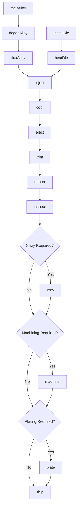
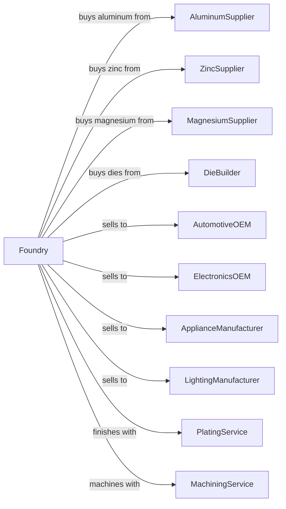

# Nonferrous Metal Die-Casting Foundries

> Business-as-Code definition for die casting operations. Models high-volume production of aluminum, zinc, and magnesium die castings for automotive, electronics, and consumer products.

## Overview

This U.S. industry comprises establishments primarily engaged in introducing molten nonferrous metal, under high pressure, into molds or dies to make nonferrous metal die-castings. Establishments in this industry purchase nonferrous metals made in other establishments.

## Actors

| Actor | Description |
|-------|-------------|
| AluminumSupplier | Supplies aluminum alloy ingots |
| ZincSupplier | Supplies zinc alloy ingots |
| MagnesiumSupplier | Supplies magnesium alloy ingots |
| DieBuilder | Fabricates and maintains die cast tooling |
| AutomotiveOEM | Purchases housings, brackets, and covers |
| ElectronicsOEM | Purchases enclosures and heat sinks |
| ApplianceManufacturer | Purchases handles and housings |
| LightingManufacturer | Purchases LED housings and reflectors |
| PlatingService | Provides chrome and decorative finishes |
| MachiningService | Provides secondary machining operations |

## Roles

| Role | Description |
|------|-------------|
| PlantManager | Oversees die casting operations |
| DieCastOperator | Operates cold and hot chamber die cast machines |
| DieSetter | Sets up and maintains dies in casting machines |
| SprayOperator | Applies die lubricant between casting cycles for thermal management |
| MeltOperator | Manages holding furnaces and metal treatment |
| TrimOperator | Removes flash and gates from castings |
| QualityTechnician | Inspects castings and monitors process |
| DieMaintenanceTechnician | Repairs and refurbishes dies |
| ProcessEngineer | Optimizes casting parameters |

## Entities

| Entity | Description |
|--------|-------------|
| Ingot | Primary alloy input material |
| Die | Hardened steel mold for casting |
| Shot | Single casting cycle |
| Casting | Die cast part |
| Biscuit | Excess metal at plunger tip |
| Runner | Metal flow channel to cavities |
| Gate | Entry point into cavity |
| Flash | Metal that escapes die parting line |
| ShotSleeve | Chamber holding molten metal |
| Ejector | Pin that pushes casting from die |

## Actions

| Action | Description |
|--------|-------------|
| meltAlloy | Liquefy alloy ingots in holding furnace |
| degasAlloy | Remove dissolved hydrogen from melt |
| fluxAlloy | Clean melt of oxides and inclusions |
| installDie | Mount die in casting machine |
| heatDie | Bring die to operating temperature |
| inject | Force molten metal into die under pressure |
| cool | Allow casting to solidify in die |
| eject | Remove casting from die |
| trim | Remove gates, runners, and flash |
| deburr | Remove sharp edges |
| inspect | Verify dimensions and defects |
| xray | Radiographic inspection for porosity |
| machine | Secondary machining operations |
| plate | Apply decorative or functional finish |
| ship | Dispatch finished parts |

## Events

| Event | Description |
|-------|-------------|
| alloyMelted | Metal liquefied and ready |
| alloyTreated | Degassing and fluxing completed |
| dieInstalled | Die mounted and ready |
| dieHeated | Die at operating temperature |
| shotCompleted | Casting cycle finished |
| castingEjected | Part removed from die |
| castingTrimmed | Flash removed |
| castingDeburred | Edges finished |
| castingInspected | Quality verified |
| castingXrayed | Radiographic inspection completed |
| castingMachined | Secondary operations completed |
| castingPlated | Finish applied |
| partsShipped | Products dispatched |

## Searches

| Search | Description |
|--------|-------------|
| findAlloyStock | List available alloy inventory |
| getOrders | Retrieve open orders by part |
| getDieStatus | Check die availability and condition |
| getMachineSchedule | View production schedule |
| getProcessParams | Retrieve casting parameters |
| trackCasting | Locate parts through production |
| getRejectRate | View quality statistics by part |
| getCycleTime | Get production rate data |

## Workflow



## Actor Relationships



## Usage

### Calling Actions

```typescript
import { castNonferrousDieCastings } from '@headlessly/cast-nonferrous-die-castings'

const diecaster = castNonferrousDieCastings()

// Set up die
await diecaster.installDie({
  machineId: 'HPDC-800-3',
  dieId: 'DIE-HOUSING-4521',
  cavities: 2,
  shotWeight: 4.5
})

await diecaster.heatDie({
  dieId: 'DIE-HOUSING-4521',
  targetTemperature: 400,
  zones: ['fixed', 'moving', 'slides']
})

// Run production
await diecaster.inject({
  machineId: 'HPDC-800-3',
  alloy: 'A380',
  metalTemperature: 1250,
  firstPhaseSpeed: 0.5,
  secondPhaseSpeed: 3.5,
  intensificationPressure: 12000
})
```

### Event-Driven Automation

```typescript
// Auto-eject when solidified
diecaster.shotCompleted(async ({ machineId, cycleTime }) => {
  await diecaster.eject({
    machineId,
    ejectorForce: 'standard',
    sprayLubricate: true
  })
})

// Auto-schedule x-ray for critical parts
diecaster.castingTrimmed(async ({ castingId, partNumber }) => {
  const spec = await diecaster.getSpecification(partNumber)

  if (spec.xrayRequired) {
    await diecaster.xray({
      castingId,
      standard: 'ASTM-E505',
      acceptanceLevel: spec.porosityLevel
    })
  }
})
```
