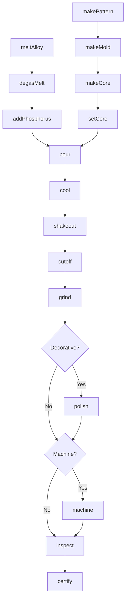
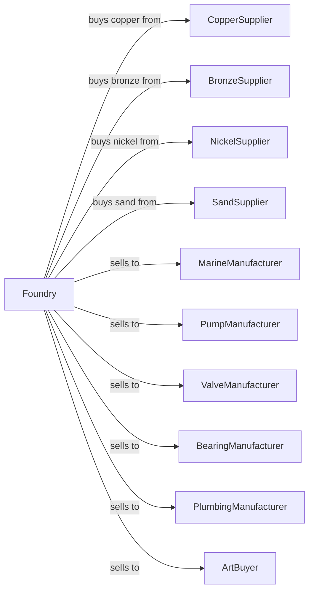

# Other Nonferrous Metal Foundries (except Die-Casting)

> Business-as-Code definition for copper, bronze, and specialty metal foundry operations. Models the production of sand and permanent mold castings from copper alloys and other nonferrous metals.

## Overview

This U.S. industry comprises establishments primarily engaged in pouring molten nonferrous metals (except aluminum) into molds to manufacture nonferrous castings (except nonferrous die-castings and aluminum castings). Establishments in this industry purchase nonferrous metals, such as copper, nickel, lead, and zinc, made in other establishments.

## Actors

| Actor | Description |
|-------|-------------|
| CopperSupplier | Supplies copper and copper alloys |
| BronzeSupplier | Supplies bronze alloys |
| NickelSupplier | Supplies nickel alloys for high-temp use |
| SandSupplier | Provides foundry sand and binders |
| MarineManufacturer | Purchases propellers and ship fittings |
| PumpManufacturer | Purchases impellers and wear rings |
| ValveManufacturer | Purchases valve bodies and trim |
| BearingManufacturer | Purchases bearing shells |
| PlumbingManufacturer | Purchases fittings and fixtures |
| ArtBuyer | Purchases sculptures and decorative items |

## Roles

| Role | Description |
|------|-------------|
| FoundryManager | Oversees nonferrous foundry operations |
| MeltSupervisor | Manages melting and alloy control |
| MoldMaker | Creates sand molds for castings |
| CoreMaker | Produces cores for hollow sections |
| PouringOperator | Controls metal pouring |
| ShakeoutOperator | Removes castings from molds |
| FinishingOperator | Cleans and polishes castings |
| Machinist | Performs secondary machining |
| QualityInspector | Tests and inspects castings |

## Entities

| Entity | Description |
|--------|-------------|
| Ingot | Primary alloy input material |
| Melt | Batch of molten metal |
| Pattern | Template for mold cavity |
| Mold | Sand form for casting |
| Core | Sand insert for internal features |
| Casting | Solidified metal part |
| Bronze | Copper-tin alloy family |
| Brass | Copper-zinc alloy family |
| GunMetal | Copper-tin-zinc alloy |
| Phosphor Bronze | High-strength bearing alloy |

## Actions

| Action | Description |
|--------|-------------|
| meltAlloy | Liquefy copper or specialty alloy |
| degasMelt | Remove dissolved gases |
| addPhosphorus | Deoxidize copper alloys |
| makePattern | Create or modify pattern |
| makeMold | Form sand mold around pattern |
| makeCore | Produce sand cores |
| setCore | Position cores in mold |
| pour | Transfer molten metal into molds |
| cool | Allow castings to solidify |
| shakeout | Remove castings from sand |
| cutoff | Remove gates and risers |
| grind | Remove casting defects |
| polish | Achieve decorative finish |
| machine | Secondary machining operations |
| inspect | Verify dimensions and quality |
| certify | Issue test reports |

## Events

| Event | Description |
|-------|-------------|
| alloyMelted | Metal liquefied |
| meltDegassed | Gases removed |
| meltDeoxidized | Oxygen removed |
| patternCompleted | Pattern ready |
| moldMade | Mold completed |
| coresMade | Cores produced |
| coresSet | Cores positioned |
| metalPoured | Castings filled |
| castingsCooled | Solidification complete |
| castingsShaken | Castings extracted |
| gatesCut | Risers removed |
| castingsGround | Defects removed |
| castingsPolished | Finish completed |
| castingsMachined | Machining completed |
| castingsInspected | Quality verified |
| certified | Documentation issued |

## Searches

| Search | Description |
|--------|-------------|
| findAlloyStock | List available alloys |
| getOrders | Retrieve open orders by part |
| getMoldSchedule | View planned molding runs |
| getPatternLibrary | Browse available patterns |
| trackCasting | Locate castings through production |
| findTestReports | Retrieve mechanical test data |
| getAlloySpecs | Get alloy composition requirements |
| getYieldMetrics | View casting yield statistics |

## Workflow



## Actor Relationships



## Usage

### Calling Actions

```typescript
import { castNonferrousMetalCastings } from '@headlessly/cast-nonferrous-metal-castings'

const foundry = castNonferrousMetalCastings()

// Melt bronze alloy
await foundry.meltAlloy({
  furnaceId: 'INDUC-500',
  alloy: 'C95400',
  chargeWeight: 500,
  targetTemperature: 2100
})

// Deoxidize for sound castings
await foundry.addPhosphorus({
  meltId: 'MELT-2024-0892',
  addition: 'CuP-15',
  rate: 0.05
})

// Pour propeller casting
await foundry.pour({
  meltId: 'MELT-2024-0892',
  moldId: 'M-PROP-36-001',
  pouringTemperature: 2050,
  pouringRate: 'controlled'
})
```

### Event-Driven Automation

```typescript
// Auto-degas after melting
foundry.alloyMelted(async ({ meltId, alloy, temperature }) => {
  if (isHighTinBronze(alloy)) {
    await foundry.degasMelt({
      meltId,
      method: 'nitrogen-lance',
      duration: 10
    })
  }
})

// Auto-polish decorative castings
foundry.castingsGround(async ({ castingId, partType }) => {
  if (partType === 'decorative' || partType === 'art') {
    await foundry.polish({
      castingId,
      stages: ['coarse', 'medium', 'fine', 'buff'],
      finish: 'mirror'
    })
  }
})
```
