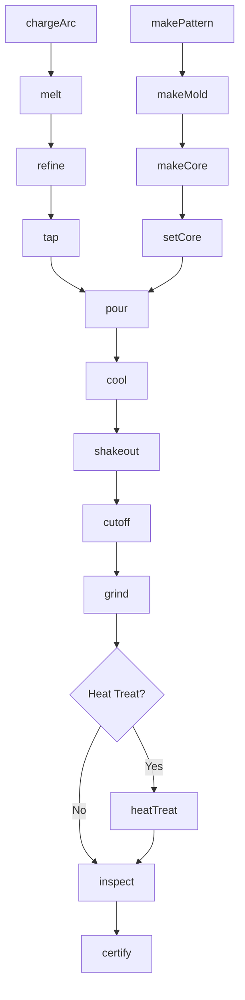
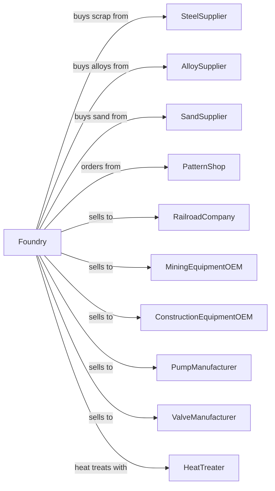

# Steel Foundries (except Investment)

> Business-as-Code definition for steel sand casting operations. Models the production of heavy steel castings for industrial, railroad, and mining applications.

## Overview

This U.S. industry comprises establishments primarily engaged in manufacturing steel castings (except steel investment castings). Establishments in this industry purchase steel made in other establishments.

## Actors

| Actor | Description |
|-------|-------------|
| SteelSupplier | Supplies steel scrap and alloys for melting |
| AlloySupplier | Provides ferroalloys for chemistry adjustment |
| SandSupplier | Provides foundry sand, binders, and coatings |
| PatternShop | Fabricates wooden and metal patterns |
| RailroadCompany | Purchases couplers, truck frames, and wheels |
| MiningEquipmentOEM | Purchases crusher parts and wear components |
| ConstructionEquipmentOEM | Purchases structural and wear parts |
| PumpManufacturer | Purchases volutes and impellers |
| ValveManufacturer | Purchases valve bodies and bonnets |
| HeatTreater | Provides heat treatment services |

## Roles

| Role | Description |
|------|-------------|
| FoundryManager | Oversees steel foundry operations |
| MeltSupervisor | Manages electric arc furnace operations |
| PatternMaker | Produces and maintains patterns |
| MoldMaker | Creates sand molds for large castings |
| CoreMaker | Produces sand cores for internal cavities |
| PouringCrew | Controls ladle pouring operations |
| CutoffOperator | Removes risers and gates from castings |
| GrinderOperator | Finishes casting surfaces |
| QualityInspector | Inspects and tests castings |
| MetallurgistEngineer | Controls chemistry and heat treatment |

## Entities

| Entity | Description |
|--------|-------------|
| SteelScrap | Primary input material for melting |
| Melt | Batch of molten steel |
| Pattern | Template for creating mold cavity |
| Mold | Sand form for casting |
| Core | Sand insert for internal features |
| Casting | Solidified steel part |
| Riser | Reservoir feeding casting shrinkage |
| Ladle | Vessel for holding and pouring molten steel |
| HeatLot | Traceability identifier |
| Specification | Material and property requirements |

## Actions

| Action | Description |
|--------|-------------|
| chargeArc | Load scrap and alloys into electric arc furnace |
| melt | Liquefy charge in electric arc furnace |
| refine | Adjust chemistry and remove impurities |
| tap | Transfer molten steel to ladle |
| makePattern | Create or modify pattern for casting |
| makeMold | Form sand mold around pattern |
| makeCore | Produce sand cores for internal features |
| setCore | Position cores in mold cavity |
| pour | Transfer molten steel into molds |
| cool | Allow castings to solidify |
| shakeout | Remove castings from sand |
| cutoff | Remove risers and gates |
| grind | Finish surfaces and remove defects |
| heatTreat | Normalize, quench, or temper castings |
| inspect | Verify dimensions and soundness |
| certify | Issue mill test reports |

## Events

| Event | Description |
|-------|-------------|
| arcCharged | Furnace loaded |
| steelMelted | Metal liquefied |
| steelRefined | Chemistry adjusted |
| steelTapped | Metal transferred to ladle |
| patternCompleted | Pattern ready |
| moldMade | Mold completed |
| coresSet | Cores positioned |
| metalPoured | Castings filled |
| castingsCooled | Solidification complete |
| castingsShaken | Castings extracted |
| risersCut | Gates removed |
| castingsGround | Finishing completed |
| castingsHeatTreated | Heat treatment completed |
| castingsInspected | Quality verified |
| certified | Documentation issued |

## Searches

| Search | Description |
|--------|-------------|
| findMaterialStock | List available scrap and alloys |
| getOrders | Retrieve open orders by part |
| getMoldSchedule | View planned molding runs |
| getPatternLibrary | Browse available patterns |
| getMeltSchedule | View planned pour schedule |
| trackCasting | Locate castings through production |
| findTestReports | Retrieve mechanical test data |
| getYieldMetrics | View casting yield statistics |

## Workflow



## Actor Relationships



## Usage

### Calling Actions

```typescript
import { castSteelCastings } from '@headlessly/cast-steel-castings'

const foundry = castSteelCastings()

// Charge and melt steel
await foundry.chargeArc({
  furnaceId: 'EAF-1',
  scrap: { pounds: 20000, type: 'clean-HMS' },
  returns: { pounds: 5000 },
  alloys: [
    { type: 'FeMn', pounds: 200 },
    { type: 'FeSi', pounds: 150 }
  ]
})

const melt = await foundry.melt({
  furnaceId: 'EAF-1',
  targetTemperature: 3000,
  targetCarbon: 0.30
})

// Pour large casting
await foundry.pour({
  ladleId: 'LADLE-2',
  moldId: 'M-COUPLER-2024-001',
  pouringTemperature: 2900,
  pouringTime: 45
})
```

### Event-Driven Automation

```typescript
// Auto-tap when chemistry ready
foundry.steelRefined(async ({ meltId, chemistry }) => {
  if (meetsSpec(chemistry, targetSpec)) {
    await foundry.tap({
      meltId,
      ladleId: 'LADLE-2',
      tapTemperature: 3050
    })
  }
})

// Auto-schedule heat treatment
foundry.castingsGround(async ({ castingId, specification }) => {
  if (specification.heatTreatment) {
    await foundry.heatTreat({
      castingId,
      process: specification.heatTreatment,
      temperature: getHeatTreatTemp(specification)
    })
  }
})
```
