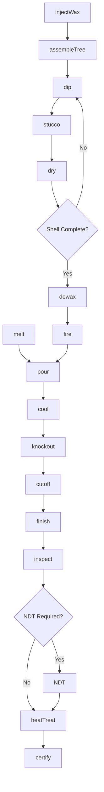
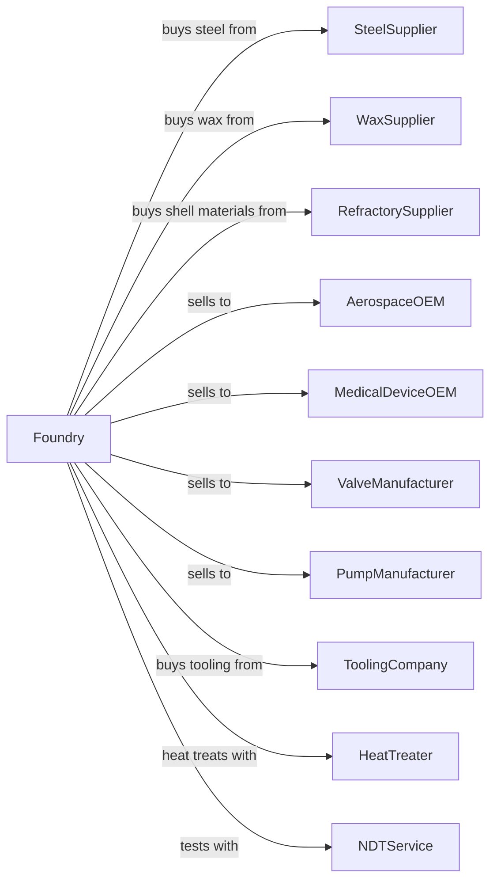

# Steel Investment Foundries

> Business-as-Code definition for steel investment casting operations. Models the precision lost-wax casting process for aerospace, medical, and industrial components.

## Overview

This U.S. industry comprises establishments primarily engaged in manufacturing steel investment castings. Investment molds are formed by covering a wax shape with a refractory slurry. After the refractory slurry hardens, the wax is melted, leaving a seamless mold. Investment molds provide highly detailed, consistent castings.

## Actors

| Actor | Description |
|-------|-------------|
| SteelSupplier | Supplies virgin steel alloys for melting |
| WaxSupplier | Provides pattern wax and runner systems |
| RefractorySupplier | Supplies ceramic shell materials |
| AerospaceOEM | Purchases turbine blades and structural parts |
| MedicalDeviceOEM | Purchases surgical instruments and implants |
| ValveManufacturer | Purchases precision valve bodies |
| PumpManufacturer | Purchases impellers and pump components |
| ToolingCompany | Supplies injection molds for wax patterns |
| HeatTreater | Provides heat treatment services |
| NDTService | Provides nondestructive testing |

## Roles

| Role | Description |
|------|-------------|
| FoundryManager | Oversees investment casting operations |
| WaxRoomSupervisor | Manages pattern injection and assembly |
| WaxInjector | Operates injection presses to create precision wax patterns |
| ShellRoomOperator | Applies ceramic shell coatings |
| MeltSupervisor | Controls induction melting operations |
| PouringOperator | Manages vacuum or air pour operations |
| FinishingOperator | Removes gates and finishes castings |
| QualityEngineer | Inspects and certifies to aerospace standards |
| MetallurgistEngineer | Controls alloy chemistry and properties |

## Entities

| Entity | Description |
|--------|-------------|
| WaxPattern | Expendable pattern injected from mold |
| WaxTree | Assembly of patterns on central sprue |
| Shell | Ceramic mold built around wax tree |
| Melt | Batch of molten steel alloy |
| Casting | Solidified steel part |
| Gate | Metal flow path into casting cavity |
| Sprue | Central metal feed channel |
| Alloy | Specific steel composition |
| Specification | Aerospace or medical material standard |
| Lot | Production batch for traceability |

## Actions

| Action | Description |
|--------|-------------|
| injectWax | Create wax patterns in injection molds |
| assembleTree | Attach patterns to wax sprue |
| dip | Apply ceramic slurry to wax tree |
| stucco | Apply refractory particles to wet slurry |
| dry | Cure ceramic shell between coats |
| dewax | Remove wax in steam autoclave |
| fire | Sinter ceramic shell at high temperature |
| melt | Liquefy steel alloy in induction furnace |
| pour | Transfer molten steel into ceramic shells |
| cool | Allow castings to solidify |
| knockout | Break away ceramic shell |
| cutoff | Remove gates and sprues |
| finish | Grind and blend surfaces |
| inspect | Verify dimensions and defects |
| heatTreat | Process castings to final properties |
| certify | Issue compliance certifications |

## Events

| Event | Description |
|-------|-------------|
| waxInjected | Patterns produced |
| treeAssembled | Patterns mounted on sprue |
| shellBuilt | Ceramic coating completed |
| waxRemoved | Dewaxing completed |
| shellFired | Ceramic sintered and ready |
| steelMelted | Alloy liquefied |
| metalPoured | Shells filled with steel |
| castingsCooled | Solidification complete |
| shellsKnocked | Ceramic removed |
| gatesCut | Castings separated |
| castingsFinished | Surface preparation completed |
| castingsInspected | Quality verified |
| castingsHeatTreated | Properties achieved |
| certified | Documentation issued |

## Searches

| Search | Description |
|--------|-------------|
| findMaterialStock | List available steel alloys |
| getOrders | Retrieve open orders by part number |
| getShellStatus | Track trees through shell room |
| getMeltSchedule | View planned pour schedule |
| findTestReports | Retrieve mechanical test data |
| trackCasting | Locate castings through production |
| getCertifications | Retrieve compliance documents |
| getYieldMetrics | View casting yield statistics |

## Workflow



## Actor Relationships



## Usage

### Calling Actions

```typescript
import { castSteelInvestmentCastings } from '@headlessly/cast-steel-investment-castings'

const foundry = castSteelInvestmentCastings()

// Inject wax patterns
const patterns = await foundry.injectWax({
  moldId: 'MOLD-TB-4521',
  waxType: 'filled-pattern',
  quantity: 24,
  partNumber: 'TURBINE-BLADE-A'
})

// Build ceramic shell
await foundry.assembleTree({
  patternIds: patterns.map(p => p.id),
  sprueSize: 2.0,
  treeId: 'TREE-2024-0892'
})

// Pour castings
await foundry.pour({
  shellId: 'SHELL-2024-0892',
  alloy: '17-4PH',
  pouringTemperature: 2950,
  pourMethod: 'vacuum'
})
```

### Event-Driven Automation

```typescript
// Auto-fire shell after dewaxing
foundry.waxRemoved(async ({ shellId }) => {
  await foundry.fire({
    shellId,
    temperature: 1800,
    holdTime: 60
  })
})

// Auto-schedule NDT for aerospace parts
foundry.castingsFinished(async ({ lotId, specification }) => {
  if (specification.includes('AMS')) {
    await foundry.inspect({
      lotId,
      methods: ['fluorescent-penetrant', 'radiographic'],
      standard: specification
    })
  }
})
```
