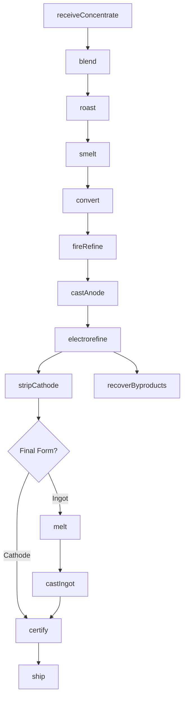
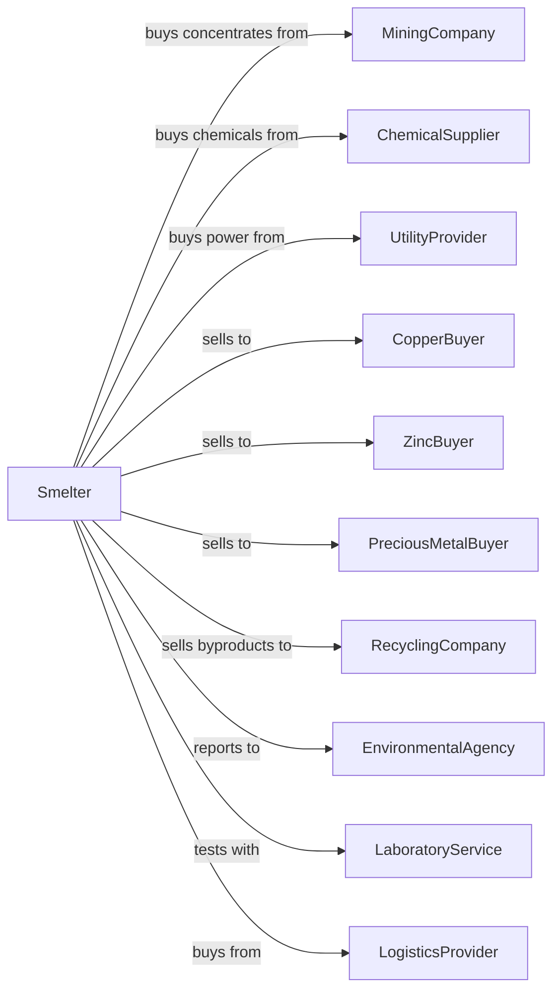

# Nonferrous Metal (except Aluminum) Smelting and Refining

> Business-as-Code definition for nonferrous metal smelting and refining operations. Models the production of copper, zinc, lead, nickel, and precious metals from ores and concentrates.

## Overview

This industry comprises establishments primarily engaged in (1) smelting ores into nonferrous metals and/or (2) the primary refining of nonferrous metals (except aluminum) by electrolytic methods or other processes.

## Actors

| Actor | Description |
|-------|-------------|
| MiningCompany | Supplies ore concentrates for smelting |
| ChemicalSupplier | Provides acids and processing chemicals |
| UtilityProvider | Supplies electricity for electrolytic refining |
| CopperBuyer | Purchases refined copper cathodes |
| ZincBuyer | Purchases zinc slabs and ingots |
| PreciousMetalBuyer | Purchases gold, silver, and PGM products |
| RecyclingCompany | Purchases byproduct materials |
| EnvironmentalAgency | Regulates emissions and waste disposal |
| LaboratoryService | Provides assaying and analysis services |
| LogisticsProvider | Transports concentrates and finished metals |

## Roles

| Role | Description |
|------|-------------|
| PlantManager | Oversees smelter and refinery operations |
| ProcessEngineer | Optimizes smelting and refining processes |
| FurnaceOperator | Manages smelting furnace operations |
| RefineryOperator | Controls electrolytic refining cells |
| AssayTechnician | Performs chemical analysis and assays |
| EnvironmentalEngineer | Manages emissions control and waste |
| MaintenanceSupervisor | Maintains furnaces and tankhouse equipment |
| MetallurgistEngineer | Controls metal purity and recovery |

## Entities

| Entity | Description |
|--------|-------------|
| Concentrate | Processed ore with high metal content |
| Matte | Intermediate smelting product |
| Blister | Impure metal from converter |
| Anode | Cast metal for electrolytic refining |
| Cathode | Pure metal deposited in refining |
| Slag | Waste material from smelting |
| Flue Dust | Particulate captured from exhaust |
| Electrolyte | Solution used in electrolytic refining |
| Slimes | Byproduct containing precious metals |
| Ingot | Cast refined metal form |

## Actions

| Action | Description |
|--------|-------------|
| receiveConcentrate | Accept and sample incoming ore concentrates |
| blend | Mix concentrates to optimize smelting feed |
| roast | Heat concentrate to remove sulfur |
| smelt | Melt roasted concentrate in furnace |
| convert | Oxidize matte to produce blister metal |
| fireRefine | Remove impurities in anode furnace |
| castAnode | Pour metal into anode molds |
| electrorefine | Purify metal in electrolytic cells |
| stripCathode | Remove deposited metal from blanks |
| melt | Remelt cathodes for final form |
| castIngot | Pour refined metal into ingot molds |
| recoverByproducts | Process slimes for precious metals |
| certify | Issue certificates of analysis |
| ship | Dispatch refined metals to customers |

## Events

| Event | Description |
|-------|-------------|
| concentrateReceived | Material sampled and accepted |
| concentrateBlended | Feed prepared for smelting |
| concentrateRoasted | Sulfur removed |
| matteProduced | Initial smelting completed |
| blisterProduced | Conversion completed |
| anodesCast | Anodes ready for refining |
| cathodesStripped | Refined metal harvested |
| ingotsCast | Final product formed |
| byproductsRecovered | Precious metals extracted |
| metalCertified | Analysis certificate issued |
| metalShipped | Product dispatched |

## Searches

| Search | Description |
|--------|-------------|
| findConcentrateStock | List available concentrates by grade |
| getCellStatus | Monitor electrolytic cell performance |
| getMetalInventory | Check refined metal stock |
| findOrders | Retrieve customer orders by metal |
| getRecoveryMetrics | View metal recovery statistics |
| findAssayReports | Retrieve analysis certificates |
| trackLot | Follow material through processing |
| getByproductStatus | Check precious metal recovery |

## Workflow



## Actor Relationships



## Usage

### Calling Actions

```typescript
import { refineNonferrousMetal } from '@headlessly/refine-nonferrous-metal'

const refinery = refineNonferrousMetal()

// Check available stock
const stock = await refinery.findConcentrateStock({ status: 'available' })

// Review production data
const data = await refinery.getCellStatus()

// Receive copper concentrate
const concentrate = await refinery.receiveConcentrate({
  shipmentId: 'CONC-2024-4521',
  metal: 'copper',
  grade: 28.5,
  tons: 5000,
  origin: 'Chile'
})

// Smelt to produce matte
await refinery.smelt({
  furnaceId: 'FLASH-1',
  feedBlend: [concentrate.id],
  targetMatteGrade: 65,
  oxygenEnrichment: 55
})

// Electrorefine to cathode
await refinery.electrorefine({
  anodeId: 'ANODE-2024-0892',
  cellBank: 'A',
  currentDensity: 320,
  cycleTime: 14
})
```

### Event-Driven Automation

```typescript
// Auto-convert when matte ready
refinery.matteProduced(async ({ matteId, grade }) => {
  if (grade >= 60) {
    await refinery.convert({
      matteId,
      converterId: 'PS-2',
      blowCycles: 3
    })
  }
})

// Auto-recover precious metals from slimes
refinery.cathodesStripped(async ({ cellBank, slimesWeight }) => {
  if (slimesWeight > 500) {
    await refinery.recoverByproducts({
      cellBank,
      process: 'precious-metal-recovery',
      targetMetals: ['gold', 'silver', 'selenium']
    })
  }
})
```
