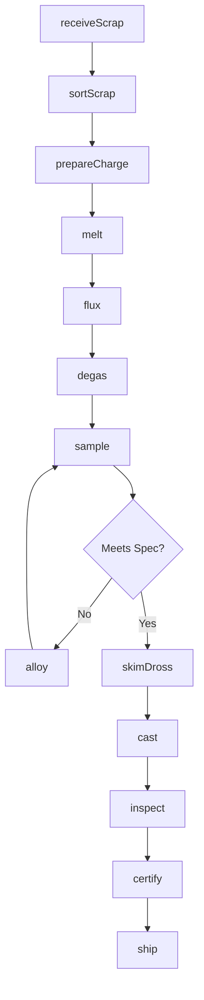
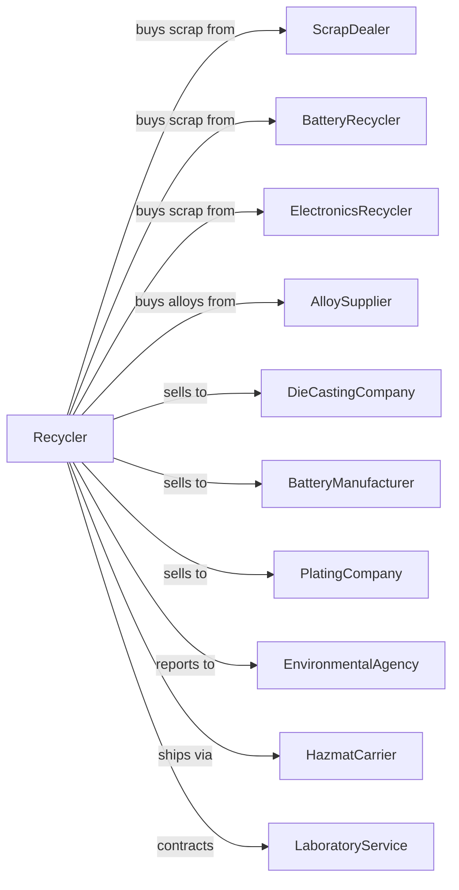

# Secondary Smelting, Refining, and Alloying of Nonferrous Metal (except Copper and Aluminum)

> Business-as-Code definition for secondary nonferrous metal smelting operations. Models the recycling and alloying of zinc, lead, nickel, and other specialty metals from scrap.

## Overview

This U.S. industry comprises establishments primarily engaged in (1) alloying purchased nonferrous metals and/or (2) recovering nonferrous metals from scrap. Establishments in this industry make primary forms (e.g., bar, billet, bloom, cake, ingot, slab, slug, wire) using smelting or refining processes.

## Actors

| Actor | Description |
|-------|-------------|
| ScrapDealer | Supplies sorted nonferrous metal scrap |
| BatteryRecycler | Supplies lead from spent batteries |
| ElectronicsRecycler | Supplies precious metal bearing scrap |
| AlloySupplier | Provides alloying elements and master alloys |
| DieCastingCompany | Purchases zinc and magnesium alloys |
| BatteryManufacturer | Purchases refined lead and lead alloys |
| PlatingCompany | Purchases zinc and nickel anodes |
| EnvironmentalAgency | Regulates emissions and waste disposal |
| LaboratoryService | Provides spectrographic analysis |
| HazmatCarrier | Transports regulated materials |

## Roles

| Role | Description |
|------|-------------|
| PlantManager | Oversees recycling and smelting operations |
| MeltShopSupervisor | Manages furnace operations |
| FurnaceOperator | Operates smelting furnaces |
| AlloySpecialist | Controls chemistry and alloy formulations |
| CastingOperator | Operates ingot casting equipment |
| QualityAnalyst | Tests chemistry and certifies products |
| EnvironmentalTechnician | Monitors emissions and waste handling |
| MaintenanceMechanic | Maintains furnaces and material handling |

## Entities

| Entity | Description |
|--------|-------------|
| Scrap | Recovered nonferrous metal feedstock |
| Flux | Chemical agent for removing impurities |
| Dross | Oxide-rich byproduct from melting |
| Alloy | Metal with controlled composition |
| Ingot | Cast metal form for remelting |
| Slab | Flat cast form |
| Anode | Cast form for electroplating |
| Heat | Batch of molten metal |
| MasterAlloy | Concentrated alloying addition |
| Certificate | Analysis documentation |

## Actions

| Action | Description |
|--------|-------------|
| receiveScrap | Accept and weigh incoming metal scrap |
| sortScrap | Separate by metal type and quality |
| prepareCharge | Blend scrap and alloys for target chemistry |
| melt | Liquefy metal in furnace |
| flux | Add chemicals to remove impurities |
| degas | Remove dissolved gases |
| sample | Take molten metal samples for analysis |
| alloy | Add elements to achieve target chemistry |
| skimDross | Remove oxide and impurity layer |
| cast | Pour molten metal into molds |
| inspect | Verify ingot quality and weight |
| certify | Issue certificates of analysis |
| ship | Dispatch finished products |

## Events

| Event | Description |
|-------|-------------|
| scrapReceived | Material weighed and accepted |
| scrapSorted | Material classified by type |
| chargePreapared | Furnace charge ready |
| metalMelted | Material liquefied |
| meltFluxed | Impurities removed |
| meltDegassed | Gases removed |
| meltSampled | Analysis results available |
| alloyAdjusted | Chemistry within specification |
| drossSkimmed | Surface cleaned |
| ingotsCast | Metal cast into forms |
| inspected | Quality verified |
| certified | Documentation issued |
| shipped | Product dispatched |

## Searches

| Search | Description |
|--------|-------------|
| findScrapInventory | List available scrap by type |
| getOrderQueue | Retrieve pending orders by alloy |
| checkIngotStock | Get inventory by specification |
| getFurnaceStatus | Monitor furnace capacity |
| getYieldMetrics | View recovery efficiency |
| findCertificates | Retrieve analysis documents |
| trackHeat | Follow batch through processing |
| getChemistryReports | Retrieve analysis data |

## Workflow



## Actor Relationships



## Usage

### Calling Actions

```typescript
import { refineSecondarySmelting } from '@headlessly/refine-secondary-smelting'

const recycler = refineSecondarySmelting()

// List available scrap by type
const scrapInventory = await recycler.findScrapInventory({ metal: 'zinc', grade: 'old-die-cast' })

// Retrieve pending orders by alloy
const orderQueue = await recycler.getOrderQueue({ alloy: 'zamak-3', status: 'pending' })

// Receive zinc scrap
const scrap = await recycler.receiveScrap({
  loadId: 'ZN-2024-3421',
  type: 'die-cast-returns',
  weight: 22000,
  estimatedPurity: 0.94
})

// Melt and alloy
await recycler.melt({
  furnaceId: 'REV-2',
  chargeIds: [scrap.id],
  targetTemperature: 850
})

// Adjust to target alloy
await recycler.alloy({
  heatId: 'HT-2024-0892',
  targetAlloy: 'ZAMAK-3',
  additions: [
    { element: 'aluminum', pounds: 180 },
    { element: 'magnesium', pounds: 15 }
  ]
})
```

### Event-Driven Automation

```typescript
// Auto-flux after melting
recycler.metalMelted(async ({ heatId, temperature }) => {
  await recycler.flux({
    heatId,
    fluxType: 'ammonium-chloride',
    quantity: calculateFluxAmount(heatId)
  })
})

// Auto-certify when chemistry verified
recycler.meltSampled(async ({ heatId, chemistry }) => {
  const spec = await recycler.getSpecification(heatId)

  if (meetsAlloySpec(chemistry, spec)) {
    await recycler.cast({
      heatId,
      moldType: spec.productForm,
      ingotWeight: spec.targetWeight
    })
  }
})
```
