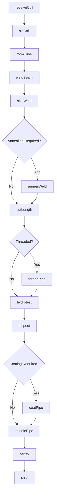
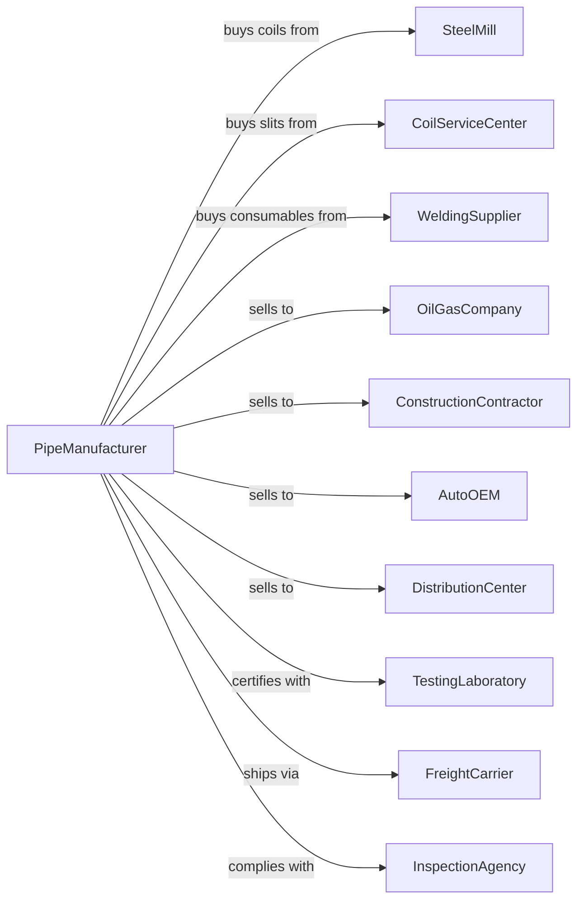

# Iron and Steel Pipe and Tube Manufacturing from Purchased Steel

> Business-as-Code definition for steel pipe and tube manufacturing operations. Models the complete production process from coil procurement through finished pipe testing and delivery.

## Overview

This industry comprises establishments primarily engaged in manufacturing welded, riveted, or seamless pipe and tube from purchased iron or steel.

## Actors

| Actor | Description |
|-------|-------------|
| SteelMill | Supplies hot rolled coils and skelp for pipe production |
| CoilServiceCenter | Provides slit coils to width specifications |
| WeldingSupplier | Provides welding consumables and equipment |
| OilGasCompany | Purchases OCTG and line pipe for drilling and transport |
| ConstructionContractor | Purchases structural tubing for building projects |
| AutoOEM | Purchases precision tubing for vehicle components |
| DistributionCenter | Stocks and resells standard pipe sizes |
| TestingLaboratory | Provides third-party testing and certification |
| FreightCarrier | Transports finished pipe to customers |
| InspectionAgency | Certifies products to API and ASTM standards |

## Roles

| Role | Description |
|------|-------------|
| PlantManager | Oversees production schedules and plant operations |
| MillLineOperator | Runs tube mill forming and welding equipment |
| QualityEngineer | Manages testing protocols and certifications |
| WeldingTechnician | Monitors weld parameters and quality |
| FinishingOperator | Operates cutting, threading, and coating equipment |
| MaintenanceMechanic | Maintains mill lines and support equipment |
| ProductionPlanner | Schedules orders and manages inventory |
| ShippingCoordinator | Arranges logistics and documentation |

## Entities

| Entity | Description |
|--------|-------------|
| Coil | Input steel in rolled form for pipe production |
| Skelp | Slit coil prepared for tube forming |
| Pipe | Hollow cylindrical steel product |
| Tube | Precision hollow product for structural use |
| Weld | Seam joining formed edges of pipe |
| Thread | Machined connection ends for pipe joining |
| Coating | Protective layer applied to pipe exterior |
| HeatNumber | Traceability identifier from source steel |
| TestReport | Documentation of mechanical and hydrostatic tests |
| Bundle | Packaged group of pipes for shipping |

## Actions

| Action | Description |
|--------|-------------|
| receiveCoil | Accept and verify incoming steel coils |
| slitCoil | Cut wide coil into strips for tube forming |
| formTube | Shape flat strip into round or square profile |
| weldSeam | Join edges using high-frequency or ERW welding |
| sizeWeld | Remove weld bead and size to final dimension |
| annealWeld | Heat treat weld zone for stress relief |
| cutLength | Cut continuous tube to specified lengths |
| threadPipe | Machine threads on pipe ends for connections |
| hydrotest | Pressure test pipe to verify integrity |
| inspect | Perform visual and dimensional inspection |
| coatPipe | Apply protective coatings or linings |
| bundlePipe | Package pipes for shipping and handling |
| certify | Issue mill test reports and compliance documents |
| ship | Dispatch finished products to customers |

## Events

| Event | Description |
|-------|-------------|
| coilReceived | Steel coil verified and accepted |
| coilSlit | Skelp prepared for tube mill |
| tubeFormed | Strip shaped into tubular profile |
| seamWelded | Weld completed and inspected |
| weldSized | Weld scarfed and tube sized |
| weldAnnealed | Heat treatment completed |
| pipeCut | Tube cut to specified length |
| pipeThreaded | Threading operation completed |
| hydrotested | Pressure test passed |
| inspected | Quality inspection completed |
| coated | Protective coating applied |
| bundled | Pipes packaged for shipping |
| certified | Documentation issued |
| shipped | Product dispatched to customer |

## Searches

| Search | Description |
|--------|-------------|
| findCoils | List available coils by size and grade |
| getOrders | Retrieve open orders by customer and due date |
| checkInventory | Get finished goods by size and specification |
| findTestReports | Retrieve test documentation by heat number |
| getProductionSchedule | List scheduled mill runs by line |
| trackPipe | Locate specific pipe through production |
| getCapacity | Check available production capacity |
| findCertifications | Retrieve compliance documents by standard |

## Workflow



## Actor Relationships



## Usage

### Calling Actions

```typescript
import { manufactureSteelPipeTube } from '@headlessly/manufacture-steel-pipe-tube'

const pipemill = manufactureSteelPipeTube()

// Receive incoming coil
const coil = await pipemill.receiveCoil({
  coilId: 'HRC-2024-0892',
  grade: 'API-5L-X52',
  width: 48,
  gauge: 0.375,
  weight: 22000
})

// Form and weld tube
await pipemill.formTube({
  skelpId: coil.skelpId,
  outerDiameter: 6.625,
  wallThickness: 0.280,
  millLine: 'ERW-2'
})

// Hydrotest finished pipe
const testResult = await pipemill.hydrotest({
  pipeId: 'PIPE-2024-1234',
  testPressure: 2500,
  holdTime: 10
})
```

### Event-Driven Automation

```typescript
// Auto-schedule cutting when weld complete
pipemill.seamWelded(async ({ tubeId, weldQuality }) => {
  if (weldQuality === 'pass') {
    const order = await pipemill.getOrder(tubeId)
    await pipemill.cutLength({
      tubeId,
      lengths: order.cutLengths,
      tolerance: order.lengthTolerance
    })
  }
})

// Auto-certify when all tests pass
pipemill.hydrotested(async ({ pipeId, result, pressure }) => {
  if (result === 'pass') {
    const inspection = await pipemill.inspect({ pipeId })
    if (inspection.status === 'conforming') {
      await pipemill.certify({
        pipeId,
        standards: ['API-5L', 'ASTM-A53'],
        testPressure: pressure
      })
    }
  }
})
```
