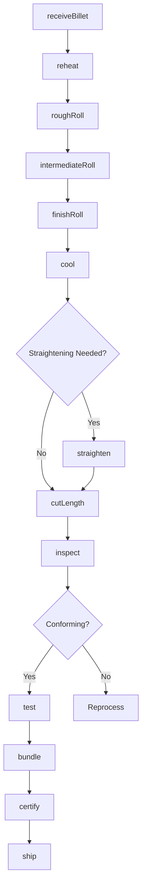
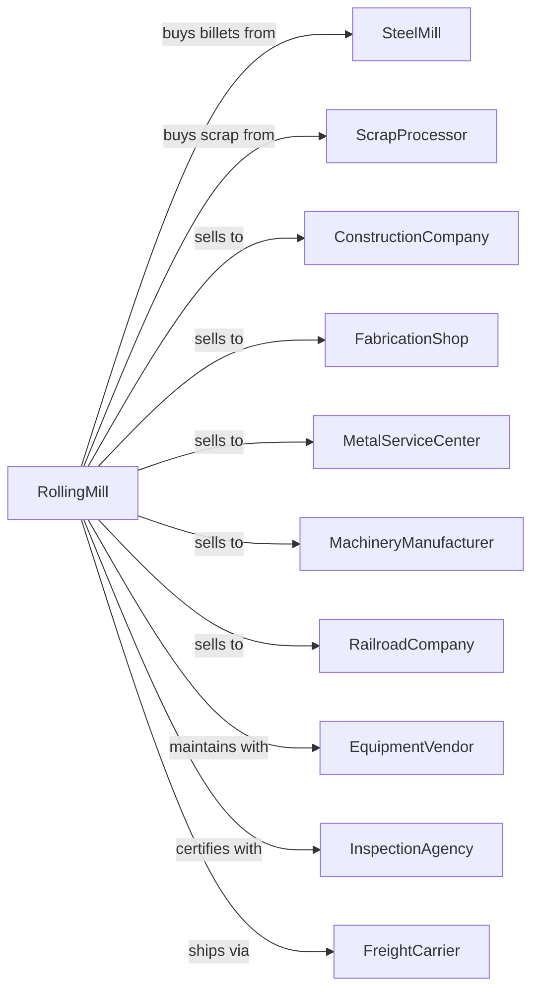

# Rolled Steel Shape Manufacturing

> Business-as-Code definition for rolled steel shape manufacturing operations. Models the production of structural shapes, bars, and plates from purchased steel billets and slabs.

## Overview

This U.S. industry comprises establishments primarily engaged in rolling or drawing shapes (except wire), such as plate, sheet, strip, rod, and bar, from purchased steel.

## Actors

| Actor | Description |
|-------|-------------|
| SteelMill | Supplies billets, blooms, and slabs for rolling |
| ScrapProcessor | Provides scrap for billet production |
| ConstructionCompany | Purchases structural shapes for building projects |
| FabricationShop | Buys shapes for steel structure fabrication |
| MetalServiceCenter | Stocks and distributes rolled products |
| MachineryManufacturer | Purchases bars and flats for components |
| RailroadCompany | Purchases rail and track components |
| EquipmentVendor | Supplies and maintains rolling mill equipment |
| InspectionAgency | Certifies products to ASTM and AISC standards |
| FreightCarrier | Transports finished products to customers |

## Roles

| Role | Description |
|------|-------------|
| PlantManager | Oversees mill operations and production targets |
| RollingMillOperator | Controls rolling stand passes and reductions |
| ReheatingFurnaceOperator | Manages billet heating for rolling |
| QualityInspector | Verifies dimensions and mechanical properties |
| MaintenanceTechnician | Maintains rolls, bearings, and drive systems |
| ProductionScheduler | Plans rolling campaigns and changeovers |
| MetallurgistEngineer | Monitors grain structure and properties |
| ShippingCoordinator | Manages finished goods logistics |

## Entities

| Entity | Description |
|--------|-------------|
| Billet | Square semi-finished steel input for rolling |
| Bloom | Large semi-finished steel for heavy shapes |
| Beam | I-shaped structural member |
| Channel | C-shaped structural section |
| Angle | L-shaped structural section |
| FlatBar | Rectangular cross-section bar stock |
| RoundBar | Circular cross-section bar stock |
| RollPass | Single reduction through rolling stand |
| RollSchedule | Sequence of passes for finished shape |
| HeatNumber | Traceability identifier for material lot |

## Actions

| Action | Description |
|--------|-------------|
| receiveBillet | Accept and verify incoming billets |
| reheat | Heat billets in reheat furnace to rolling temperature |
| roughRoll | Initial reduction passes in roughing stands |
| intermediateRoll | Progressive reduction through intermediate stands |
| finishRoll | Final passes through finishing stands |
| cool | Controlled cooling on cooling bed |
| straighten | Correct camber and twist in straightening machine |
| cutLength | Shear or saw to ordered lengths |
| inspect | Verify dimensions and surface quality |
| test | Perform mechanical testing on samples |
| bundle | Package products for shipping |
| certify | Issue mill test reports |
| ship | Dispatch finished products |

## Events

| Event | Description |
|-------|-------------|
| billetReceived | Input material verified and accepted |
| billetReheated | Material at rolling temperature |
| roughRolled | Initial reduction completed |
| intermediateRolled | Intermediate passes completed |
| finishRolled | Final shape achieved |
| cooled | Controlled cooling completed |
| straightened | Shape corrected for straightness |
| cut | Material cut to ordered length |
| inspected | Dimensional inspection passed |
| tested | Mechanical properties verified |
| bundled | Product packaged for shipping |
| certified | Mill test certificate issued |
| shipped | Product dispatched to customer |

## Searches

| Search | Description |
|--------|-------------|
| findBillets | List available billets by grade and size |
| getOrders | Retrieve open orders by shape and customer |
| checkInventory | Get finished stock by size and grade |
| getRollSchedule | List planned rolling campaigns |
| findTestReports | Retrieve mechanical test data |
| getProductionMetrics | View yield and throughput statistics |
| trackMaterial | Locate material by heat number |
| getCapacity | Check available rolling capacity |

## Workflow



## Actor Relationships



## Usage

### Calling Actions

```typescript
import { manufactureRolledSteel } from '@headlessly/manufacture-rolled-steel'

const mill = manufactureRolledSteel()

// List available billets by grade and size
const billets = await mill.findBillets({ grade: 'A992', size: '8x8' })

// Retrieve open orders by shape and customer
const orders = await mill.getOrders({ shape: 'W-beam', status: 'open' })

// Receive incoming billets
const billet = await mill.receiveBillet({
  billetId: 'BLT-2024-4521',
  grade: 'A992',
  size: '6x6',
  length: 30,
  heatNumber: 'H-89234'
})

// Reheat for rolling
await mill.reheat({
  billetId: billet.id,
  targetTemperature: 2200,
  furnaceZone: 'zone-3'
})

// Roll to finished shape
await mill.finishRoll({
  billetId: billet.id,
  targetShape: 'W12x26',
  rollSchedule: 'schedule-W12'
})
```

### Event-Driven Automation

```typescript
// Auto-straighten when cooling complete
mill.cooled(async ({ shapeId, camber, twist }) => {
  if (camber > 0.125 || twist > 0.5) {
    await mill.straighten({
      shapeId,
      rollerPressure: calculatePressure(camber, twist)
    })
  }
})

// Auto-certify when tests pass
mill.tested(async ({ shapeId, yield: yieldStrength, tensile }) => {
  const spec = await mill.getSpecification(shapeId)

  if (yieldStrength >= spec.minYield && tensile >= spec.minTensile) {
    await mill.certify({
      shapeId,
      standard: 'ASTM-A992',
      yieldStrength,
      tensileStrength: tensile
    })
  }
})
```
