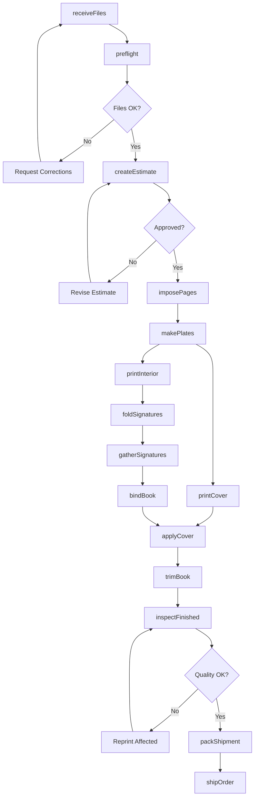
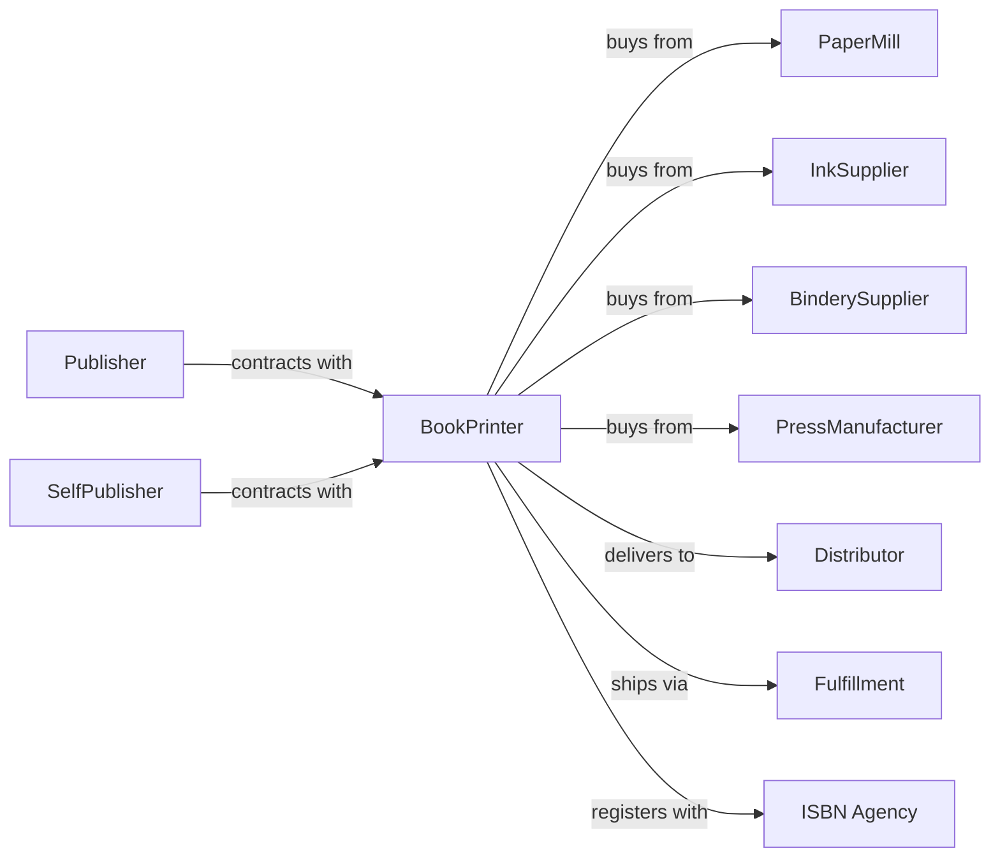

# Books Printing

> Business-as-Code definition for book printing and binding operations. Models the complete production workflow from manuscript files through finished bound books.

## Overview

This U.S. industry comprises establishments primarily engaged in printing or printing and binding books and pamphlets without publishing. This includes printing hardcover and softcover books, children's books, textbooks, journals, and specialty publications on a contract basis for publishers and self-publishing authors.

## Actors

| Actor | Description |
|-------|-------------|
| Publisher | Traditional or independent publisher contracting print runs |
| SelfPublisher | Author producing their own books |
| PaperMill | Supplies book paper, cover stock, and specialty papers |
| InkSupplier | Provides printing inks optimized for book production |
| BinderySupplier | Supplies adhesives, thread, cover materials, and binding equipment |
| PressManufacturer | Sells and services web and sheet-fed presses |
| Distributor | Warehouses and ships books to retailers |
| Fulfillment | Handles print-on-demand and direct-to-reader shipping |
| ISBN Agency | Issues ISBNs and registers titles |

## Roles

| Role | Description |
|------|-------------|
| PlantManager | Oversees entire printing facility operations |
| ProductionScheduler | Plans job sequencing and press allocation |
| PressOperator | Runs web or sheet-fed printing presses |
| PrePressSpecialist | Manages file preparation, imposition, and plate making |
| BinderyOperator | Operates folding, gathering, and binding equipment |
| QualityController | Inspects print quality and binding integrity |
| CustomerService | Manages publisher accounts and job status updates |
| MaterialsBuyer | Procures paper, ink, and binding supplies |
| WarehouseWorker | Manages finished goods inventory and shipping |

## Entities

| Entity | Description |
|--------|-------------|
| BookOrder | Production job with title, quantity, and specifications |
| Manuscript | Digital files ready for print production |
| Signature | Folded sheet containing multiple pages |
| TextBlock | Gathered signatures before binding |
| CoverStock | Material for book cover (paper, cloth, leather) |
| BindingType | Method of assembly (perfect, case, saddle-stitch) |
| ISBN | Unique identifier for the book title |
| Plate | Printing plate for offset production |
| Spine | Bound edge of the book |
| TrimSize | Final dimensions of the finished book |

## Actions

| Action | Description |
|--------|-------------|
| receiveFiles | Accept manuscript and cover files from publisher |
| preflight | Verify files meet print specifications |
| createEstimate | Calculate production costs and pricing |
| imposePages | Arrange pages on press sheets for efficient printing |
| makePlates | Create printing plates for text and cover |
| printInterior | Run text pages on web or sheet-fed press |
| printCover | Print cover on appropriate stock |
| foldSignatures | Fold printed sheets into signatures |
| gatherSignatures | Collate signatures in page order |
| bindBook | Attach pages using specified binding method |
| trimBook | Cut book to final trim size |
| applyCover | Attach cover to text block |
| inspectFinished | Quality check completed books |
| packShipment | Carton and palletize for distribution |
| shipOrder | Deliver books to publisher or warehouse |
| storeInventory | Warehouse books for future fulfillment |

## Events

| Event | Description |
|-------|-------------|
| filesReceived | Manuscript and cover files uploaded |
| preflightPassed | Files verified as print-ready |
| estimateApproved | Publisher accepted production quote |
| platesPrepared | Printing plates completed |
| interiorPrinted | Text pages finished printing |
| coverPrinted | Covers finished printing |
| signaturesGathered | All signatures collated |
| bindingCompleted | Books fully bound |
| trimCompleted | Books cut to final size |
| qualityApproved | Books passed inspection |
| orderPacked | Shipment packaged and labeled |
| orderShipped | Books dispatched to destination |
| inventoryStocked | Books added to warehouse inventory |

## Searches

| Search | Description |
|--------|-------------|
| findOrders | List book orders by publisher, status, or date |
| checkPaperStock | Query paper inventory by grade and quantity |
| getPressSchedule | View web and sheet-fed press availability |
| getBinderySchedule | Check binding equipment availability |
| findTitle | Search orders by book title or ISBN |
| getOrderStatus | Check production stage of specific order |
| getInventory | Query warehoused books by title |

## Workflow

## Actor Relationships

