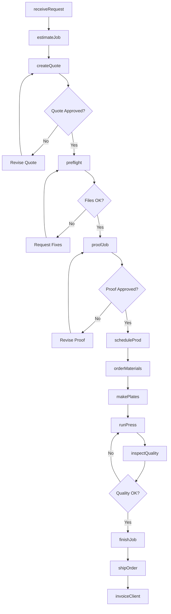
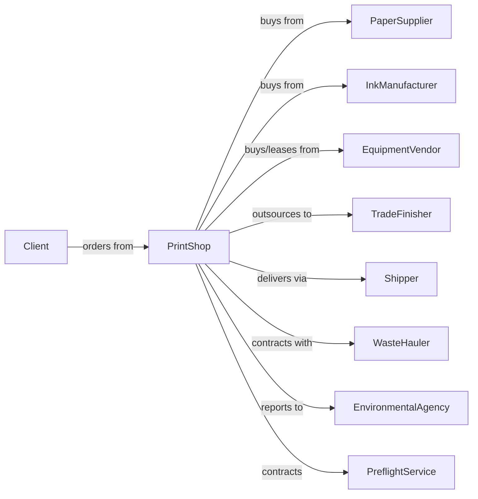

# Commercial Printing (except Screen and Books)

> Business-as-Code definition for commercial printing operations. Models the complete print production workflow from client request through delivery.

## Overview

This U.S. industry comprises establishments primarily engaged in commercial printing (except screen printing, books printing) without publishing (except fabric grey goods printing). The printing processes used in this industry include, but are not limited to, lithographic, gravure, flexographic, letterpress, engraving, and various digital printing technologies. This industry includes establishments engaged in commercial printing on purchased stock materials, such as stationery, invitations, labels, and similar items, on a job-order basis.

## Actors

| Actor | Description |
|-------|-------------|
| Client | Business or individual ordering print materials |
| PaperSupplier | Provides paper stock, cardstock, and specialty substrates |
| InkManufacturer | Supplies printing inks, toners, and coatings |
| EquipmentVendor | Sells and services printing presses and finishing equipment |
| PreflightService | Provides file preparation and proofing services |
| Shipper | Delivers finished products to clients or distribution points |
| TradeFinisher | Provides specialized finishing services like die-cutting or foil stamping |
| WasteHauler | Handles paper waste and recycling |
| EnvironmentalAgency | Oversees VOC emissions and waste disposal compliance |

## Roles

| Role | Description |
|------|-------------|
| PrintShopOwner | Owns the business and sets strategic direction |
| ProductionManager | Oversees daily operations and job scheduling |
| PressOperator | Runs and maintains printing presses |
| PrePressSpecialist | Prepares digital files, creates plates, and manages color |
| Estimator | Calculates job costs and prepares quotes |
| SalesRepresentative | Acquires new clients and manages accounts |
| Bindery Worker | Operates finishing equipment for cutting, folding, and binding |
| QualityInspector | Checks output for color accuracy and defects |

## Entities

| Entity | Description |
|--------|-------------|
| PrintJob | A specific order with specifications and deadline |
| Substrate | Paper or material being printed on |
| Plate | Image carrier used in offset printing |
| Ink | Colorant applied to substrate |
| Proof | Sample print for client approval |
| Press | Printing machinery (offset, digital, flexo) |
| Imposition | Layout arrangement for efficient printing |
| BleedArea | Portion of design extending beyond trim line |
| ColorProfile | ICC profile for consistent color reproduction |
| Bindery | Post-press finishing operations |

## Actions

| Action | Description |
|--------|-------------|
| receiveRequest | Accept print job specifications from client |
| estimateJob | Calculate materials, labor, and pricing |
| createQuote | Generate formal pricing proposal |
| preflight | Check submitted files for printability issues |
| proofJob | Create physical or digital proof for approval |
| scheduleProd | Assign job to press and set production timeline |
| orderMaterials | Procure paper, ink, and supplies for job |
| makePlates | Create printing plates from approved files |
| runPress | Execute print production on press |
| inspectQuality | Check printed sheets for defects and color accuracy |
| finishJob | Perform cutting, folding, binding, and packaging |
| shipOrder | Deliver completed job to client |
| invoiceClient | Generate and send invoice for completed work |
| archiveJob | Store job files and specifications for reprints |

## Events

| Event | Description |
|-------|-------------|
| requestReceived | New print job request has been logged |
| quoteApproved | Client has accepted pricing proposal |
| filesReceived | Print-ready files uploaded by client |
| proofApproved | Client has signed off on proof |
| platesPrepared | Printing plates have been made |
| pressStarted | Print production has begun |
| pressStopped | Print production has completed |
| qualityPassed | Job passed quality inspection |
| qualityFailed | Job failed inspection and requires reprint |
| finishingCompleted | Post-press operations completed |
| jobShipped | Order has been dispatched to client |
| paymentReceived | Client payment has been processed |

## Searches

| Search | Description |
|--------|-------------|
| findJobs | List print jobs by status, client, or date |
| checkInventory | Query paper and ink stock levels |
| getPressSchedule | View current and upcoming press assignments |
| getClientHistory | Retrieve past orders and preferences for client |
| findQuotes | List pending quotes awaiting approval |
| getJobStatus | Check current status of specific job |
| findOverdue | List jobs past their delivery deadline |

## Workflow

## Actor Relationships

