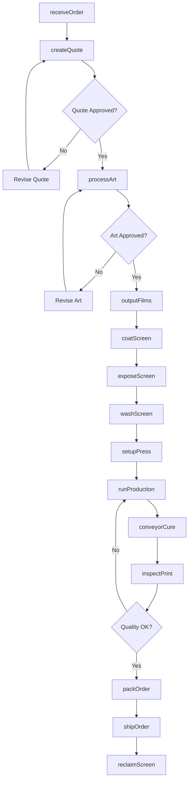
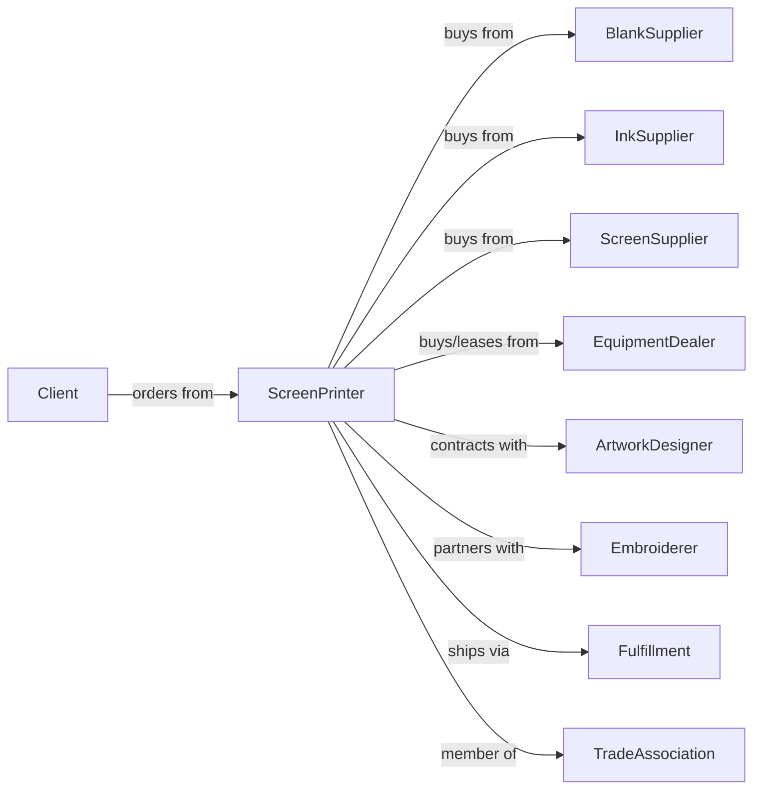

# Commercial Screen Printing

> Business-as-Code definition for commercial screen printing operations. Models the complete workflow from artwork to finished printed products on various substrates.

## Overview

This U.S. industry comprises establishments primarily engaged in screen printing without publishing (except books, fabric grey goods, and manifold business forms). This industry includes establishments engaged in screen printing on purchased stock materials, such as stationery, invitations, labels, and similar items, on a job-order basis. Establishments primarily engaged in printing on apparel and textile products, such as T-shirts, caps, jackets, towels, and napkins, are included in this industry.

## Actors

| Actor | Description |
|-------|-------------|
| Client | Business or individual ordering screen-printed products |
| BlankSupplier | Provides unprinted garments, promotional items, and substrates |
| InkSupplier | Provides plastisol, water-based, and specialty screen printing inks |
| ScreenSupplier | Provides mesh, frames, and emulsion materials |
| EquipmentDealer | Sells and services presses, dryers, and exposure units |
| ArtworkDesigner | Creates vector artwork and separations for printing |
| Embroiderer | Provides complementary decoration services |
| Fulfillment | Handles warehousing and individual order shipping |
| TradeAssociation | Provides industry standards and certification |

## Roles

| Role | Description |
|------|-------------|
| ShopOwner | Owns the business and manages growth strategy |
| ProductionManager | Schedules jobs and oversees floor operations |
| ScreenPrinter | Operates manual or automatic screen printing presses |
| ArtDepartment | Prepares artwork, creates separations, and burns screens |
| ScreenMaker | Coats, exposes, and reclaims screens |
| Catcher | Removes printed items from press and stages for curing |
| QualityChecker | Inspects prints for registration, coverage, and defects |
| PackingCrew | Folds, bags, and boxes finished orders |
| SalesRep | Manages client relationships and generates quotes |

## Entities

| Entity | Description |
|--------|-------------|
| PrintOrder | A job with quantity, colors, and specifications |
| Screen | Mesh frame with stencil for ink transfer |
| Ink | Plastisol, water-based, or specialty ink |
| Substrate | Garment or item receiving the print |
| Artwork | Digital design file ready for separation |
| Separation | Individual color layers for multi-color prints |
| Registration | Alignment of multiple colors in a design |
| Pallet | Platen on press that holds substrate |
| Dryer | Conveyor or flash unit for curing ink |
| Squeegee | Blade that pushes ink through screen mesh |

## Actions

| Action | Description |
|--------|-------------|
| receiveOrder | Accept job specifications and artwork from client |
| createQuote | Calculate pricing based on colors, quantity, and complexity |
| processArt | Prepare artwork and create color separations |
| outputFilms | Print separations on transparency film |
| coatScreen | Apply emulsion to mesh screen |
| exposeScreen | Use UV light to create stencil from film |
| washScreen | Develop exposed screen and remove unexposed emulsion |
| setupPress | Mount screens, mix inks, and register colors |
| runProduction | Print order on automatic or manual press |
| flashCure | Partially cure between colors on press |
| conveyorCure | Fully cure prints in conveyor dryer |
| inspectPrint | Check for coverage, registration, and defects |
| packOrder | Fold, count, and package finished items |
| reclaimScreen | Strip and clean screens for reuse |
| shipOrder | Deliver finished order to client or fulfillment |

## Events

| Event | Description |
|-------|-------------|
| orderReceived | New screen printing order has been logged |
| quoteAccepted | Client has approved pricing and terms |
| artApproved | Client has approved artwork proof |
| screensPrepared | All screens burned and prepared for press |
| pressSetUp | Press configured and test prints approved |
| productionStarted | Print run has begun |
| productionCompleted | All items have been printed |
| cureCompleted | All prints have passed through dryer |
| qualityApproved | Order passed quality inspection |
| orderPacked | Items counted and packaged |
| orderShipped | Shipment dispatched to client |
| screenReclaimed | Screens cleaned and returned to inventory |

## Searches

| Search | Description |
|--------|-------------|
| findOrders | List orders by status, client, or due date |
| checkBlanks | Query inventory of garments and substrates |
| getInkStock | Check ink colors and quantities on hand |
| findScreens | List available screens by mesh count |
| getPressSchedule | View press assignments and availability |
| getOrderStatus | Check production status of specific order |
| findReorders | List past orders eligible for repeat production |

## Workflow

## Actor Relationships

