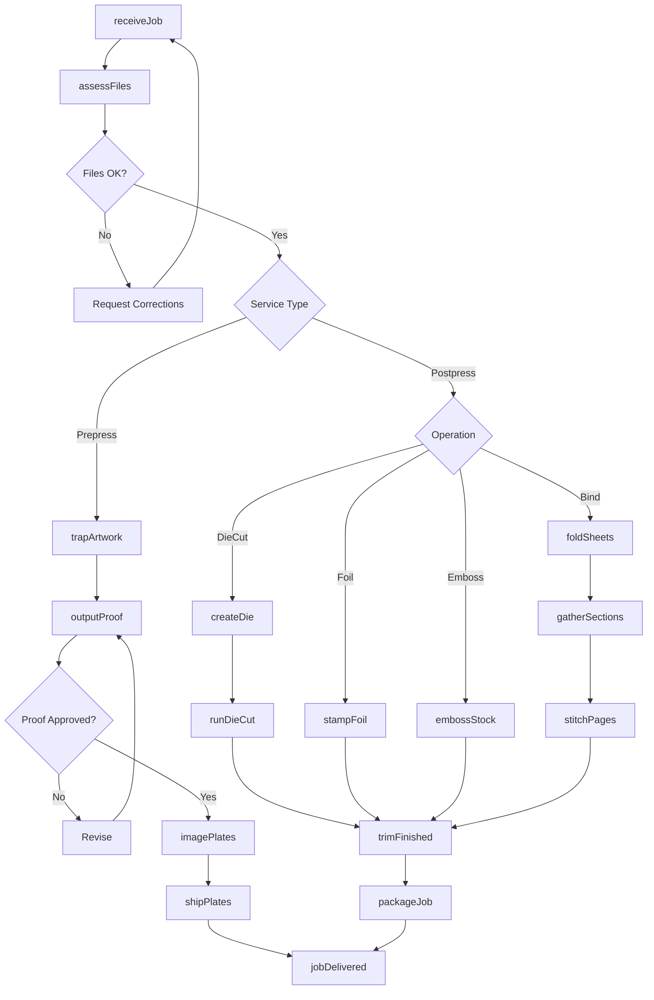
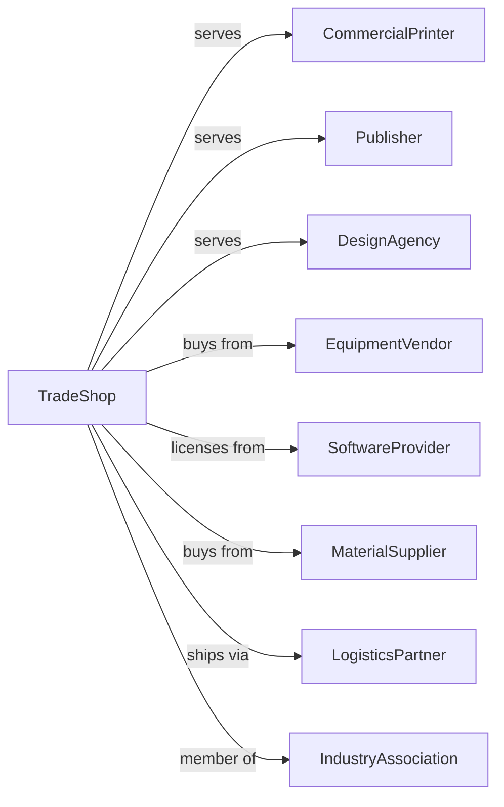

# Support Activities for Printing

> Business-as-Code definition for prepress and postpress service operations. Models specialized trade services supporting the printing industry from file preparation through finishing.

## Overview

This industry comprises establishments primarily engaged in performing prepress and postpress services in support of printing activities. Prepress services may include such things as platemaking, typesetting, trade binding, and sample mounting. Postpress services include such things as book or paper bronzing, die cutting, edging, embossing, folding, gilding, gluing, and indexing.

## Actors

| Actor | Description |
|-------|-------------|
| CommercialPrinter | Print shop outsourcing specialized services |
| Publisher | Book or periodical publisher requiring binding services |
| DesignAgency | Creative firm needing proofs and color management |
| EquipmentVendor | Supplies specialized prepress and finishing equipment |
| SoftwareProvider | Provides RIP software, color management, and workflow tools |
| MaterialSupplier | Provides plates, films, dies, foils, and specialty materials |
| LogisticsPartner | Handles pickup and delivery between print facilities |
| IndustryAssociation | Provides standards and certification programs |

## Roles

| Role | Description |
|------|-------------|
| ShopOwner | Owns the trade service business |
| ProductionManager | Schedules jobs and manages workflow |
| PrePressOperator | Operates imaging, proofing, and platemaking equipment |
| ColorSpecialist | Manages color profiles and press matching |
| DieOperator | Sets up and runs die cutting equipment |
| FoilOperator | Operates hot stamping and foil machinery |
| BinderyOperator | Runs folding, stitching, and binding equipment |
| QualityTechnician | Inspects work against specifications |
| CustomerCoordinator | Manages client communications and job tracking |

## Entities

| Entity | Description |
|--------|-------------|
| TradeJob | Service order with specifications and deadline |
| DigitalFile | Client artwork or print-ready file |
| Plate | Printing plate imaged from digital file |
| Proof | Color-accurate representation for approval |
| Die | Custom cutting tool for specific shape |
| FoilStamp | Metallic or pigmented foil design element |
| Emboss | Raised or debossed pattern on substrate |
| Fold | Specific folding pattern for piece |
| Bind | Assembly method for multi-page documents |
| Substrate | Paper or material being processed |

## Actions

| Action | Description |
|--------|-------------|
| receiveJob | Accept trade job from printer or client |
| assessFiles | Review submitted files for completeness |
| trapArtwork | Apply trapping for accurate color registration |
| outputProof | Generate contract proof for color approval |
| imagePlates | Expose plates using CTP or CTF technology |
| shipPlates | Deliver plates to printer |
| createDie | Design and produce custom cutting die |
| runDieCut | Cut sheets using steel rule die |
| stampFoil | Apply metallic or pigmented foil |
| embossStock | Create raised or debossed impressions |
| foldSheets | Fold printed sheets to specification |
| gatherSections | Collate multiple components in sequence |
| stitchPages | Bind with wire staples or thread |
| perfectBind | Glue bind pages with cover |
| trimFinished | Cut to final dimensions |
| packageJob | Prepare completed work for pickup or delivery |

## Events

| Event | Description |
|-------|-------------|
| jobReceived | Trade job logged into system |
| filesAssessed | File review completed |
| proofApproved | Color proof signed off by client |
| platesImaged | Printing plates completed |
| platesShipped | Plates delivered to printer |
| dieCreated | Custom die manufactured |
| dieCutCompleted | Die cutting operation finished |
| foilStamped | Foil stamping completed |
| embossed | Embossing operation finished |
| folded | Folding completed |
| gathered | Sections collated |
| bound | Binding completed |
| trimmed | Final trim completed |
| jobPackaged | Work ready for delivery |
| jobDelivered | Work delivered to client |

## Searches

| Search | Description |
|--------|-------------|
| findJobs | List jobs by client, type, or status |
| getPlateQueue | View platemaking schedule and backlog |
| getDieInventory | Search existing dies by client or shape |
| getProofQueue | List proofs awaiting approval |
| findBinderyJobs | List binding jobs by method or deadline |
| checkEquipment | View equipment availability and scheduling |
| getJobHistory | Retrieve past jobs for client |

## Workflow

## Actor Relationships

