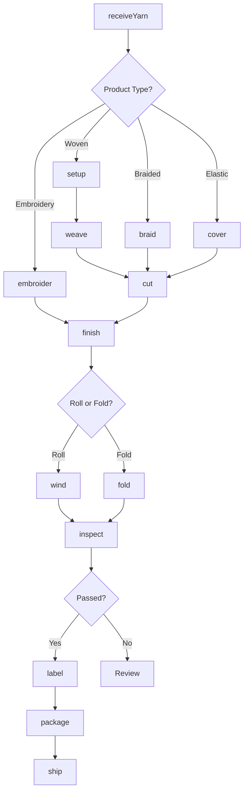
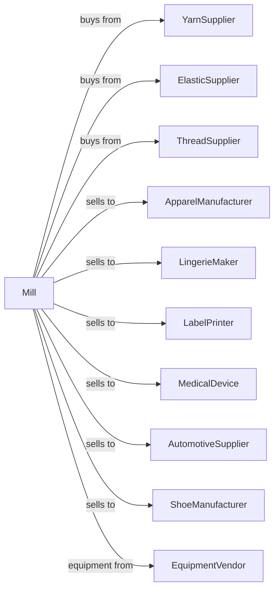

# Narrow Fabric Mills and Schiffli Machine Embroidery

> Business-as-Code definition for narrow fabric and embroidery manufacturing operations. Models weaving and braiding of ribbons, tapes, elastic webbing, labels, and machine embroidery production.

## Overview

This industry comprises establishments primarily engaged in weaving or braiding narrow fabrics in their final form or initially made in wider widths that are specially constructed for narrower widths, making fabric-covered elastic yarn and thread, and manufacturing Schiffli machine embroideries. This definition exposes actions for narrow weaving, braiding, and embroidery production.

## Actors

| Actor | Description |
|-------|-------------|
| YarnSupplier | Provides yarns for narrow weaving |
| ElasticSupplier | Supplies rubber and spandex threads |
| ThreadSupplier | Provides embroidery threads |
| ApparelManufacturer | Purchases trims and labels |
| LingerieMaker | Uses elastic and lace for intimate apparel |
| LabelPrinter | Adds printing to woven labels |
| MedicalDevice | Uses narrow fabrics for straps and supports |
| AutomotiveSupplier | Purchases seatbelt webbing |
| ShoeManufacturer | Uses narrow fabrics for laces and straps |
| EquipmentVendor | Supplies narrow looms and embroidery machines |

## Roles

| Role | Description |
|------|-------------|
| MillManager | Oversees narrow fabric production |
| WeavingMaster | Manages narrow loom operations |
| QualityManager | Ensures products meet specifications |
| LoomOperator | Runs narrow and label looms |
| BraidingOperator | Operates braiding machines |
| EmbroideryOperator | Runs Schiffli embroidery machines |
| Finisher | Applies finishing and cutting |
| DesignTechnician | Programs patterns and designs |

## Entities

| Entity | Description |
|--------|-------------|
| Ribbon | Decorative narrow woven fabric |
| Tape | Functional narrow woven strip |
| Webbing | Strong woven strap material |
| Elastic | Stretchable narrow fabric |
| Label | Woven identification tag |
| Braid | Interlaced narrow fabric |
| Embroidery | Schiffli-produced lace and trim |
| Pattern | Design for narrow fabric or embroidery |
| Roll | Package of narrow fabric |
| Lot | Traceable production batch |

## Actions

| Action | Description |
|--------|-------------|
| receiveYarn | Accept and test incoming materials |
| setup | Thread and configure narrow loom |
| weave | Produce narrow woven fabric |
| braid | Interlace yarns for braided products |
| embroider | Create Schiffli embroidery |
| cover | Apply fabric covering to elastic yarn |
| cut | Separate individual pieces from production |
| finish | Apply final treatments |
| fold | Crease for flat packaging |
| wind | Roll onto spools or reels |
| inspect | Check quality and dimensions |
| label | Tag products with identification |
| package | Prepare for shipment |
| ship | Dispatch to customers |

## Events

| Event | Description |
|-------|-------------|
| yarnReceived | Materials tested and accepted |
| loomSetUp | Machine configured for production |
| fabricWoven | Narrow fabric produced |
| fabricBraided | Braided product completed |
| embroideryCompleted | Schiffli embroidery finished |
| elasticCovered | Covered elastic yarn produced |
| productCut | Individual pieces separated |
| productFinished | Final treatments applied |
| qualityApproved | Product passed inspection |
| qualityFailed | Product failed specifications |
| orderPackaged | Products prepared for shipment |
| orderShipped | Products dispatched to customer |

## Searches

| Search | Description |
|--------|-------------|
| findMaterials | List yarn and thread inventory |
| getInventory | Check finished goods stock |
| getOrders | Retrieve orders by customer or product |
| getMachineSchedule | View loom and machine assignments |
| getPatterns | List available designs |
| getQualityReports | Retrieve inspection data |
| findCustomers | List customers by product type |
| getProductionSchedule | View planned production runs |

## Workflow



## Actor Relationships



## Usage

### Calling Actions

```typescript
import { weaveNarrowFabric } from '@headlessly/weave-narrow-fabric'

const mill = weaveNarrowFabric()

// Set up for label weaving
await mill.setup({
  loom: 'jacquard-narrow-8',
  pattern: 'brand-label-001',
  width: 20,
  unit: 'mm',
  warpYarn: 'polyester-white',
  weftYarn: 'polyester-black'
})

// Weave woven labels
const labels = await mill.weave({
  loomId: 'jacquard-narrow-8',
  quantity: 50000,
  unit: 'pieces'
})

await mill.cut({
  lotId: labels.lotId,
  cutLength: 45,
  foldType: 'center-fold'
})
```

### Event-Driven Automation

```typescript
// Auto-finish based on product type
mill.fabricWoven(async ({ lotId, productType }) => {
  if (productType === 'label') {
    await mill.cut({
      lotId,
      method: 'hot-knife'
    })
  } else if (productType === 'ribbon') {
    await mill.finish({
      lotId,
      treatment: 'heat-seal-edge'
    })
  }
})

// Auto-package when inspection passes
mill.qualityApproved(async ({ lotId, productType }) => {
  const orders = await mill.getOrders({ lotId })

  await mill.package({
    lotId,
    orderId: orders[0].id,
    packagingType: productType === 'elastic' ? 'spool' : 'poly-bag'
  })
})
```
