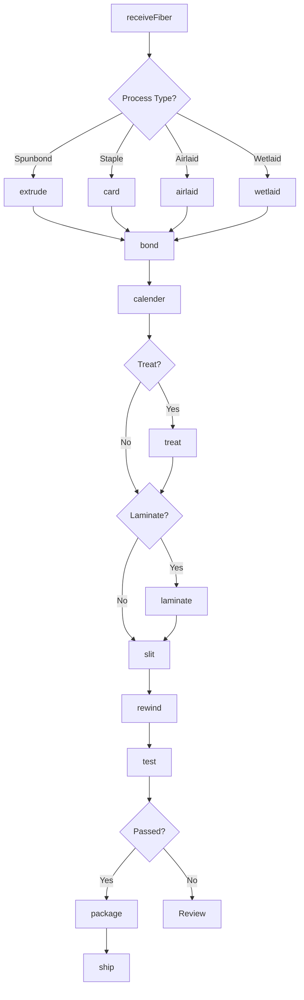
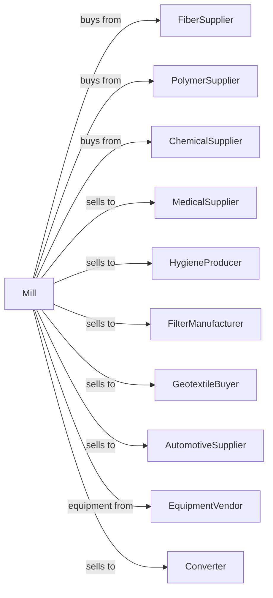

# Nonwoven Fabric Mills

> Business-as-Code definition for nonwoven fabric manufacturing operations. Models production of bonded fabrics for medical, hygiene, filtration, and industrial applications using mechanical, thermal, or chemical bonding.

## Overview

This industry comprises establishments primarily engaged in manufacturing nonwoven fabrics and felts. Processes used include bonding and/or interlocking fibers by mechanical, chemical, thermal, or solvent means, or by combinations thereof. This definition exposes actions for web formation, bonding, finishing, and converting nonwoven materials.

## Actors

| Actor | Description |
|-------|-------------|
| FiberSupplier | Provides staple fibers and filaments |
| PolymerSupplier | Supplies polypropylene and polyester chips |
| ChemicalSupplier | Provides binders, additives, and finishes |
| MedicalSupplier | Purchases materials for gowns, drapes, and masks |
| HygieneProducer | Uses materials for diapers and wipes |
| FilterManufacturer | Purchases filtration media |
| GeotextileBuyer | Uses materials for construction and erosion control |
| AutomotiveSupplier | Purchases interior and insulation materials |
| EquipmentVendor | Supplies web forming and bonding equipment |
| Converter | Purchases rolls for further processing |

## Roles

| Role | Description |
|------|-------------|
| PlantManager | Oversees nonwoven production |
| ProcessEngineer | Optimizes web forming and bonding |
| QualityManager | Ensures product specifications |
| ExtrusionOperator | Controls spunbond and meltblown lines |
| CardingOperator | Runs staple fiber web formation |
| BondingOperator | Controls thermal, chemical, or mechanical bonding |
| ConvertingOperator | Runs slitting and rewinding equipment |
| LabTechnician | Tests material properties |

## Entities

| Entity | Description |
|--------|-------------|
| Fiber | Staple or filament raw material |
| Web | Unbonded fiber structure |
| Spunbond | Continuous filament nonwoven |
| Meltblown | Fine fiber nonwoven for filtration |
| Needlepunch | Mechanically bonded nonwoven |
| Thermalbond | Heat-fused nonwoven |
| SMS | Spunbond-meltblown-spunbond composite |
| Roll | Package of nonwoven fabric |
| Specification | Customer requirements for properties |
| Lot | Traceable production batch |

## Actions

| Action | Description |
|--------|-------------|
| receiveFiber | Accept and test incoming fiber or polymer |
| extrude | Melt polymer and form filaments |
| card | Form web from staple fibers |
| airlaid | Form web using air deposition |
| wetlaid | Form web using water suspension |
| bond | Join fibers using heat, chemicals, or needles |
| calender | Smooth and densify fabric |
| treat | Apply hydrophilic or hydrophobic finishes |
| laminate | Combine multiple nonwoven layers |
| slit | Cut rolls to specified width |
| rewind | Transfer to customer-specified rolls |
| test | Analyze weight, strength, and properties |
| package | Prepare rolls for shipment |
| ship | Dispatch to customers |

## Events

| Event | Description |
|-------|-------------|
| fiberReceived | Fiber or polymer tested and accepted |
| webFormed | Unbonded web created |
| webBonded | Fibers joined to form fabric |
| fabricCalendered | Surface smoothed |
| fabricTreated | Finish applied |
| fabricLaminated | Layers combined |
| fabricSlit | Rolls cut to width |
| rollRewound | Transfer completed |
| qualityApproved | Fabric passed testing |
| qualityFailed | Fabric failed specifications |
| orderShipped | Fabric dispatched to customer |

## Searches

| Search | Description |
|--------|-------------|
| findFiberLots | List fiber and polymer inventory |
| getInventory | Check nonwoven stock by grade |
| getOrders | Retrieve orders by customer or product |
| getLineStatus | View production line status |
| getSpecifications | List product specifications |
| getQualityReports | Retrieve test results |
| getProductionSchedule | View planned production |
| findApplications | List products by end use |

## Workflow



## Actor Relationships



## Usage

### Calling Actions

```typescript
import { bondNonwovenFabric } from '@headlessly/bond-nonwoven-fabric'

const mill = bondNonwovenFabric()

// Produce spunbond-meltblown-spunbond (SMS)
const spunbond = await mill.extrude({
  polymer: 'polypropylene',
  process: 'spunbond',
  basisWeight: 25,
  unit: 'gsm'
})

const meltblown = await mill.extrude({
  polymer: 'polypropylene',
  process: 'meltblown',
  basisWeight: 20,
  fiberDiameter: 2,
  unit: 'microns'
})

await mill.laminate({
  layers: [spunbond.lotId, meltblown.lotId, spunbond.lotId],
  bondMethod: 'thermal'
})
```

### Event-Driven Automation

```typescript
// Auto-treat based on application
mill.webBonded(async ({ lotId, application }) => {
  if (application === 'medical') {
    await mill.treat({
      lotId,
      treatment: 'hydrophobic',
      antistatic: true
    })
  } else if (application === 'wipes') {
    await mill.treat({
      lotId,
      treatment: 'hydrophilic',
      lotion: true
    })
  }
})

// Auto-slit to customer specifications
mill.fabricTreated(async ({ lotId }) => {
  const orders = await mill.getOrders({ lotId })
  const spec = await mill.getSpecifications({ orderId: orders[0].id })

  await mill.slit({
    lotId,
    widths: spec.rollWidths,
    cores: spec.coreSize
  })
})
```
