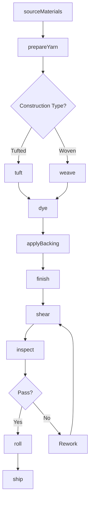
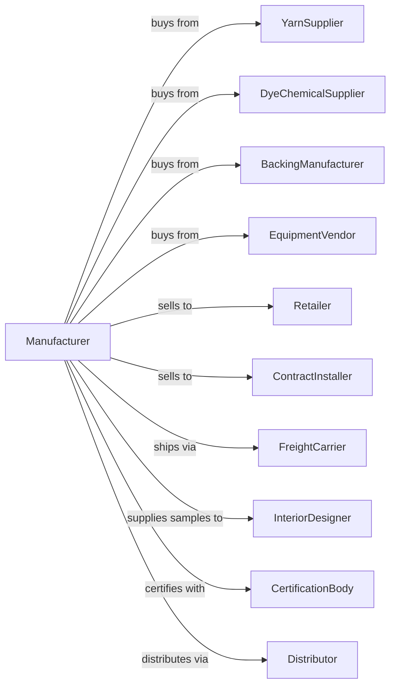

# Carpet and Rug Mills

> Business-as-Code definition for carpet and rug manufacturing operations. Models the complete production lifecycle from yarn preparation through finishing and distribution.

## Overview

This industry comprises establishments primarily engaged in (1) manufacturing woven, tufted, and other carpets and rugs, such as art squares, floor mattings, needlepunch carpeting, and door mats and mattings, from textile materials or from twisted paper, grasses, reeds, sisal, jute, or rags and/or (2) finishing carpets and rugs.

## Actors

| Actor | Description |
|-------|-------------|
| YarnSupplier | Provides synthetic and natural yarns for carpet construction |
| DyeChemicalSupplier | Supplies dyes, stain treatments, and finishing chemicals |
| BackingManufacturer | Provides primary and secondary backing materials |
| EquipmentVendor | Sells and services tufting, weaving, and finishing machinery |
| Retailer | Purchases carpets for resale to consumers |
| ContractInstaller | Buys commercial carpet for installation projects |
| InteriorDesigner | Specifies carpet for commercial and residential projects |
| Distributor | Warehouses and distributes carpet to regional markets |
| FreightCarrier | Transports raw materials and finished goods |
| CertificationBody | Provides sustainability and quality certifications |

## Roles

| Role | Description |
|------|-------------|
| PlantManager | Oversees daily manufacturing operations and production schedules |
| TuftingOperator | Operates tufting machines to construct carpet face |
| DyeTechnician | Manages dyeing processes and color consistency |
| QualityInspector | Tests carpet for pile weight, density, and defects |
| PatternDesigner | Creates carpet patterns and color combinations |
| MaintenanceTechnician | Maintains and repairs production equipment |
| WarehouseManager | Manages inventory and shipping logistics |
| ProductionPlanner | Schedules manufacturing runs and material requirements |

## Entities

| Entity | Description |
|--------|-------------|
| Carpet | The finished floor covering product |
| Yarn | Fiber material used for carpet face construction |
| Backing | Primary and secondary layers providing structure |
| Dye | Coloring agents applied to yarn or finished carpet |
| Pattern | Design specification for carpet construction |
| Loom | Weaving equipment for woven carpet production |
| TuftingMachine | Equipment that inserts yarn into backing |
| Roll | Standard unit of finished carpet inventory |
| Sample | Cut piece used for customer selection |
| Batch | Production lot with consistent specifications |

## Actions

| Action | Description |
|--------|-------------|
| sourceMaterials | Procure yarn, backing, and chemicals from suppliers |
| prepareYarn | Wind, twist, and heat-set yarn for tufting or weaving |
| tuft | Insert yarn loops into primary backing using tufting machines |
| weave | Interlace yarns on looms to create woven carpet |
| dye | Apply color using solution dyeing, beck dyeing, or continuous methods |
| applyBacking | Bond secondary backing for dimensional stability |
| finish | Apply stain resistance, antimicrobial, or other treatments |
| shear | Trim pile to uniform height and texture |
| inspect | Test for defects, color consistency, and specifications |
| roll | Wind finished carpet onto rolls for shipping |
| cut | Trim carpet to customer specifications |
| ship | Transport finished goods to customers or distribution centers |
| sample | Create and distribute samples to designers and retailers |

## Events

| Event | Description |
|-------|-------------|
| materialsReceived | Raw materials arrived at facility |
| yarnPrepared | Yarn ready for carpet construction |
| carpetTufted | Tufting operation completed |
| carpetWoven | Weaving operation completed |
| dyeingCompleted | Color application finished |
| backingApplied | Secondary backing attached |
| finishingCompleted | Surface treatments applied |
| inspectionPassed | Quality control approved product |
| inspectionFailed | Quality control identified defects |
| orderReceived | Customer purchase order entered |
| orderShipped | Finished goods dispatched to customer |
| sampleRequested | Design sample order placed |

## Searches

| Search | Description |
|--------|-------------|
| findProducts | List carpet products by style, color, or construction type |
| getInventory | Retrieve current stock levels by product and location |
| findOrders | List orders with filters for customer, status, or date |
| getProductionSchedule | View scheduled manufacturing runs and capacity |
| findSuppliers | List approved vendors by material type |
| getQualityMetrics | Retrieve defect rates and inspection results |
| findSamples | Locate sample inventory by pattern and color |
| getPricing | Get current pricing and volume discounts |

## Workflow



## Actor Relationships



## Usage

### Calling Actions

```typescript
import { millCarpetRug } from '@headlessly/mill-carpet-rug'

const mill = millCarpetRug()

// Check available stock
const stock = await mill.findProducts({ status: 'available' })

// Check finished goods inventory
const inventory = await mill.getInventory({ lowStockOnly: true })

// Produce tufted commercial carpet
const materials = await mill.sourceMaterials({
  yarn: { type: 'nylon-6', color: 'solution-dyed-blue', quantity: 5000, unit: 'pounds' },
  backing: { type: 'polypropylene', quantity: 10000, unit: 'yards' }
})

await mill.prepareYarn({
  batchId: materials.batchId,
  process: 'heat-set',
  twist: 4.5,
  unit: 'turns-per-inch'
})

await mill.tuft({
  batchId: materials.batchId,
  gauge: '1/10',
  pileHeight: 0.25,
  unit: 'inches',
  pattern: 'level-loop'
})

await mill.applyBacking({
  batchId: materials.batchId,
  backingType: 'action-back',
  adhesive: 'latex'
})

await mill.finish({
  batchId: materials.batchId,
  treatments: ['stain-resist', 'antimicrobial'],
  warranty: '10-year'
})
```

### Event-Driven Automation

```typescript
// Auto-inspect after finishing
mill.finishingCompleted(async ({ batchId }) => {
  await mill.shear({
    batchId,
    method: 'rotary',
    tolerance: 0.01,
    unit: 'inches'
  })

  await mill.inspect({
    batchId,
    tests: ['pile-weight', 'tuft-bind', 'color-match']
  })
})

// Auto-roll after passing inspection
mill.inspectionPassed(async ({ batchId, style }) => {
  await mill.roll({
    batchId,
    rollWidth: 12,
    unit: 'feet',
    labeling: 'barcode'
  })
})

// Alert on quality failure
mill.inspectionFailed(async ({ batchId, defectType, location }) => {
  await mill.alertQuality({
    batchId,
    issue: `${defectType} detected at ${location}`,
    action: 'hold-for-review'
  })
})
```
