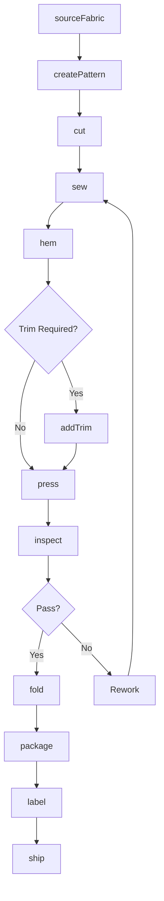
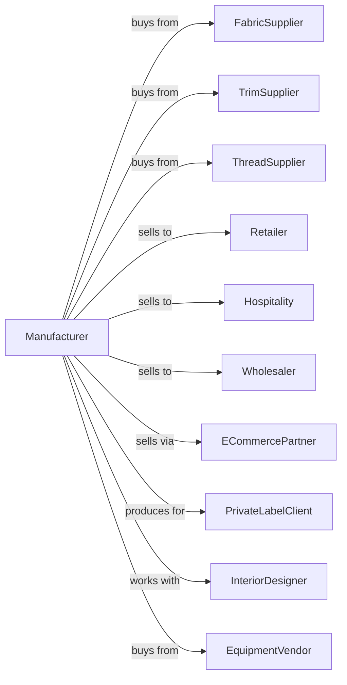

# Curtain and Linen Mills

> Business-as-Code definition for curtain and household linen manufacturing operations. Models the complete production lifecycle from fabric sourcing through finished home textile products.

## Overview

This industry comprises establishments primarily engaged in manufacturing household textile products, such as curtains, draperies, linens, bedspreads, sheets, tablecloths, towels, and shower curtains, from purchased materials. The household textile products may be made on a stock or custom basis for sale to individual retail customers.

## Actors

| Actor | Description |
|-------|-------------|
| FabricSupplier | Provides woven and knit fabrics for product manufacturing |
| TrimSupplier | Supplies decorative trims, tassels, and hardware |
| ThreadSupplier | Provides sewing threads and embroidery materials |
| EquipmentVendor | Sells and services cutting, sewing, and finishing equipment |
| Retailer | Purchases finished goods for resale to consumers |
| Hospitality | Hotels and restaurants requiring commercial linens |
| InteriorDesigner | Specifies custom window treatments and linens |
| Wholesaler | Distributes products to regional retail markets |
| ECommercePartner | Online platforms selling home textiles |
| PrivateLabelClient | Brands requiring contract manufacturing |

## Roles

| Role | Description |
|------|-------------|
| ProductionManager | Oversees manufacturing operations and schedules |
| CuttingOperator | Operates cutting equipment to prepare fabric pieces |
| SewingOperator | Assembles products using industrial sewing machines |
| QualityInspector | Examines finished products for defects and specifications |
| PatternMaker | Creates cutting patterns and product specifications |
| PackagingWorker | Folds, tags, and packages finished products |
| CustomOrderSpecialist | Processes special orders with custom dimensions |
| InventoryManager | Manages raw material and finished goods inventory |

## Entities

| Entity | Description |
|--------|-------------|
| Curtain | Window covering product with various styles and headings |
| Drapery | Lined or unlined decorative window treatment |
| Sheet | Bed covering in various sizes and thread counts |
| Towel | Bath, hand, or kitchen absorbent textile product |
| Bedspread | Decorative bed covering product |
| Tablecloth | Dining table covering in various sizes |
| ShowerCurtain | Waterproof or water-resistant bath product |
| Fabric | Base material used for product construction |
| Pattern | Cutting and assembly template for products |
| Order | Customer purchase specification |

## Actions

| Action | Description |
|--------|-------------|
| sourceFabric | Procure fabrics and materials from approved suppliers |
| createPattern | Develop cutting patterns for new or custom products |
| cut | Cut fabric to pattern specifications using automated or manual methods |
| sew | Assemble product components using industrial sewing equipment |
| hem | Finish edges with appropriate hem techniques |
| addTrim | Attach decorative elements and hardware |
| press | Iron and shape products for finished appearance |
| inspect | Examine products for quality and specification compliance |
| fold | Prepare products for packaging |
| package | Place products in retail or shipping packaging |
| label | Apply care labels, brand tags, and pricing |
| ship | Transport finished goods to customers |
| customSize | Manufacture products to custom dimensions |

## Events

| Event | Description |
|-------|-------------|
| fabricReceived | Raw fabric delivered to facility |
| patternCreated | New cutting pattern developed and approved |
| batchCut | Cutting operation completed for production batch |
| sewingCompleted | Assembly operation finished |
| qualityApproved | Product passed inspection |
| qualityRejected | Product failed inspection |
| orderReceived | Customer purchase order entered |
| customOrderPlaced | Special size or style order submitted |
| productionScheduled | Manufacturing run assigned to production line |
| orderShipped | Finished goods dispatched to customer |
| inventoryDepleted | Stock fell below threshold |

## Searches

| Search | Description |
|--------|-------------|
| findProducts | List products by category, size, or style |
| getInventory | Retrieve stock levels by product and location |
| findOrders | List orders by customer, status, or date range |
| getFabricStock | Check raw material availability |
| findCustomOrders | List pending custom dimension orders |
| getProductionCapacity | View available manufacturing capacity |
| findSuppliers | List approved vendors by material type |
| getPricing | Retrieve wholesale and retail pricing |

## Workflow



## Actor Relationships



## Usage

### Calling Actions

```typescript
import { millCurtainLinen } from '@headlessly/mill-curtain-linen'

const mill = millCurtainLinen()

// Check available stock
const stock = await mill.findProducts({ status: 'available' })

// Check finished goods inventory
const inventory = await mill.getInventory({ lowStockOnly: true })

// Produce hotel bed sheet sets
const fabric = await mill.sourceFabric({
  supplier: 'premium-textiles',
  material: 'egyptian-cotton',
  threadCount: 400,
  width: 110,
  unit: 'inches',
  quantity: 2000,
  yardUnit: 'yards'
})

await mill.createPattern({
  productType: 'fitted-sheet',
  sizes: ['twin', 'full', 'queen', 'king'],
  pocketDepth: 15,
  unit: 'inches'
})

await mill.cut({
  batchId: fabric.batchId,
  pattern: 'fitted-sheet-queen',
  quantity: 500
})

await mill.sew({
  batchId: fabric.batchId,
  seamType: 'french',
  elastic: 'all-around'
})

await mill.hem({
  batchId: fabric.batchId,
  hemWidth: 4,
  unit: 'inches',
  style: 'double-fold'
})
```

### Event-Driven Automation

```typescript
// Auto-press and fold after sewing
mill.sewingCompleted(async ({ batchId, productType }) => {
  await mill.press({
    batchId,
    temperature: productType.includes('cotton') ? 400 : 300,
    unit: 'fahrenheit'
  })

  await mill.fold({
    batchId,
    style: 'retail-presentation'
  })
})

// Auto-package after inspection
mill.qualityApproved(async ({ batchId, destination }) => {
  const format = destination === 'hospitality' ? 'bulk-poly' : 'retail-zippered'

  await mill.package({
    batchId,
    format,
    insertCard: destination === 'retail'
  })
})

// Handle custom orders
mill.customOrderPlaced(async ({ orderId, dimensions, fabric }) => {
  await mill.customSize({
    orderId,
    width: dimensions.width,
    length: dimensions.length,
    unit: 'inches',
    fabricType: fabric
  })
})
```
