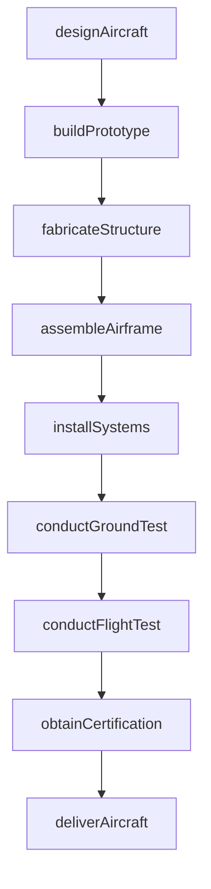
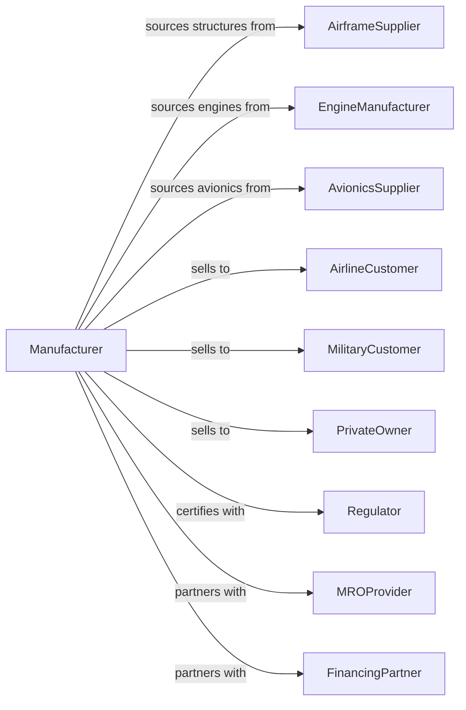

# Aircraft Manufacturing

> Business-as-Code definition for aircraft manufacturing operations. Models the complete production process from design and prototyping through final assembly, certification, and delivery.

## Overview

This U.S. industry comprises establishments primarily engaged in manufacturing or assembling complete aircraft, developing and making aircraft prototypes, aircraft conversion involving major modifications to systems, and complete aircraft overhaul and rebuilding. Products include commercial airliners, business jets, military aircraft, helicopters, general aviation aircraft, and unmanned aerial vehicles.

## Actors

| Actor | Description |
|-------|-------------|
| AirframeSupplier | Provides major structural assemblies and components |
| EngineManufacturer | Supplies aircraft engines and propulsion systems |
| AvionicsSupplier | Provides flight control and navigation systems |
| AirlineCustomer | Purchases aircraft for commercial passenger and cargo operations |
| MilitaryCustomer | Acquires aircraft for defense applications |
| PrivateOwner | Purchases business jets and general aviation aircraft |
| Regulator | FAA or other authority certifying aircraft airworthiness |
| MROProvider | Performs maintenance, repair, and overhaul services |
| FinancingPartner | Provides aircraft financing and leasing |

## Roles

| Role | Description |
|------|-------------|
| ProgramManager | Oversees aircraft development and production program |
| DesignEngineer | Creates aircraft structural and systems designs |
| ProductionManager | Coordinates manufacturing and assembly operations |
| StructuralMechanic | Assembles airframe components and structures |
| SystemsInstaller | Installs avionics, hydraulics, and electrical systems |
| FlightTestEngineer | Plans and analyzes flight test programs |
| TestPilot | Conducts developmental and certification flight tests |
| QualityInspector | Verifies conformance to design and certification requirements |

## Entities

| Entity | Description |
|--------|-------------|
| Aircraft | Complete flying machine including airframe, engines, and systems |
| Airframe | Structural assembly including fuselage, wings, and empennage |
| Fuselage | Main body structure housing crew, passengers, and cargo |
| Wing | Lifting surface providing aerodynamic lift |
| Engine | Propulsion system generating thrust |
| Avionics | Electronic flight control and navigation systems |
| LandingGear | Takeoff and landing support structure |
| TypeCertificate | Regulatory approval for aircraft design |
| ProductionCertificate | Authorization for serial production |
| AirworthinessCertificate | Approval for individual aircraft operation |

## Actions

| Action | Description |
|--------|-------------|
| designAircraft | Create aerodynamic and structural design |
| buildPrototype | Construct test aircraft for certification |
| fabricateStructure | Build fuselage, wing, and empennage sections |
| assembleAirframe | Join major structural assemblies |
| installSystems | Mount engines, avionics, and subsystems |
| conductGroundTest | Perform systems integration and ground testing |
| conductFlightTest | Execute flight test program for certification |
| obtainCertification | Secure type and production certificates |
| deliverAircraft | Complete customer acceptance and delivery |
| performConversion | Execute major modifications to existing aircraft |
| rebuildAircraft | Restore aircraft to original design specifications |

## Events

| Event | Description |
|-------|-------------|
| aircraftDesigned | Design specifications completed and approved |
| prototypeBuilt | Test aircraft completed and ready for testing |
| structureFabricated | Major structural sections completed |
| airframeAssembled | Structural assembly completed |
| systemsInstalled | All aircraft systems mounted |
| groundTestCompleted | Ground testing successfully completed |
| flightTestCompleted | Flight test program completed |
| certificationObtained | Type certificate issued by regulator |
| aircraftDelivered | Aircraft accepted by customer |
| conversionCompleted | Modified aircraft returned to service |
| aircraftRebuilt | Restored aircraft certified airworthy |

## Searches

| Search | Description |
|--------|-------------|
| findOrders | Query production orders by customer or aircraft type |
| getInventory | Check work-in-progress and deliverable aircraft |
| trackProduction | Monitor aircraft through manufacturing stages |
| findSuppliers | List suppliers by system or component |
| getFlightTestData | Retrieve test results and certification status |
| getFleetStatus | Check operator fleet composition and utilization |
| getCertificationStatus | Verify aircraft and component certification |

## Workflow

## Actor Relationships

