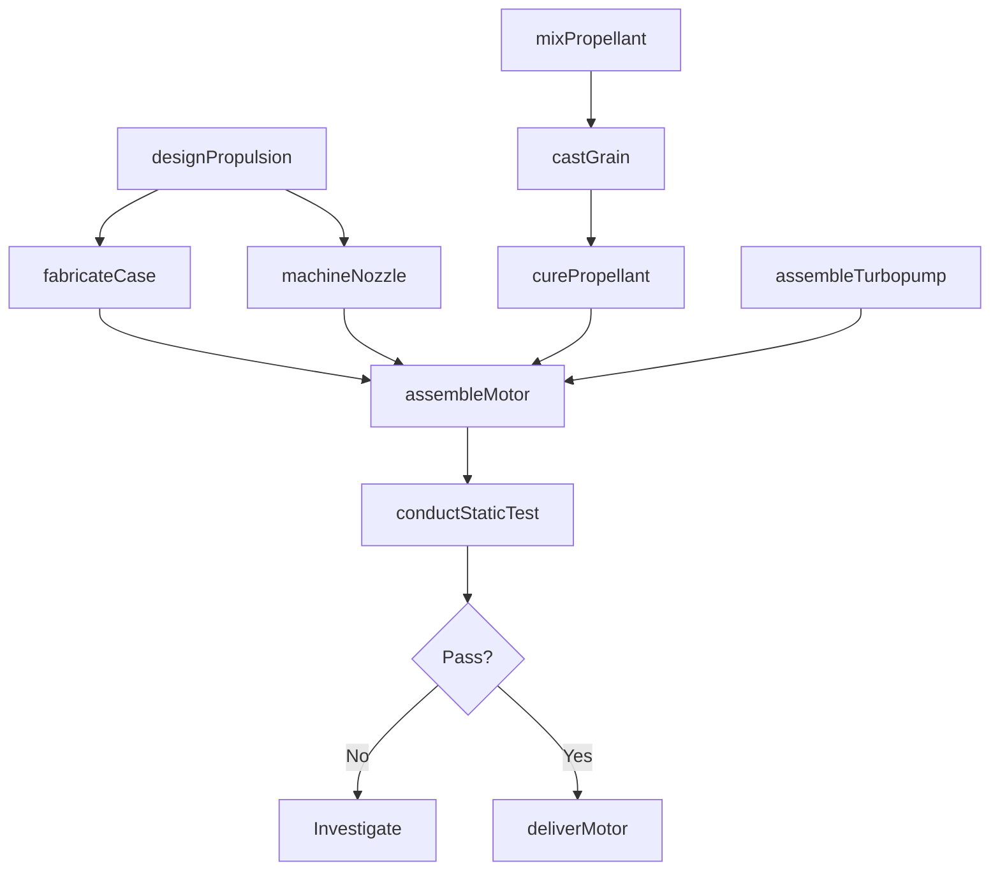
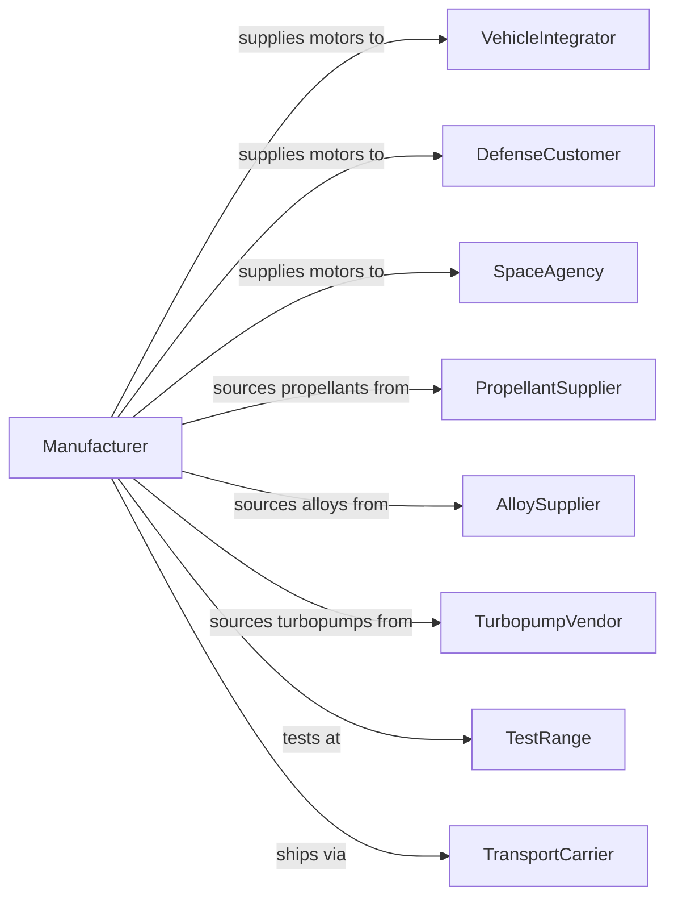

# Guided Missile and Space Vehicle Propulsion Unit and Propulsion Unit Parts Manufacturing

> Business-as-Code definition for rocket motor and space propulsion manufacturing. Models the complete production process from design through fabrication, testing, and delivery.

## Overview

This U.S. industry comprises establishments primarily engaged in manufacturing guided missile and/or space vehicle propulsion units and propulsion unit parts and/or developing and making prototypes of guided missile and space vehicle propulsion units and propulsion unit parts. Products include solid rocket motors, liquid rocket engines, hybrid motors, thrusters, and propulsion components.

## Actors

| Actor | Description |
|-------|-------------|
| VehicleIntegrator | Missile or launch vehicle manufacturer purchasing propulsion |
| DefenseCustomer | Military branch procuring missile motors |
| SpaceAgency | NASA or agency procuring launch propulsion |
| PropellantSupplier | Provides solid propellants and liquid fuels |
| AlloySupplier | Supplies high-temperature metals and composites |
| TurbopumpVendor | Provides turbomachinery for liquid engines |
| Regulator | FAA and range safety authorities |
| TestRange | Provides static fire test facilities |
| TransportCarrier | Handles hazardous material transportation |

## Roles

| Role | Description |
|------|-------------|
| ProgramManager | Oversees propulsion development and production |
| PropulsionEngineer | Designs motors and engine systems |
| ProductionManager | Coordinates manufacturing operations |
| PropellantTechnician | Handles and processes energetic materials |
| MachinistOperator | Fabricates precision propulsion components |
| TestEngineer | Plans and conducts static fire testing |
| QualityInspector | Verifies conformance to specifications |
| SafetyEngineer | Manages explosive and propellant safety |

## Entities

| Entity | Description |
|--------|-------------|
| SolidMotor | Propulsion unit using solid propellant grain |
| LiquidEngine | Propulsion unit using liquid fuel and oxidizer |
| Nozzle | Exhaust component directing thrust |
| Combustor | Chamber where propellant burns |
| Turbopump | Pump assembly feeding liquid propellants |
| Propellant | Fuel and oxidizer materials |
| Case | Structural housing for solid motor propellant |
| Igniter | Device initiating propellant combustion |
| Thruster | Small propulsion unit for attitude control |
| Grain | Shaped solid propellant charge |

## Actions

| Action | Description |
|--------|-------------|
| designPropulsion | Create motor or engine specifications |
| fabricateCase | Build motor case or engine chamber |
| machineNozzle | Fabricate exhaust nozzle components |
| mixPropellant | Blend and process solid propellant |
| castGrain | Pour propellant into motor case |
| curePropellant | Heat cure solid propellant grain |
| assembleTurbopump | Build liquid engine pump assembly |
| assembleMotor | Integrate motor components |
| conductStaticTest | Fire motor on test stand |
| deliverMotor | Ship qualified propulsion unit |

## Events

| Event | Description |
|-------|-------------|
| propulsionDesigned | Design specifications completed |
| caseFabricated | Motor case completed |
| nozzleMachined | Nozzle components completed |
| propellantMixed | Propellant batch prepared |
| grainCast | Propellant poured in case |
| propellantCured | Grain cure completed |
| turbopumpAssembled | Pump assembly completed |
| motorAssembled | Propulsion unit integrated |
| staticTestComplete | Test firing successful |
| motorDelivered | Propulsion unit shipped |

## Searches

| Search | Description |
|--------|-------------|
| findOrders | Query production orders by customer or motor type |
| getInventory | Check motor and component inventory |
| trackProduction | Monitor motors through manufacturing stages |
| findSuppliers | List suppliers by material or component |
| getTestData | Retrieve static test performance data |
| getPropellantLots | Track propellant batch genealogy |
| getQualityMetrics | Retrieve inspection and test data |

## Workflow

## Actor Relationships

