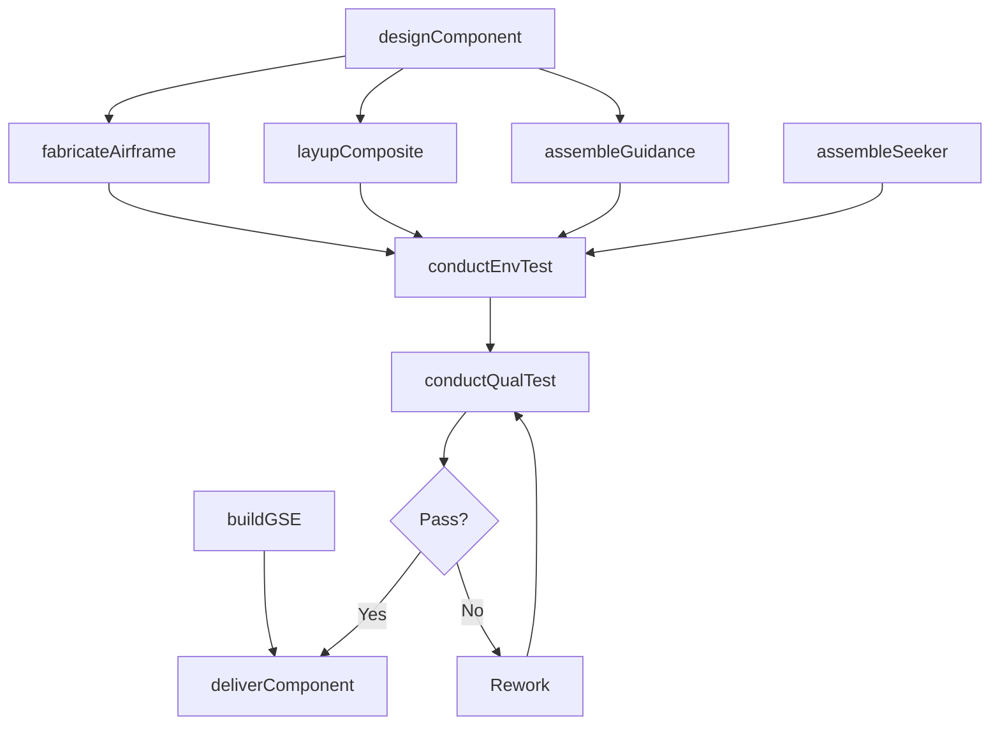
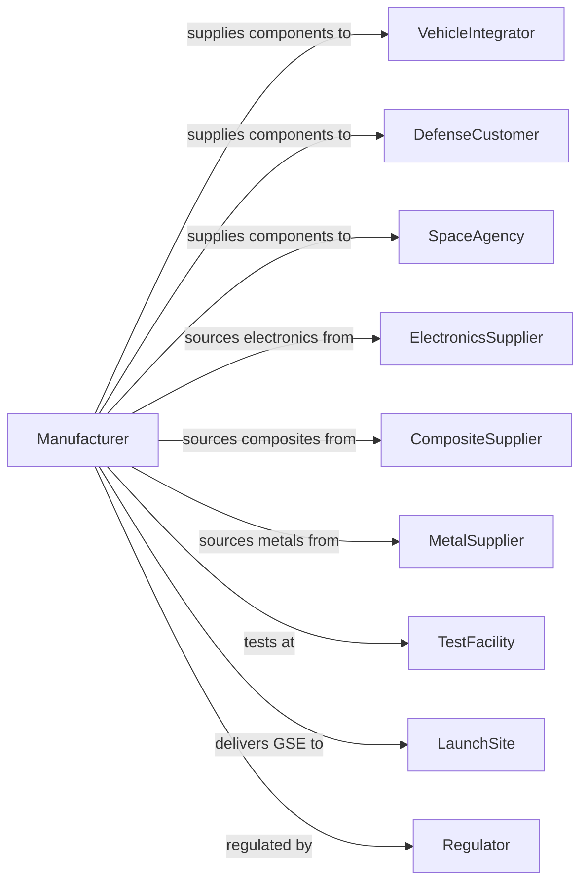

# Other Guided Missile and Space Vehicle Parts and Auxiliary Equipment Manufacturing

> Business-as-Code definition for missile and space vehicle parts and auxiliary equipment manufacturing. Models the complete production process from design through fabrication, testing, and delivery.

## Overview

This U.S. industry comprises establishments primarily engaged in manufacturing guided missile and space vehicle parts and auxiliary equipment (except guided missile and space vehicle propulsion units and propulsion unit parts) and/or developing and making prototypes of guided missile and space vehicle parts and auxiliary equipment. Products include guidance systems, nose cones, airframes, fins, ground support equipment, and payload adapters.

## Actors

| Actor | Description |
|-------|-------------|
| VehicleIntegrator | Missile or space vehicle manufacturer purchasing components |
| DefenseCustomer | Military branch procuring missile system components |
| SpaceAgency | NASA or agency procuring space vehicle parts |
| ElectronicsSupplier | Provides guidance and control electronics |
| CompositeSupplier | Supplies advanced composite materials |
| MetalSupplier | Provides aerospace alloys and specialty metals |
| Regulator | Defense and space regulatory authorities |
| TestFacility | Provides environmental and qualification testing |
| LaunchSite | Receives and integrates ground support equipment |

## Roles

| Role | Description |
|------|-------------|
| ProgramManager | Oversees component development and production |
| SystemsEngineer | Integrates components into vehicle systems |
| DesignEngineer | Creates component specifications and designs |
| ProductionManager | Coordinates manufacturing operations |
| CompositeTechnician | Fabricates composite structures |
| ElectronicsAssembler | Builds guidance and control assemblies |
| TestEngineer | Conducts environmental and qualification testing |
| QualityInspector | Verifies conformance to specifications |

## Entities

| Entity | Description |
|--------|-------------|
| GuidanceUnit | Navigation and flight control assembly |
| NoseCone | Aerodynamic forward structure protecting payload |
| Airframe | Structural body of missile or vehicle |
| Fin | Aerodynamic stabilization surface |
| PayloadAdapter | Interface structure between vehicle and payload |
| SeekingSystem | Target acquisition and tracking assembly |
| GroundSupportEquipment | Equipment for vehicle checkout and launch |
| FlightComputer | Onboard processing for navigation and control |
| Antenna | Communication and telemetry structures |
| HeatShield | Thermal protection for reentry vehicles |

## Actions

| Action | Description |
|--------|-------------|
| designComponent | Create component specifications and drawings |
| fabricateAirframe | Build structural assemblies |
| layupComposite | Construct composite nose cones and structures |
| assembleGuidance | Build guidance and navigation assemblies |
| assembleSeeker | Integrate target acquisition systems |
| buildGSE | Construct ground support equipment |
| conductEnvTest | Perform vibration, thermal, and shock testing |
| conductQualTest | Execute qualification test program |
| deliverComponent | Ship qualified components to customer |
| supportIntegration | Assist vehicle integration and checkout |

## Events

| Event | Description |
|-------|-------------|
| componentDesigned | Design specifications completed |
| airframeFabricated | Structural assembly completed |
| compositeLaidUp | Composite structure completed |
| guidanceAssembled | Guidance unit completed |
| seekerAssembled | Seeker system integrated |
| gseBuilt | Ground support equipment completed |
| envTestCompleted | Environmental testing passed |
| qualTestCompleted | Qualification testing passed |
| componentDelivered | Parts shipped to customer |
| integrationSupported | Vehicle integration assisted |

## Searches

| Search | Description |
|--------|-------------|
| findOrders | Query production orders by customer or component |
| getInventory | Check component and assembly inventory |
| trackProduction | Monitor parts through manufacturing stages |
| findSuppliers | List suppliers by material or component |
| getTestData | Retrieve environmental and qualification test data |
| getDeliverySchedule | Check component delivery timelines |
| getQualityMetrics | Retrieve inspection and conformance data |

## Workflow

## Actor Relationships

