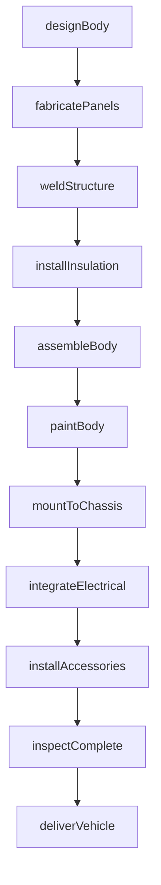
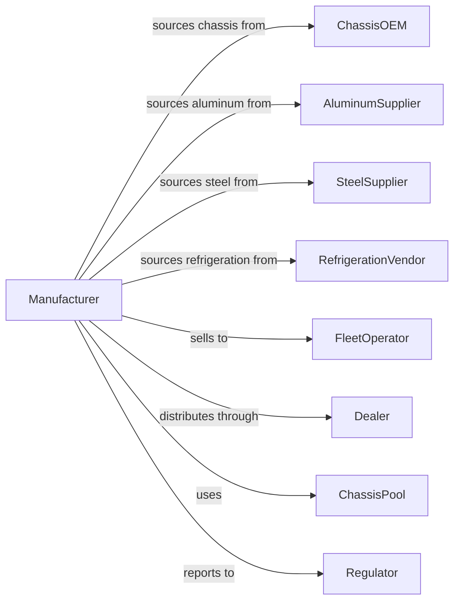

# Motor Vehicle Body Manufacturing

> Business-as-Code definition for truck and bus body manufacturing. Models the complete process from design through fabrication, assembly on chassis, and delivery.

## Overview

This U.S. industry comprises establishments primarily engaged in manufacturing truck and bus bodies and cabs and automobile bodies. The products made may be sold separately or may be assembled on purchased chassis and sold as complete vehicles. Body types include box trucks, refrigerated bodies, dump bodies, utility bodies, school bus bodies, transit bus bodies, and specialty vocational bodies for specific commercial applications.

## Actors

| Actor | Description |
|-------|-------------|
| ChassisOEM | Provides truck or bus chassis for body mounting |
| AluminumSupplier | Provides sheet aluminum and extrusions for body construction |
| SteelSupplier | Provides steel components for structural elements |
| RefrigerationVendor | Supplies cooling units for refrigerated body applications |
| FleetOperator | Purchases completed vehicles for commercial operations |
| Dealer | Distributes finished vehicles and provides service support |
| ChassisPool | Manages inventory of chassis awaiting body installation |
| Regulator | Enforces weight limits, lighting, and safety standards |
| InsulationSupplier | Provides foam insulation for temperature-controlled bodies |

## Roles

| Role | Description |
|------|-------------|
| PlantManager | Oversees body manufacturing facility operations |
| DesignEngineer | Creates body specifications and CAD drawings |
| ProductionSupervisor | Manages fabrication and assembly crews |
| Welder | Fabricates structural components and joins body panels |
| Assembler | Installs components and mounts body to chassis |
| Painter | Applies protective coatings and customer graphics |
| QualityInspector | Verifies dimensional accuracy and workmanship |
| InstallationTechnician | Completes chassis integration and systems hookup |

## Entities

| Entity | Description |
|--------|-------------|
| Body | Enclosed or open cargo carrying structure |
| Chassis | Truck or bus frame on which body is mounted |
| Subframe | Structural mounting interface between body and chassis |
| Panel | Wall, floor, or roof section of body structure |
| Door | Rear, side, or access door assembly |
| Liftgate | Powered or manual cargo loading platform |
| Insulation | Thermal barrier material for temperature control |
| Interior | Cargo area lining and restraint systems |
| Lighting | Interior and exterior lamps required for operation |
| Specification | Customer requirements defining body configuration |

## Actions

| Action | Description |
|--------|-------------|
| designBody | Create engineering drawings and bill of materials |
| fabricatePanels | Cut, form, and prepare body panels |
| weldStructure | Join panels and structural members |
| installInsulation | Apply foam insulation in walls, floor, and roof |
| assembleBody | Complete body structure with doors and hardware |
| paintBody | Apply primer, paint, and graphics |
| mountToChassis | Install body on chassis with proper mounting |
| integrateElectrical | Connect body lighting and systems to chassis |
| installAccessories | Add liftgate, interior equipment, and options |
| inspectComplete | Perform final quality inspection |
| deliverVehicle | Ship completed vehicle to customer or dealer |

## Events

| Event | Description |
|-------|-------------|
| bodyDesigned | Engineering specifications approved for production |
| panelsFabricated | Body panels cut and formed |
| structureWelded | Body frame fully assembled |
| insulationInstalled | Thermal insulation applied |
| bodyAssembled | Structure complete with doors and hardware |
| bodyPainted | Paint and graphics applied |
| mountedToChassis | Body secured to chassis frame |
| electricalIntegrated | All systems connected and functional |
| accessoriesInstalled | Options and equipment installed |
| inspectionPassed | Quality audit completed successfully |
| vehicleDelivered | Completed unit shipped to customer |

## Searches

| Search | Description |
|--------|-------------|
| findOrders | Query production orders by customer or specification |
| getChassisInventory | Check available chassis for body mounting |
| trackProduction | Monitor body progress through manufacturing stages |
| findSuppliers | List material suppliers by commodity |
| getCapacity | Query available production capacity |
| findDealers | Locate dealers by region and specialty |
| getWarrantyData | Retrieve warranty claims by body type or component |

## Workflow

## Actor Relationships

