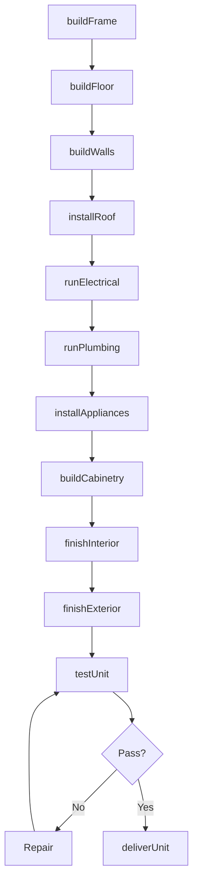
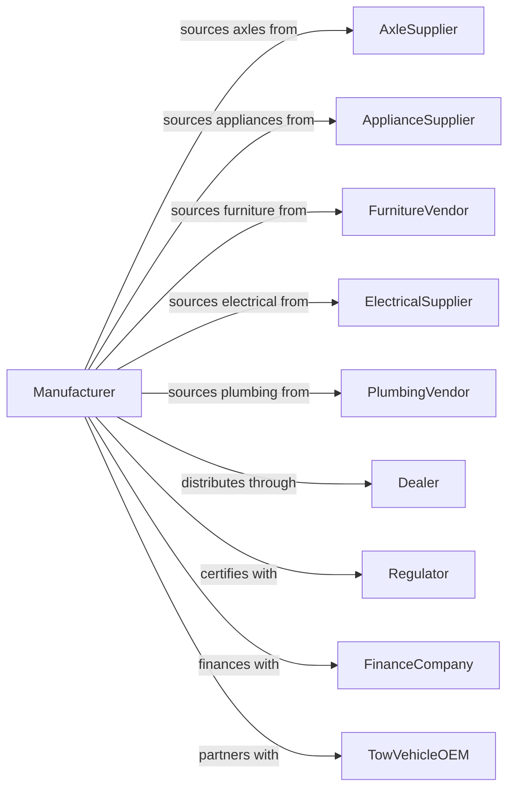

# Travel Trailer and Camper Manufacturing

> Business-as-Code definition for travel trailer and camper manufacturing. Models the complete production process from frame construction through interior finishing and delivery.

## Overview

This U.S. industry comprises establishments primarily engaged in manufacturing travel trailers and campers designed to attach to motor vehicles, pick-up coaches and caps for mounting on pick-up trucks, and automobile, utility, and light-truck trailers. Travel trailers do not have their own motor but are designed to be towed by a motor unit. Products include conventional travel trailers, fifth wheel trailers, toy haulers, pop-up campers, and truck campers.

## Actors

| Actor | Description |
|-------|-------------|
| AxleSupplier | Provides suspension systems and axle assemblies |
| ApplianceSupplier | Provides refrigerators, water heaters, and HVAC units |
| FurnitureVendor | Supplies seating, dinettes, and sleeping systems |
| ElectricalSupplier | Provides wiring, panels, and lighting systems |
| PlumbingVendor | Supplies water systems and holding tanks |
| Dealer | Retails travel trailers and provides service support |
| TowVehicleOEM | Manufactures vehicles that tow travel trailers |
| FinanceCompany | Provides RV loans and extended service contracts |
| Regulator | Enforces RVIA standards and highway safety regulations |

## Roles

| Role | Description |
|------|-------------|
| PlantManager | Oversees travel trailer manufacturing operations |
| DesignEngineer | Creates floor plans and structural specifications |
| ProductionSupervisor | Manages assembly teams and line flow |
| FrameBuilder | Constructs chassis and floor structure |
| WallBuilder | Fabricates and assembles sidewalls and roof |
| ElectricalTechnician | Installs wiring and electrical components |
| PlumbingTechnician | Installs water and sanitation systems |
| InteriorFinisher | Completes cabinetry, upholstery, and trim |

## Entities

| Entity | Description |
|--------|-------------|
| TravelTrailer | Towable recreational vehicle for travel and camping |
| FifthWheel | Trailer designed to couple with truck bed hitch |
| ToyHauler | Trailer with garage space for ATVs or motorcycles |
| PopUp | Collapsible trailer with fold-out sleeping areas |
| TruckCamper | Slide-in unit designed for pickup truck beds |
| Frame | Structural chassis including tongue and axle mounts |
| FloorPlan | Interior configuration defining living spaces |
| Sidewall | Wall assembly with insulation and exterior skin |
| Hitch | Coupling system connecting trailer to tow vehicle |
| Slideout | Extendable room section for added interior space |

## Actions

| Action | Description |
|--------|-------------|
| buildFrame | Construct chassis frame with tongue and axle mounts |
| buildFloor | Install decking and insulation on frame |
| buildWalls | Fabricate and raise sidewall assemblies |
| installRoof | Complete roof structure with membrane and vents |
| runElectrical | Install wiring, panels, and lighting |
| runPlumbing | Install water lines and holding tanks |
| installAppliances | Mount kitchen and comfort equipment |
| buildCabinetry | Install storage and furniture components |
| finishInterior | Complete flooring, upholstery, and trim |
| finishExterior | Apply graphics, install awnings and accessories |
| testUnit | Perform systems testing and road simulation |
| deliverUnit | Ship completed trailer to dealer |

## Events

| Event | Description |
|-------|-------------|
| frameBuilt | Chassis structure completed |
| floorBuilt | Decking and insulation installed |
| wallsBuilt | Sidewalls raised and secured |
| roofInstalled | Top structure completed |
| electricalCompleted | All wiring installed and tested |
| plumbingCompleted | Water systems installed and tested |
| appliancesInstalled | Equipment mounted and connected |
| cabinetryCompleted | Storage and furniture installed |
| interiorFinished | All interior trim completed |
| exteriorFinished | Graphics and accessories installed |
| unitTested | Systems and road testing passed |
| unitDelivered | Trailer shipped to dealer |

## Searches

| Search | Description |
|--------|-------------|
| findOrders | Query production orders by dealer or model |
| getInventory | Check work-in-progress and finished units |
| trackProduction | Monitor unit progress through assembly |
| findFloorPlans | List available configurations by model |
| getSuppliers | Search suppliers by component type |
| findDealers | Locate dealers by region |
| getTowRatings | Retrieve tow capacity requirements by model |

## Workflow

## Actor Relationships

