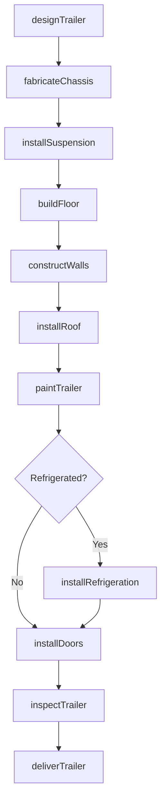
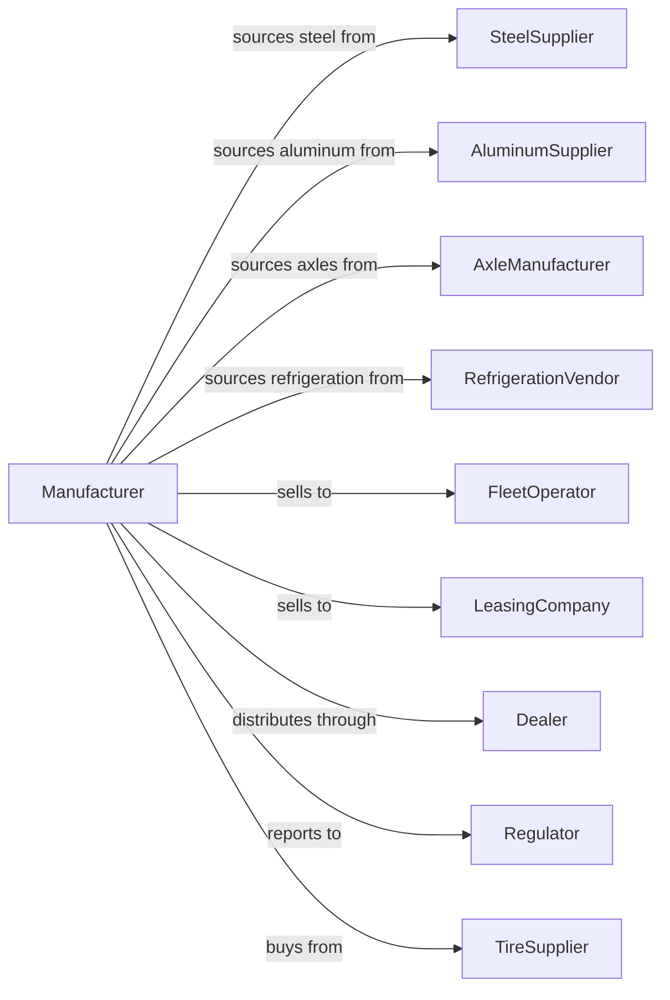

# Truck Trailer Manufacturing

> Business-as-Code definition for truck trailer manufacturing. Models the complete production process from design through fabrication, assembly, and delivery.

## Overview

This U.S. industry comprises establishments primarily engaged in manufacturing truck trailers, truck trailer chassis, cargo container chassis, detachable trailer bodies, and detachable trailer chassis for sale separately. Products include dry van trailers, refrigerated trailers, flatbed trailers, tanker trailers, lowboy trailers, and intermodal container chassis used in over-the-road freight transportation.

## Actors

| Actor | Description |
|-------|-------------|
| SteelSupplier | Provides structural steel and sheet metal for trailer construction |
| AluminumSupplier | Provides aluminum components for lightweight trailer designs |
| AxleManufacturer | Supplies suspension systems and axle assemblies |
| RefrigerationVendor | Provides cooling units for refrigerated trailers |
| FleetOperator | Purchases trailers for freight hauling operations |
| LeasingCompany | Acquires trailers for rental and leasing programs |
| Dealer | Sells new trailers and provides parts and service |
| Regulator | Enforces weight limits, safety standards, and inspection requirements |
| TireSupplier | Provides tires and wheel assemblies |

## Roles

| Role | Description |
|------|-------------|
| PlantManager | Oversees trailer manufacturing facility operations |
| DesignEngineer | Creates trailer specifications and structural designs |
| ProductionPlanner | Schedules manufacturing based on orders and capacity |
| Welder | Fabricates and assembles trailer structural components |
| Assembler | Installs suspension, flooring, and hardware |
| Painter | Applies protective coatings and customer graphics |
| QualityInspector | Verifies dimensional accuracy and structural integrity |
| SalesEngineer | Configures trailers to meet customer application requirements |

## Entities

| Entity | Description |
|--------|-------------|
| Trailer | Towable freight transport unit designed for specific cargo |
| Chassis | Structural frame including crossmembers and landing gear |
| Suspension | Axle and spring system supporting trailer weight |
| Floor | Trailer deck surface configured for cargo type |
| Sidewall | Structural or curtain side panels |
| Roof | Top structure for enclosed trailers |
| LandingGear | Retractable support legs for unhitched trailer |
| Kingpin | Coupling device connecting trailer to tractor fifth wheel |
| Refrigeration | Cooling system for temperature-controlled trailers |
| Specification | Configuration document defining trailer features |

## Actions

| Action | Description |
|--------|-------------|
| designTrailer | Create engineering specifications and drawings |
| fabricateChassis | Cut, weld, and assemble frame components |
| installSuspension | Mount axles, springs, and brake systems |
| buildFloor | Install decking appropriate for cargo type |
| constructWalls | Build sidewalls and install interior lining |
| installRoof | Complete top structure for enclosed units |
| paintTrailer | Apply primer, topcoat, and customer graphics |
| installRefrigeration | Mount and connect cooling unit for reefer trailers |
| installDoors | Mount rear doors, side doors, or curtains |
| inspectTrailer | Perform quality audit and road test |
| deliverTrailer | Ship completed unit to customer or dealer |

## Events

| Event | Description |
|-------|-------------|
| trailerDesigned | Specifications approved for production |
| chassisFabricated | Frame assembly completed |
| suspensionInstalled | Axles and suspension mounted |
| floorBuilt | Decking installation completed |
| wallsConstructed | Sidewall assembly completed |
| roofInstalled | Top structure completed |
| trailerPainted | Finish coat applied |
| refrigerationInstalled | Cooling unit mounted and tested |
| doorsInstalled | Access doors fitted and adjusted |
| inspectionPassed | Quality verification completed |
| trailerDelivered | Unit shipped to customer |

## Searches

| Search | Description |
|--------|-------------|
| findOrders | Query production orders by customer or specification |
| getInventory | Check finished and work-in-progress inventory |
| trackProduction | Monitor trailer progress through manufacturing |
| findSuppliers | List suppliers by component category |
| getCapacity | Query available production capacity by line |
| findDealers | Locate dealers by region |
| getFleetData | Retrieve fleet utilization and maintenance history |

## Workflow

## Actor Relationships

