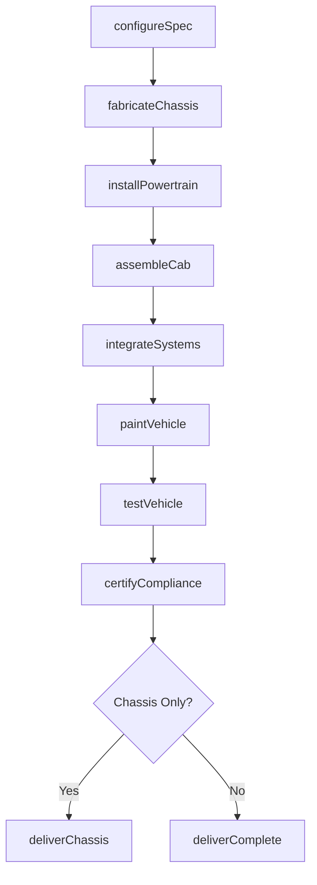
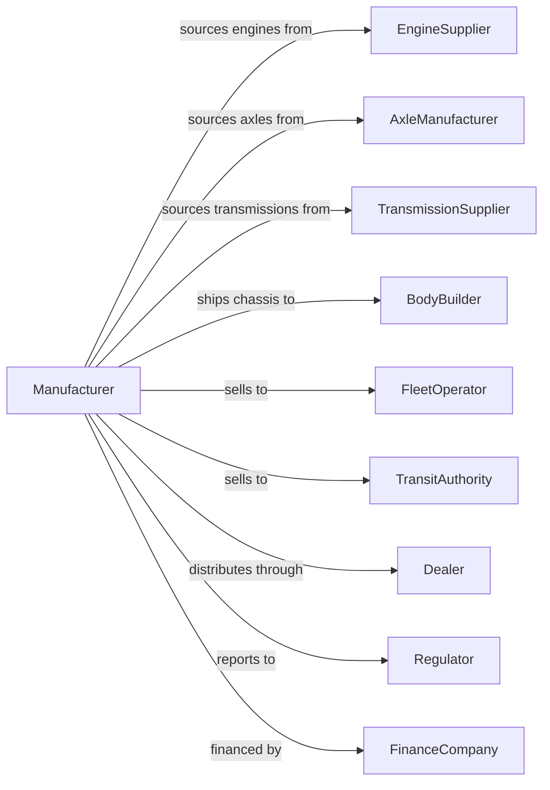

# Heavy Duty Truck Manufacturing

> Business-as-Code definition for heavy duty truck and bus manufacturing. Models the complete production process from chassis fabrication through final assembly and customer delivery.

## Overview

This industry comprises establishments primarily engaged in manufacturing heavy duty truck chassis and assembling complete heavy duty trucks, buses, heavy duty motor homes, and other special purpose heavy duty motor vehicles for highway use, or manufacturing heavy duty truck chassis only. These Class 7 and Class 8 vehicles serve commercial freight, passenger transit, and specialty applications with gross vehicle weight ratings exceeding 26,000 pounds.

## Actors

| Actor | Description |
|-------|-------------|
| EngineSupplier | Provides diesel or alternative fuel powertrains for commercial vehicles |
| AxleManufacturer | Supplies drive axles, steer axles, and suspension systems |
| TransmissionSupplier | Provides manual and automated manual transmissions |
| BodyBuilder | Custom fabricator that builds specialized bodies on truck chassis |
| FleetOperator | Trucking company that purchases vehicles for freight operations |
| TransitAuthority | Public agency that purchases buses for passenger service |
| Dealer | Sells new trucks and provides parts and service support |
| Regulator | Enforces emissions, safety, and hours of service regulations |
| FinanceCompany | Provides commercial vehicle financing and leasing |

## Roles

| Role | Description |
|------|-------------|
| PlantManager | Oversees heavy truck production facility operations |
| ProductionPlanner | Schedules build sequences based on customer orders |
| ChassisEngineer | Designs frame rails, crossmembers, and mounting systems |
| ApplicationEngineer | Configures vehicles for specific customer applications |
| QualityInspector | Verifies assembly conformance and performs audits |
| LineWorker | Assembles chassis and cab components |
| TestDriver | Conducts road tests and dynamometer evaluations |
| ServiceTechnician | Diagnoses and repairs vehicles at dealer locations |

## Entities

| Entity | Description |
|--------|-------------|
| Chassis | Frame assembly including rails, crossmembers, and suspension mounts |
| Cab | Driver compartment configured for day cab or sleeper operation |
| Engine | Diesel or alternative fuel powertrain meeting emissions standards |
| Transmission | Manual or automated gearbox matched to engine output |
| Axle | Drive or steer axle with specified capacity and ratio |
| Specification | Detailed configuration document for customer order |
| GVW | Gross vehicle weight rating determining vehicle classification |
| Wheelbase | Distance between axles affecting body mounting options |
| VIN | Vehicle identification number for tracking and registration |
| WarrantyPolicy | Coverage terms for powertrain and component failures |

## Actions

| Action | Description |
|--------|-------------|
| configureSpec | Build detailed vehicle specification from customer requirements |
| fabricateChassis | Cut, weld, and assemble frame rails and crossmembers |
| installPowertrain | Mount engine, transmission, and driveline components |
| assembleCab | Build cab structure with interior trim and controls |
| integrateSystems | Connect electrical, pneumatic, and hydraulic systems |
| paintVehicle | Apply primer and finish coat to cab and chassis |
| testVehicle | Perform dynamometer and road testing |
| certifyCompliance | Verify vehicle meets regulatory requirements |
| deliverChassis | Ship chassis to body builder for final upfitting |
| deliverComplete | Transport finished truck to dealer or customer |
| processWarranty | Handle warranty claims and authorize repairs |

## Events

| Event | Description |
|-------|-------------|
| specConfigured | Vehicle specification finalized and approved |
| chassisFabricated | Frame assembly completed and ready for line |
| powertrainInstalled | Engine and transmission mounted and connected |
| cabAssembled | Cab structure completed with trim |
| systemsIntegrated | All vehicle systems connected and functional |
| vehiclePainted | Paint application completed |
| vehicleTested | Quality and performance testing passed |
| complianceCertified | Regulatory certification obtained |
| chassisDelivered | Chassis shipped to body builder |
| vehicleDelivered | Completed truck delivered to customer |
| warrantyClaimProcessed | Warranty repair authorized and completed |

## Searches

| Search | Description |
|--------|-------------|
| findOrders | Query production orders by customer, dealer, or specification |
| getInventory | Check chassis and finished goods inventory |
| trackBuild | Monitor vehicle progress through production stages |
| findSuppliers | List suppliers by component category |
| getBodyBuilders | Find certified body builders by region and specialty |
| checkCapacity | Query available production slots by plant |
| getWarrantyHistory | Retrieve warranty claims by fleet or component |

## Workflow

## Actor Relationships

