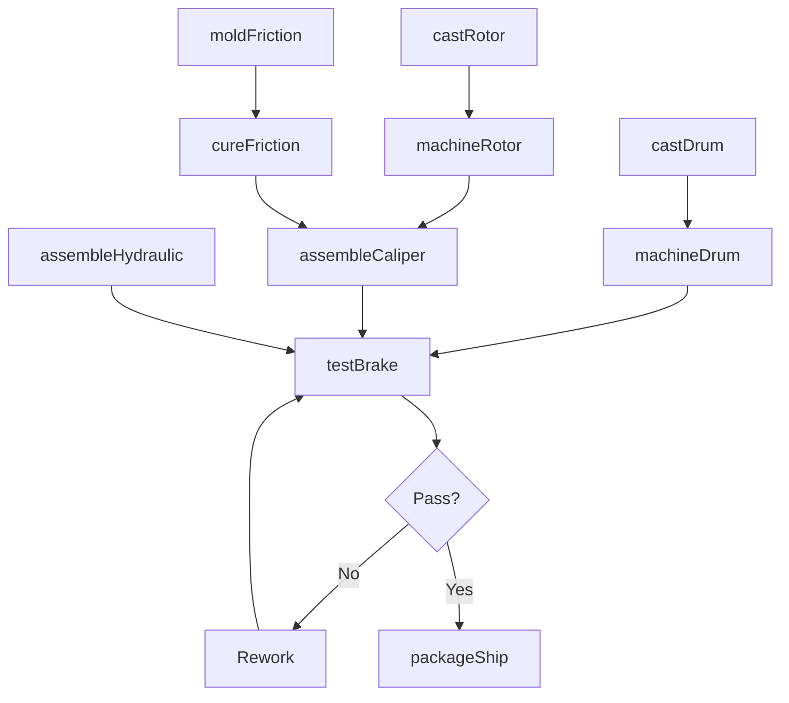
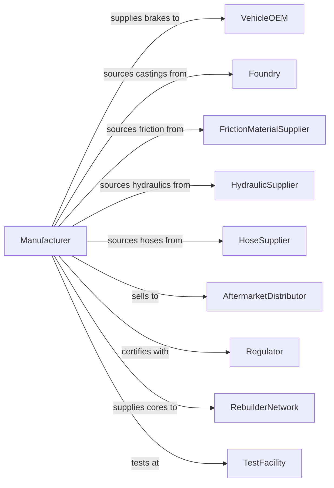

# Motor Vehicle Brake System Manufacturing

> Business-as-Code definition for brake system and component manufacturing. Models the complete production process from casting and forging through assembly, testing, and delivery.

## Overview

This industry comprises establishments primarily engaged in manufacturing and/or rebuilding motor vehicle brake systems and related components. Products include brake cylinders (master and wheel), brake drums, brake rotors, brake hose assemblies, brake pads and shoes, calipers, anti-lock braking system modules, and complete brake assemblies for automotive, truck, and bus applications.

## Actors

| Actor | Description |
|-------|-------------|
| VehicleOEM | Purchases brake systems for vehicle assembly |
| Foundry | Provides cast iron drums and rotors |
| FrictionMaterialSupplier | Provides brake pad and shoe friction compounds |
| HydraulicSupplier | Supplies master cylinders and wheel cylinders |
| HoseSupplier | Provides reinforced brake hoses and fittings |
| AftermarketDistributor | Purchases parts for replacement market |
| Regulator | Enforces FMVSS brake performance standards |
| TestFacility | Provides brake dynamometer and vehicle testing |
| RebuilderNetwork | Purchases cores for remanufacturing operations |

## Roles

| Role | Description |
|------|-------------|
| PlantManager | Oversees brake component manufacturing facility |
| DesignEngineer | Develops brake system specifications and designs |
| ProductionManager | Coordinates casting, machining, and assembly operations |
| FoundryOperator | Operates casting equipment for drums and rotors |
| MachinistOperator | Machines brake drums, rotors, and housings |
| Assembler | Builds complete brake assemblies and calipers |
| TestTechnician | Performs dynamometer and friction testing |
| QualityEngineer | Manages inspection and process control |

## Entities

| Entity | Description |
|--------|-------------|
| BrakeRotor | Disc that converts kinetic energy to heat via friction |
| BrakeDrum | Cylindrical component for drum brake systems |
| BrakePad | Friction material assembly for disc brakes |
| BrakeShoe | Friction material assembly for drum brakes |
| Caliper | Hydraulic clamp applying pad pressure to rotor |
| MasterCylinder | Hydraulic pump converting pedal force to pressure |
| WheelCylinder | Hydraulic actuator for drum brake shoes |
| BrakeHose | Flexible hydraulic line connecting chassis to wheel |
| ABSModule | Anti-lock braking system electronic controller |
| BrakeFluid | Hydraulic fluid transmitting pressure in system |

## Actions

| Action | Description |
|--------|-------------|
| castRotor | Pour molten iron into rotor molds |
| castDrum | Pour molten iron into drum molds |
| machineRotor | Precision machine rotor surfaces and mounting |
| machineDrum | Machine drum interior surface and mounting |
| moldFriction | Form friction material into pad or shoe shape |
| cureFriction | Heat treat friction material for proper characteristics |
| assembleCaliper | Build caliper with pistons, seals, and pads |
| assembleHydraulic | Build master and wheel cylinder assemblies |
| testBrake | Perform dynamometer friction and fade testing |
| packageShip | Package components for delivery to customer |
| rebuildCaliper | Remanufacture caliper with new seals and pistons |

## Events

| Event | Description |
|-------|-------------|
| rotorCast | Rotor casting completed |
| drumCast | Drum casting completed |
| rotorMachined | Rotor machining completed |
| drumMachined | Drum machining completed |
| frictionMolded | Friction material formed |
| frictionCured | Friction material heat treated |
| caliperAssembled | Caliper assembly completed |
| hydraulicAssembled | Hydraulic components assembled |
| brakeTested | Dynamometer testing passed |
| componentShipped | Parts delivered to customer |
| caliperRebuilt | Remanufactured caliper completed |

## Searches

| Search | Description |
|--------|-------------|
| findOrders | Query production orders by customer or part number |
| getInventory | Check component and finished goods inventory |
| trackProduction | Monitor parts through manufacturing stages |
| findSuppliers | List suppliers by component category |
| getTestResults | Retrieve dynamometer and friction test data |
| getCoreInventory | Check cores available for remanufacturing |
| getQualityMetrics | Retrieve defect rates and process capability |

## Workflow

## Actor Relationships

