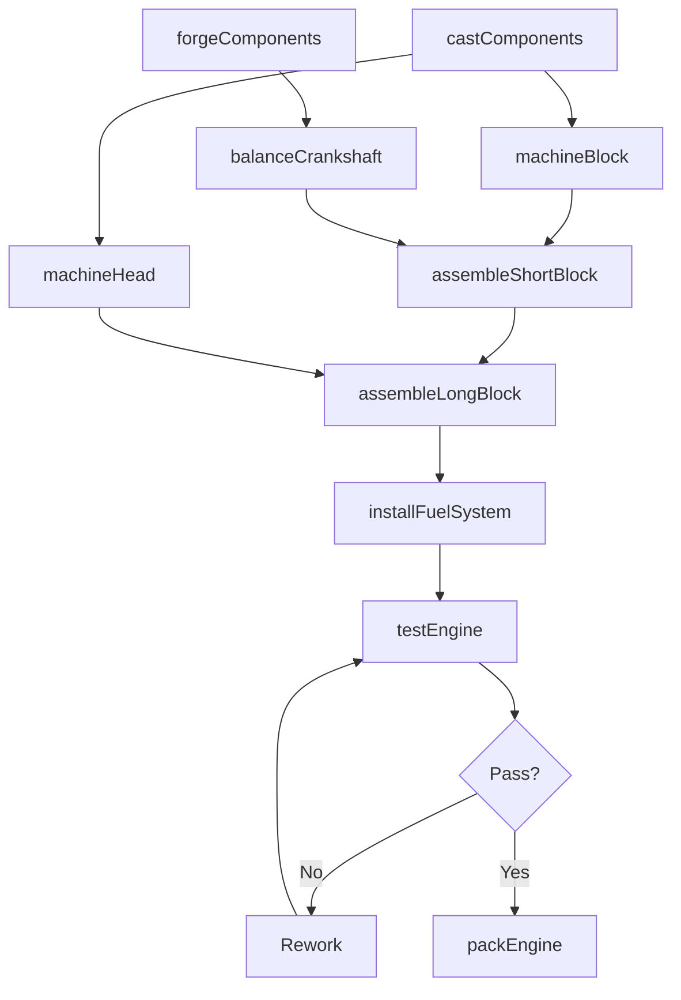
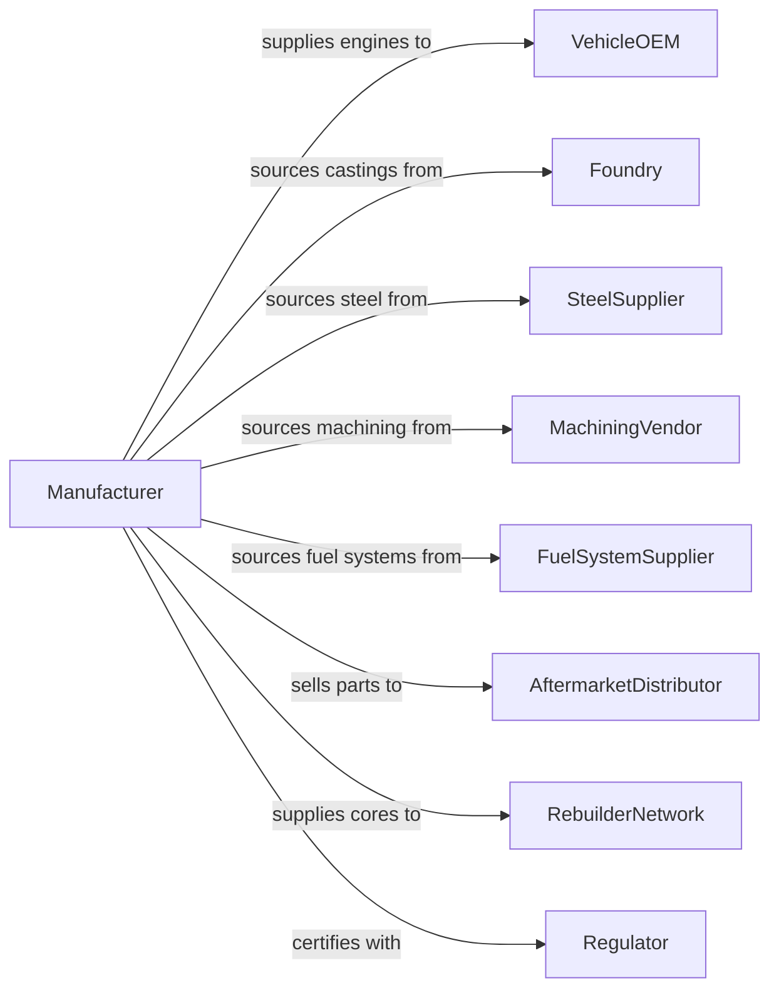

# Motor Vehicle Gasoline Engine and Engine Parts Manufacturing

> Business-as-Code definition for gasoline engine and engine parts manufacturing. Models the complete production process from casting through assembly, testing, and delivery to vehicle manufacturers.

## Overview

This industry comprises establishments primarily engaged in manufacturing and/or rebuilding motor vehicle gasoline engines and engine parts and/or manufacturing and/or rebuilding carburetors, pistons, piston rings, and engine valves, whether or not for vehicular use. Products include complete engines, cylinder heads, engine blocks, crankshafts, camshafts, fuel injection systems, and internal engine components for automotive and light truck applications.

## Actors

| Actor | Description |
|-------|-------------|
| VehicleOEM | Purchases complete engines and assemblies for vehicle production |
| Foundry | Provides cast aluminum and iron engine components |
| SteelSupplier | Provides forged steel for crankshafts and connecting rods |
| MachiningVendor | Supplies precision machined components |
| FuelSystemSupplier | Provides fuel injectors and fuel delivery components |
| AftermarketDistributor | Purchases parts for replacement and performance markets |
| RebuilderNetwork | Purchases core engines and components for remanufacturing |
| Regulator | Enforces emissions and fuel economy standards |
| TestingLab | Provides third-party emissions and durability certification |

## Roles

| Role | Description |
|------|-------------|
| PlantManager | Oversees engine manufacturing facility operations |
| DesignEngineer | Develops engine specifications and component designs |
| ProductionManager | Coordinates casting, machining, and assembly operations |
| MachinistOperator | Operates CNC equipment for precision machining |
| Assembler | Builds complete engines from machined components |
| TestTechnician | Conducts dynamometer and emissions testing |
| QualityEngineer | Manages inspection protocols and statistical process control |
| MaintenanceTechnician | Maintains production equipment and tooling |

## Entities

| Entity | Description |
|--------|-------------|
| Engine | Complete gasoline powerplant assembly |
| EngineBlock | Main structural casting housing cylinders and crankcase |
| CylinderHead | Casting containing valves, ports, and combustion chambers |
| Crankshaft | Rotating assembly converting piston motion to rotation |
| Camshaft | Rotating shaft actuating valve timing |
| Piston | Reciprocating component transferring combustion force |
| ConnectingRod | Link between piston and crankshaft |
| FuelInjector | Precision metering device for fuel delivery |
| Valve | Intake and exhaust flow control components |
| Gasket | Sealing components for engine assembly |

## Actions

| Action | Description |
|--------|-------------|
| castComponents | Pour molten metal into molds for blocks and heads |
| machineBlock | Precision bore cylinders and machine mating surfaces |
| machineHead | Machine valve seats, ports, and deck surfaces |
| forgeComponents | Form crankshafts and connecting rods under pressure |
| balanceCrankshaft | Dynamically balance rotating assembly |
| assembleShortBlock | Build block with crankshaft and pistons |
| assembleLongBlock | Add cylinder heads and valve train |
| installFuelSystem | Mount injectors and fuel rail assembly |
| testEngine | Run dynamometer and emissions certification tests |
| packEngine | Prepare engine for shipment to vehicle assembly |
| rebuildEngine | Restore used engine to original specifications |

## Events

| Event | Description |
|-------|-------------|
| componentsCast | Castings completed and ready for machining |
| blockMachined | Engine block precision machining completed |
| headMachined | Cylinder head machining completed |
| componentsForged | Forged components completed |
| crankshaftBalanced | Rotating assembly balanced and certified |
| shortBlockAssembled | Lower engine assembly completed |
| longBlockAssembled | Complete engine assembly finished |
| fuelSystemInstalled | Fuel delivery system mounted |
| engineTested | Dynamometer and emissions testing passed |
| enginePacked | Engine prepared for shipment |
| engineRebuilt | Remanufactured engine completed |

## Searches

| Search | Description |
|--------|-------------|
| findOrders | Query production orders by customer or engine family |
| getInventory | Check component and finished engine inventory |
| trackProduction | Monitor engine progress through manufacturing |
| findSuppliers | List suppliers by component category |
| getTestResults | Retrieve dynamometer and emissions data |
| getCoreInventory | Check available cores for remanufacturing |
| getQualityMetrics | Retrieve defect rates and process capability |

## Workflow

## Actor Relationships

