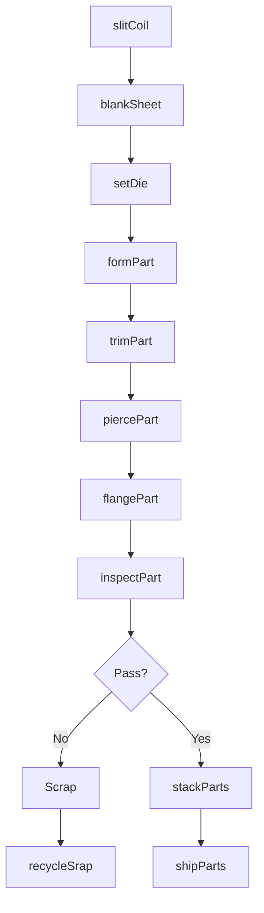
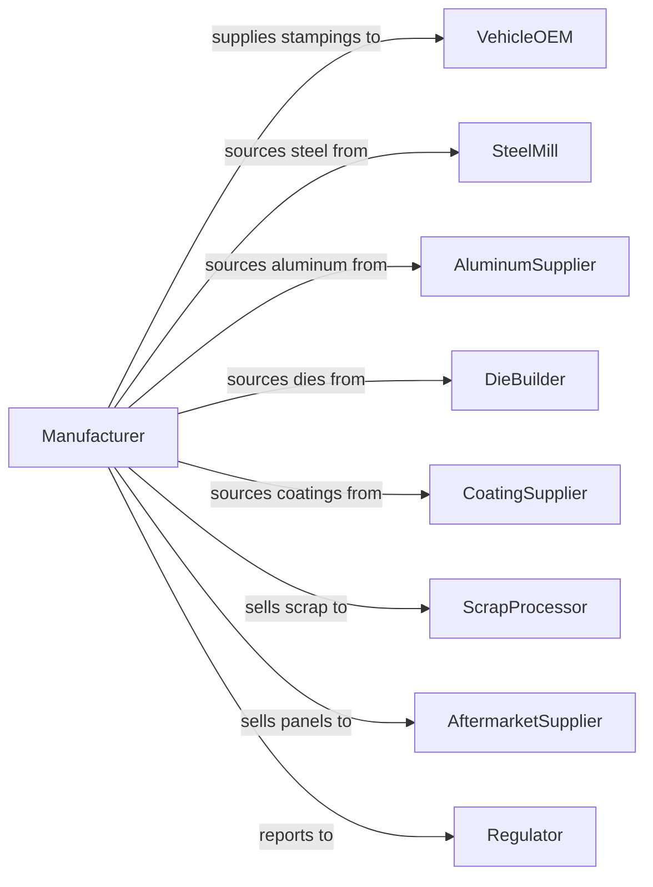

# Motor Vehicle Metal Stamping

> Business-as-Code definition for automotive metal stamping operations. Models the complete production process from coil processing through forming, finishing, and delivery to vehicle manufacturers.

## Overview

This industry comprises establishments primarily engaged in manufacturing motor vehicle stampings, such as fenders, tops, body parts, trim, and molding. Operations include blanking, drawing, forming, and progressive die stamping of sheet metal into body panels, structural components, and decorative trim using large stamping presses and precision tooling.

## Actors

| Actor | Description |
|-------|-------------|
| VehicleOEM | Purchases stamped components for vehicle body assembly |
| SteelMill | Provides flat-rolled steel coils and sheets |
| AluminumSupplier | Provides aluminum sheet for lightweight applications |
| DieBuilder | Designs and manufactures stamping dies and tooling |
| CoatingSupplier | Provides pre-coated and galvanized materials |
| WeldingEquipmentVendor | Supplies spot welding and assembly equipment |
| ScrapProcessor | Purchases and recycles offal and scrap metal |
| Regulator | Enforces workplace safety and environmental standards |
| AftermarketSupplier | Purchases panels for collision repair market |

## Roles

| Role | Description |
|------|-------------|
| PlantManager | Oversees stamping facility operations |
| DieEngineer | Designs dies and develops forming processes |
| ProductionManager | Coordinates press operations and scheduling |
| PressOperator | Operates stamping presses and monitors quality |
| DieSetterSetter | Installs and adjusts dies in presses |
| QualityInspector | Checks dimensional accuracy and surface quality |
| MaintenanceTechnician | Maintains presses and tooling |
| MaterialHandler | Manages coil storage and blank feeding |

## Entities

| Entity | Description |
|--------|-------------|
| Stamping | Formed metal component produced by pressing |
| BodyPanel | Exterior surface component such as fender or door skin |
| StructuralPart | Load-bearing component like rail or pillar |
| Die | Precision tooling that shapes sheet metal |
| Press | Machine applying force to form metal |
| Blank | Flat metal piece cut to shape before forming |
| Coil | Rolled sheet metal supply material |
| Draw | Deep forming operation creating box shapes |
| Trim | Cutting operation removing excess material |
| Offal | Scrap metal removed during stamping |

## Actions

| Action | Description |
|--------|-------------|
| slitCoil | Cut master coil to required width |
| blankSheet | Cut flat blanks from coil or sheet |
| setDie | Install and adjust die in press |
| formPart | Stamp blank into shaped component |
| trimPart | Remove excess material from formed part |
| piercePart | Create holes and openings in stamped part |
| flangePart | Bend edges to final configuration |
| inspectPart | Verify dimensional accuracy and surface quality |
| stackParts | Arrange parts in racks for transport |
| shipParts | Deliver stamped components to customer |
| recycleSrap | Process offal and scrap for recycling |

## Events

| Event | Description |
|-------|-------------|
| coilSlit | Coil cut to required width |
| blanksCut | Flat blanks prepared for forming |
| dieSet | Die installed and adjusted |
| partFormed | Component stamped to shape |
| partTrimmed | Excess material removed |
| partPierced | Holes and openings created |
| partFlanged | Edges bent to specification |
| partInspected | Quality verification completed |
| partsStacked | Components racked for shipping |
| partsShipped | Stamped parts delivered |
| scrapRecycled | Scrap material processed |

## Searches

| Search | Description |
|--------|-------------|
| findOrders | Query production orders by customer or part number |
| getInventory | Check blank and finished part inventory |
| trackProduction | Monitor parts through stamping operations |
| findSuppliers | List material suppliers by specification |
| getDieStatus | Check die location, condition, and maintenance |
| getPressSchedule | View press utilization and job schedule |
| getQualityMetrics | Retrieve dimensional data and defect rates |

## Workflow

## Actor Relationships

