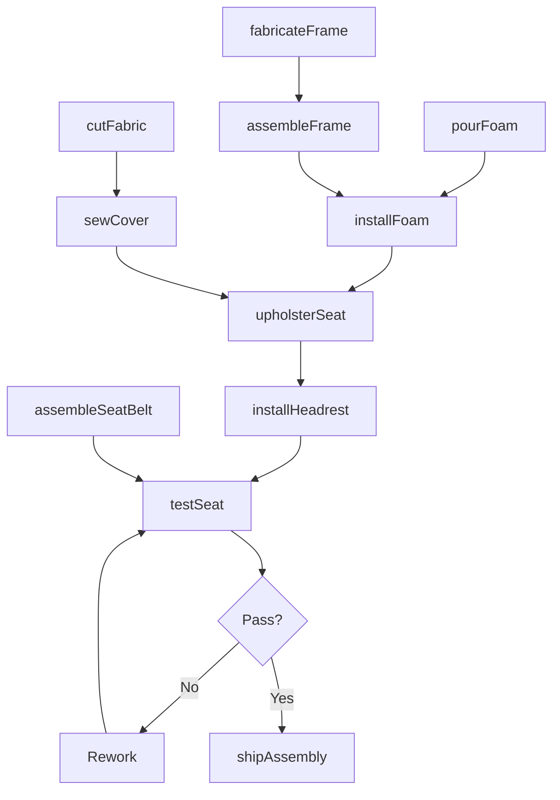
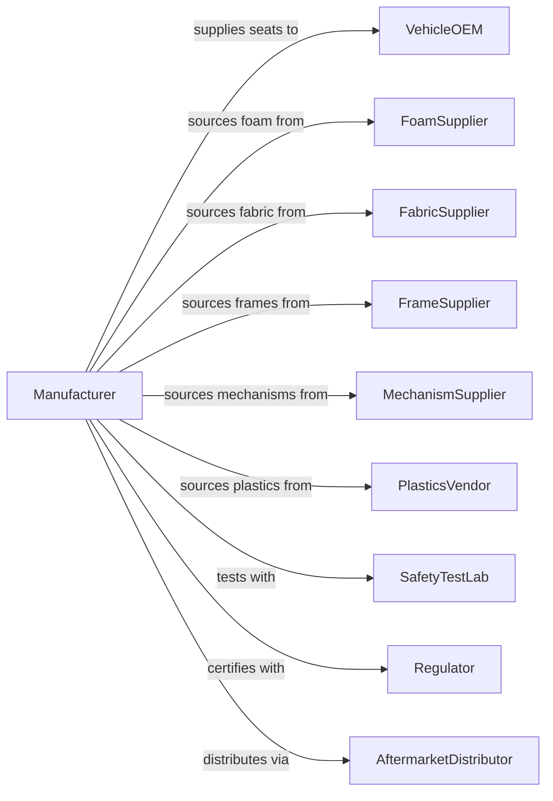

# Motor Vehicle Seating and Interior Trim Manufacturing

> Business-as-Code definition for automotive seating and interior trim manufacturing. Models the complete production process from frame fabrication through upholstery and delivery to vehicle manufacturers.

## Overview

This industry comprises establishments primarily engaged in manufacturing motor vehicle seating, seats, seat frames, seat belts, and interior trimmings. Products include complete seat assemblies, seat frames, seat tracks, seat foam cushions, headrests, door panels, headliners, instrument panel trim, center consoles, and seat belt assemblies for automotive and commercial vehicle applications.

## Actors

| Actor | Description |
|-------|-------------|
| VehicleOEM | Purchases seating and interior components for vehicle assembly |
| FoamSupplier | Provides polyurethane foam for seat cushions |
| FabricSupplier | Supplies textile and leather covering materials |
| FrameSupplier | Provides steel and magnesium seat frame components |
| MechanismSupplier | Supplies seat tracks, recliners, and adjusters |
| PlasticsVendor | Provides injection molded trim components |
| SafetyTestLab | Conducts crash testing for seat and belt certification |
| AftermarketDistributor | Purchases components for replacement market |
| Regulator | Enforces FMVSS seating and restraint standards |

## Roles

| Role | Description |
|------|-------------|
| PlantManager | Oversees seating and trim manufacturing facility |
| DesignEngineer | Develops seat and trim specifications |
| ProductionManager | Coordinates fabrication and assembly operations |
| FrameWelder | Fabricates and welds seat frame structures |
| FoamOperator | Operates foam pouring and molding equipment |
| SewingOperator | Cuts and sews seat covers and trim panels |
| Assembler | Builds complete seat assemblies |
| QualityEngineer | Manages inspection and compliance testing |

## Entities

| Entity | Description |
|--------|-------------|
| SeatAssembly | Complete seat unit with frame, foam, and cover |
| SeatFrame | Structural base providing support and mounting |
| SeatFoam | Polyurethane cushioning material |
| SeatCover | Fabric or leather outer surface material |
| SeatTrack | Mechanism allowing fore-aft seat adjustment |
| Recliner | Mechanism allowing seatback angle adjustment |
| Headrest | Head support component for occupant protection |
| SeatBelt | Restraint system including webbing and buckle |
| DoorPanel | Interior trim covering door structure |
| Headliner | Interior trim covering roof structure |

## Actions

| Action | Description |
|--------|-------------|
| fabricateFrame | Weld and assemble seat frame structure |
| pourFoam | Mold polyurethane foam cushions |
| cutFabric | Cut covering materials to pattern |
| sewCover | Stitch seat covers and trim panels |
| assembleFrame | Combine frame with tracks and mechanisms |
| installFoam | Mount foam cushions to frame |
| upholsterSeat | Install covers over foam and frame |
| installHeadrest | Mount headrest guides and assembly |
| assembleSeatBelt | Build restraint system with retractor |
| testSeat | Perform durability and crash simulation testing |
| shipAssembly | Deliver completed assemblies to vehicle line |

## Events

| Event | Description |
|-------|-------------|
| frameFabricated | Seat frame welding completed |
| foamPoured | Foam cushions molded and cured |
| fabricCut | Covering materials cut to pattern |
| coverSewn | Seat covers stitched and prepared |
| frameAssembled | Frame combined with mechanisms |
| foamInstalled | Cushions mounted to frame |
| seatUpholstered | Covers installed and secured |
| headrestInstalled | Headrest assembly completed |
| seatBeltAssembled | Restraint system completed |
| seatTested | Quality and safety testing passed |
| assemblyShipped | Completed seats delivered |

## Searches

| Search | Description |
|--------|-------------|
| findOrders | Query production orders by customer or model |
| getInventory | Check component and finished goods inventory |
| trackProduction | Monitor assemblies through manufacturing stages |
| findSuppliers | List suppliers by material category |
| getTestResults | Retrieve durability and crash test data |
| getMaterialUsage | Track fabric and foam consumption |
| getQualityMetrics | Retrieve defect rates and process capability |

## Workflow

## Actor Relationships

