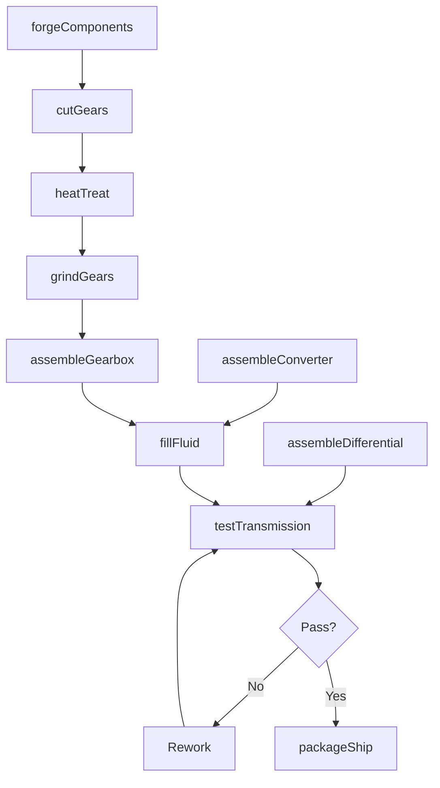
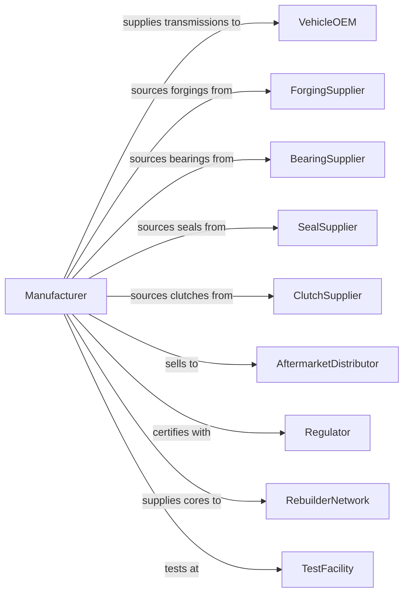

# Motor Vehicle Transmission and Power Train Parts Manufacturing

> Business-as-Code definition for transmission and power train parts manufacturing. Models the complete production process from forging and machining through assembly, testing, and delivery.

## Overview

This industry comprises establishments primarily engaged in manufacturing and/or rebuilding motor vehicle transmissions and power train parts. Products include automatic transmissions, manual transmissions, axle bearings, constant velocity joints, differential and rear axle assemblies, torque converters, transfer cases, drive shafts, and universal joints for automotive, truck, and bus applications.

## Actors

| Actor | Description |
|-------|-------------|
| VehicleOEM | Purchases transmissions and driveline components for vehicle assembly |
| ForgingSupplier | Provides forged gears, shafts, and housings |
| BearingSupplier | Supplies precision bearings for rotating assemblies |
| SealSupplier | Provides seals and gaskets for fluid containment |
| ClutchSupplier | Supplies friction plates and clutch assemblies |
| AftermarketDistributor | Purchases parts for replacement market |
| Regulator | Enforces fuel economy and emissions standards |
| TestFacility | Provides transmission dynamometer testing |
| RebuilderNetwork | Purchases cores for remanufacturing operations |

## Roles

| Role | Description |
|------|-------------|
| PlantManager | Oversees transmission manufacturing facility |
| DesignEngineer | Develops transmission specifications and gear designs |
| ProductionManager | Coordinates forging, machining, and assembly operations |
| GearCutter | Operates hobbing, shaping, and grinding machines to produce precision gears |
| HeatTreatOperator | Manages hardening and tempering processes |
| Assembler | Builds complete transmission assemblies |
| TestTechnician | Performs dynamometer and shift quality testing |
| QualityEngineer | Manages inspection and process control |

## Entities

| Entity | Description |
|--------|-------------|
| Transmission | Complete gearbox assembly for vehicle propulsion |
| GearSet | Collection of meshing gears providing ratio selection |
| TorqueConverter | Fluid coupling transferring engine power to transmission |
| Clutch | Friction device engaging and disengaging power flow |
| Differential | Gear assembly allowing wheel speed variation |
| DriveShaft | Rotating shaft transmitting power to axle |
| CVJoint | Constant velocity joint for front wheel drive |
| TransferCase | Gear assembly distributing power to multiple axles |
| Bearing | Precision rolling element supporting rotating shafts |
| Valve Body | Hydraulic control assembly for automatic shifting |

## Actions

| Action | Description |
|--------|-------------|
| forgeComponents | Form steel blanks into gear and shaft shapes |
| cutGears | Machine gear teeth using hobbing or shaping |
| heatTreat | Harden and temper gear surfaces for durability |
| grindGears | Precision grind gear teeth for quiet operation |
| assembleGearbox | Stack gears, shafts, and synchronizers in housing |
| assembleConverter | Build torque converter with pump, turbine, and stator |
| assembleDifferential | Build differential with ring gear and pinion |
| fillFluid | Add transmission fluid and calibrate levels |
| testTransmission | Perform dynamometer shift and noise testing |
| packageShip | Package components for delivery to customer |
| rebuildTransmission | Remanufacture transmission to original specification |

## Events

| Event | Description |
|-------|-------------|
| componentsForged | Gear blanks forged |
| gearsCut | Gear teeth machined |
| gearsHeatTreated | Gears hardened and tempered |
| gearsGround | Gear teeth precision finished |
| gearboxAssembled | Transmission assembly completed |
| converterAssembled | Torque converter completed |
| differentialAssembled | Differential assembly completed |
| fluidFilled | Transmission fluid added |
| transmissionTested | Dynamometer testing passed |
| componentShipped | Parts delivered to customer |
| transmissionRebuilt | Remanufactured unit completed |

## Searches

| Search | Description |
|--------|-------------|
| findOrders | Query production orders by customer or part number |
| getInventory | Check component and finished goods inventory |
| trackProduction | Monitor parts through manufacturing stages |
| findSuppliers | List suppliers by component category |
| getTestResults | Retrieve dynamometer and shift quality data |
| getCoreInventory | Check cores available for remanufacturing |
| getQualityMetrics | Retrieve defect rates and process capability |

## Workflow

## Actor Relationships

