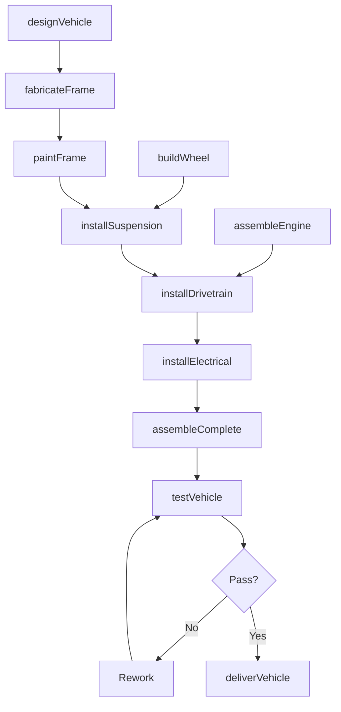
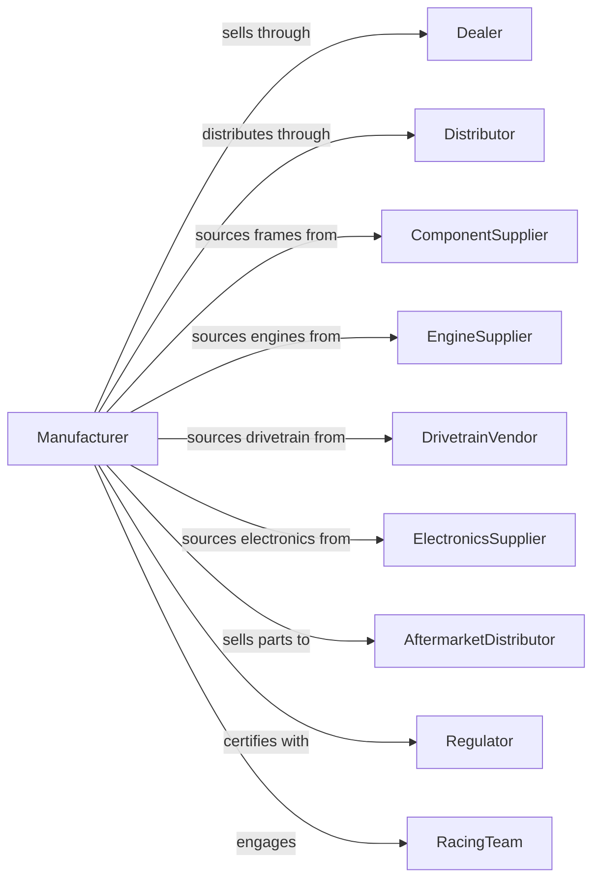

# Motorcycle, Bicycle, and Parts Manufacturing

> Business-as-Code definition for motorcycle and bicycle manufacturing. Models the complete production process from design through assembly, testing, and delivery.

## Overview

This U.S. industry comprises establishments primarily engaged in manufacturing motorcycles, bicycles, tricycles and similar equipment, and parts. Products include street motorcycles, off-road motorcycles, scooters, mopeds, road bicycles, mountain bicycles, electric bicycles, and components such as frames, forks, wheels, and drivetrain parts.

## Actors

| Actor | Description |
|-------|-------------|
| Dealer | Franchise partner selling motorcycles and bicycles |
| Distributor | Distributes products to retail channel |
| ComponentSupplier | Provides frames, forks, and structural components |
| EngineSupplier | Supplies motorcycle engines and transmissions |
| DrivetrainVendor | Provides gears, chains, and shifting systems |
| ElectronicsSupplier | Supplies ignition, lighting, and display systems |
| AftermarketDistributor | Purchases parts for replacement and upgrade |
| Regulator | DOT and EPA enforcing safety and emissions |
| RacingTeam | Uses products for competition and development |

## Roles

| Role | Description |
|------|-------------|
| PlantManager | Oversees manufacturing facility operations |
| DesignEngineer | Creates frame and system specifications |
| ProductionManager | Coordinates fabrication and assembly operations |
| FrameBuilder | Fabricates and welds frame structures |
| Assembler | Builds complete motorcycles and bicycles |
| PaintTechnician | Applies finish coatings and graphics |
| TestRider | Evaluates performance and handling |
| QualityInspector | Verifies conformance to specifications |

## Entities

| Entity | Description |
|--------|-------------|
| Motorcycle | Two-wheeled motorized vehicle |
| Bicycle | Human-powered two-wheeled vehicle |
| Scooter | Step-through motorized two-wheeler |
| EBike | Electrically assisted bicycle |
| Frame | Structural backbone of vehicle |
| Engine | Internal combustion or electric powertrain |
| Fork | Front suspension and steering assembly |
| Wheel | Rim, spokes, and hub assembly |
| Drivetrain | Chain, gears, and pedal assembly |
| Suspension | Shock absorbing system |

## Actions

| Action | Description |
|--------|-------------|
| designVehicle | Create frame geometry and specifications |
| fabricateFrame | Build frame tubes and weld structure |
| paintFrame | Apply primer, paint, and clear coat |
| buildWheel | Lace spokes and true wheel assembly |
| assembleEngine | Build or source engine assembly |
| installDrivetrain | Mount engine, transmission, or pedal system |
| installSuspension | Mount forks and rear shock |
| installElectrical | Wire ignition, lighting, and instruments |
| assembleComplete | Final assembly with accessories |
| testVehicle | Perform dyno and road testing |
| deliverVehicle | Ship to dealer or distributor |

## Events

| Event | Description |
|-------|-------------|
| vehicleDesigned | Specifications completed |
| frameFabricated | Frame structure welded |
| framePainted | Finish coating applied |
| wheelBuilt | Wheel assembly completed |
| engineAssembled | Powertrain ready |
| drivetrainInstalled | Power transmission mounted |
| suspensionInstalled | Front and rear suspension mounted |
| electricalInstalled | Wiring and lights connected |
| assemblyCompleted | Vehicle fully assembled |
| vehicleTested | Performance testing passed |
| vehicleDelivered | Product shipped |

## Searches

| Search | Description |
|--------|-------------|
| findOrders | Query production orders by dealer or model |
| getInventory | Check component and finished goods inventory |
| trackProduction | Monitor vehicles through assembly |
| findSuppliers | List suppliers by component category |
| getTestData | Retrieve dyno and performance data |
| getDealerNetwork | Locate dealers by region |
| getWarrantyData | Retrieve warranty claims by model |

## Workflow

## Actor Relationships

