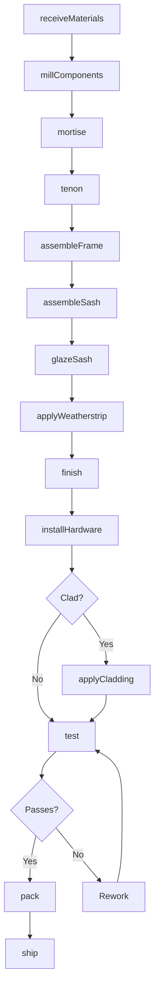
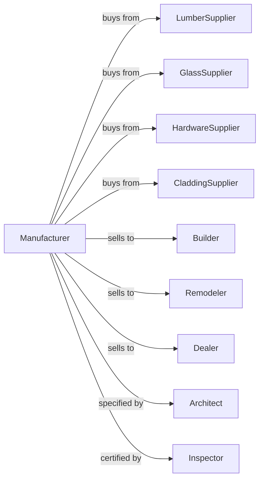

# Wood Window and Door Manufacturing

> Business-as-Code definition for wood window and door manufacturing operations. Models the complete production process from lumber procurement through milling, assembly, glazing, finishing, and installation support.

## Overview

This U.S. industry comprises establishments primarily engaged in manufacturing window and door units, sash, window and door frames, and doors from wood or wood clad with metal or plastics. Cross-References.

## Actors

| Actor | Description |
|-------|-------------|
| LumberSupplier | Provides clear lumber for window and door components |
| GlassSupplier | Provides insulated glass units and glazing |
| HardwareSupplier | Provides hinges, locks, and operating hardware |
| CladdingSupplier | Provides aluminum and vinyl cladding materials |
| Builder | Purchases windows and doors for new construction |
| Remodeler | Buys replacement windows and doors |
| Dealer | Distributes products to contractors and consumers |
| Architect | Specifies products for commercial projects |
| Inspector | Certifies energy and structural performance |

## Roles

| Role | Description |
|------|-------------|
| PlantOwner | Owns facility and directs business strategy |
| ProductionManager | Oversees daily manufacturing operations |
| MillOperator | Operates molders, shapers, and CNC machines |
| AssemblyWorker | Assembles frames, sash, and panels |
| GlazingTech | Installs glass units into frames |
| FinishingTech | Applies stains, paints, and coatings |
| QualityInspector | Verifies fit, finish, and performance |

## Entities

| Entity | Description |
|--------|-------------|
| Lumber | Clear wood stock for window and door parts |
| Frame | Structural surround for window or door |
| Sash | Movable frame holding glass in windows |
| Panel | Solid or raised section of door |
| Glass | Insulated or tempered glazing unit |
| Hardware | Operating and security components |
| Cladding | Exterior protective covering |
| Weatherstrip | Sealing material for air infiltration |
| Finish | Stain, paint, or clear coating |
| UValue | Thermal performance rating |

## Actions

| Action | Description |
|--------|-------------|
| receiveMaterials | Accept lumber, glass, and components |
| millComponents | Shape frame, sash, and panel parts |
| mortise | Cut joints for frame assembly |
| tenon | Cut mating joints for secure fit |
| assembleFrame | Join frame components with adhesive and fasteners |
| assembleSash | Build sash units with muntins and rails |
| glazeSash | Install glass into sash or frame |
| applyWeatherstrip | Install sealing materials |
| finish | Apply stain, paint, or clear coat |
| installHardware | Attach hinges, locks, and operators |
| applyCladding | Cover exterior surfaces with metal or vinyl |
| test | Verify air and water infiltration performance |
| pack | Protect and prepare for shipment |
| ship | Deliver to dealer, builder, or jobsite |

## Events

| Event | Description |
|-------|-------------|
| materialsReceived | Lumber and components accepted |
| componentsMilled | Parts shaped to specification |
| frameAssembled | Frame unit constructed |
| sashAssembled | Sash unit constructed |
| unitGlazed | Glass installed in frame |
| unitFinished | Coating applied and cured |
| hardwareInstalled | Operating components attached |
| claddingApplied | Exterior covering completed |
| unitTested | Performance verified |
| orderPacked | Products prepared for shipment |
| orderShipped | Products delivered to customer |

## Searches

| Search | Description |
|--------|-------------|
| findMaterials | List available lumber and component inventory |
| getOrders | Retrieve pending orders by customer |
| getProduction | Monitor production status by order |
| findDealers | List dealer network with territories |
| getPerformance | Retrieve energy and test ratings |
| getCustomOptions | List available sizes, styles, and finishes |
| getLeadTimes | Check production capacity and delivery dates |

## Workflow



## Actor Relationships



## Usage

### Calling Actions

```typescript
import { manufactureWoodWindow } from '@headlessly/manufacture-wood-window'

const plant = manufactureWoodWindow()

// List available lumber and component inventory
const materials = await plant.findMaterials({ species: 'pine', grade: 'premium' })

// Retrieve pending orders by customer
const orders = await plant.getOrders({ customer: 'builder-northwest', status: 'open' })

// Configure custom window order
const order = await plant.createOrder({
  customerId: 'builder-northwest',
  units: [{
    type: 'double-hung',
    width: 36,
    height: 60,
    species: 'pine',
    exterior: 'aluminum-clad',
    interior: 'primed',
    glass: 'low-e-argon',
    grilles: 'SDL-colonial'
  }],
  quantity: 24
})

// Mill components for order
const components = await plant.millComponents({
  orderId: order.id,
  parts: ['jambs', 'sill', 'head', 'rails', 'stiles'],
  profile: 'traditional'
})

// Assemble window frames
await plant.assembleFrame({
  orderId: order.id,
  componentIds: components.ids,
  adhesive: 'waterproof-PUR',
  fasteners: 'stainless'
})
```

### Event-Driven Automation

```typescript
// Auto-glaze after sash assembly
plant.sashAssembled(async ({ sashId, orderId, glassSpec }) => {
  const glass = await plant.getGlassInventory({ spec: glassSpec })

  if (glass.available) {
    await plant.glazeSash({
      sashId,
      glassId: glass.id,
      sealant: 'silicone',
      spacer: 'warm-edge'
    })
  }
})

// Auto-test before shipping
plant.hardwareInstalled(async ({ unitId, orderId, productType }) => {
  const testResult = await plant.test({
    unitId,
    tests: ['air-infiltration', 'water-penetration', 'operation']
  })

  if (testResult.allPassed) {
    await plant.pack({
      unitId,
      protection: 'corner-guards',
      labeling: 'install-orientation'
    })
  }
})
```
