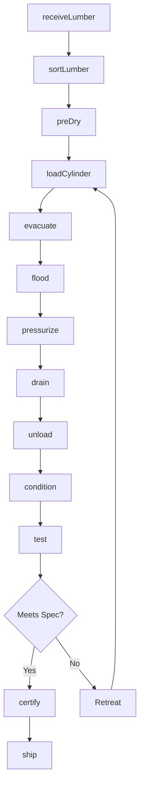
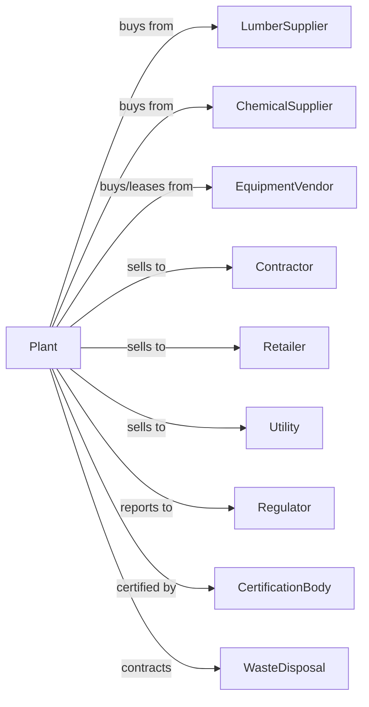

# Wood Preservation

> Business-as-Code definition for wood preservation operations. Models the complete treatment process from lumber procurement through pressure treatment, quality certification, and distribution.

## Overview

This U.S. industry comprises establishments primarily engaged in (1) treating wood sawed, planed, or shaped in other establishments with creosote or other preservatives, such as alkaline copper quat, copper azole, and sodium borates, to prevent decay and to protect against fire and insects and/or (2) sawing round wood poles, pilings, and posts and treating them with preservatives. Cross-References.

## Actors

| Actor | Description |
|-------|-------------|
| LumberSupplier | Provides untreated lumber and timber for treatment |
| ChemicalSupplier | Provides preservative chemicals and treatment solutions |
| EquipmentVendor | Sells and services treatment cylinders and pumps |
| Contractor | Purchases treated lumber for construction projects |
| Retailer | Buys treated lumber for resale to consumers |
| Utility | Purchases treated poles and crossarms |
| Regulator | Oversees EPA compliance and chemical handling |
| CertificationBody | Certifies treatment quality and retention levels |
| WasteDisposal | Handles hazardous waste and spent chemicals |

## Roles

| Role | Description |
|------|-------------|
| PlantOwner | Owns facility and manages business strategy |
| PlantManager | Oversees daily operations and production |
| TreatmentOperator | Operates pressure cylinders and treatment systems |
| ChemicalTech | Manages chemical mixing and solution monitoring |
| QualityTech | Tests treatment penetration and retention |
| YardWorker | Handles lumber movement and storage |
| SafetyOfficer | Ensures compliance with chemical handling protocols |

## Entities

| Entity | Description |
|--------|-------------|
| Lumber | Untreated wood input for preservation |
| TreatedWood | Finished product with preservative applied |
| Preservative | Chemical solution for wood treatment |
| Cylinder | Pressure vessel for treatment process |
| Charge | Batch of lumber loaded for treatment |
| Retention | Amount of preservative absorbed per cubic foot |
| Penetration | Depth of preservative absorption |
| Certificate | Quality assurance documentation |
| MSDS | Material safety data sheet for chemicals |
| Effluent | Wastewater from treatment process |

## Actions

| Action | Description |
|--------|-------------|
| receiveLumber | Accept and inspect incoming untreated lumber |
| sortLumber | Organize lumber by species, size, and end use |
| preDry | Reduce moisture content before treatment |
| loadCylinder | Place lumber charge into treatment vessel |
| evacuate | Remove air from cylinder for vacuum treatment |
| flood | Fill cylinder with preservative solution |
| pressurize | Apply pressure to force preservative into wood |
| drain | Remove excess solution from cylinder |
| unload | Remove treated lumber from cylinder |
| condition | Allow treated wood to stabilize and fix |
| test | Sample and analyze retention and penetration |
| certify | Issue quality certificate for treated batch |
| ship | Deliver treated products to customers |
| disposeSafely | Handle spent chemicals and waste properly |

## Events

| Event | Description |
|-------|-------------|
| lumberReceived | Incoming lumber accepted and inventoried |
| lumberSorted | Lumber organized for treatment batching |
| lumberDried | Pre-treatment moisture target achieved |
| cylinderLoaded | Charge placed in treatment vessel |
| treatmentStarted | Pressure cycle initiated |
| treatmentCompleted | Pressure cycle finished |
| cylinderUnloaded | Treated lumber removed from vessel |
| lumberConditioned | Post-treatment stabilization complete |
| batchTested | Quality samples analyzed |
| batchCertified | Quality certificate issued |
| orderShipped | Treated lumber delivered to customer |
| wasteDisposed | Hazardous materials properly handled |

## Searches

| Search | Description |
|--------|-------------|
| findLumber | List available untreated lumber by size and species |
| getInventory | Retrieve treated lumber stock by product type |
| checkCylinder | Get cylinder status and availability |
| getRetention | Retrieve retention test results by batch |
| findOrders | List pending customer orders |
| getChemicalLevels | Check preservative solution concentrations |
| getCertificates | Retrieve quality certificates by batch or customer |
| getComplianceStatus | Check regulatory compliance metrics |

## Workflow



## Actor Relationships



## Usage

### Calling Actions

```typescript
import { treatTreatedWood } from '@headlessly/treat-treated-wood'

const plant = treatTreatedWood()

// Receive lumber shipment
const receipt = await plant.receiveLumber({
  supplierId: 'sawmill-northwest',
  species: 'southern-pine',
  dimensions: ['4x4x8', '6x6x12', '2x6x16'],
  quantity: 5000,
  moistureContent: 25
})

// Load treatment cylinder
const charge = await plant.loadCylinder({
  cylinderId: 'cyl-001',
  lumberIds: receipt.lumberIds.slice(0, 200),
  preservativeType: 'ACQ',
  endUse: 'ground-contact'
})

// Run pressure treatment cycle
await plant.pressurize({
  chargeId: charge.id,
  pressure: 150,
  duration: 120,
  targetRetention: 0.40
})
```

### Event-Driven Automation

```typescript
// Auto-test after treatment
plant.treatmentCompleted(async ({ chargeId, cylinderId }) => {
  await plant.drain({ cylinderId })
  await plant.unload({ chargeId })

  // Sample random pieces for testing
  await plant.test({
    chargeId,
    sampleSize: 5,
    tests: ['retention', 'penetration']
  })
})

// Auto-certify passing batches
plant.batchTested(async ({ chargeId, retentionPcf, penetration }) => {
  const spec = await plant.getRetentionSpec({ chargeId })

  if (retentionPcf >= spec.minRetention && penetration >= spec.minPenetration) {
    await plant.certify({
      chargeId,
      standard: 'AWPA-UC4A',
      validYears: 40
    })
  }
})
```
