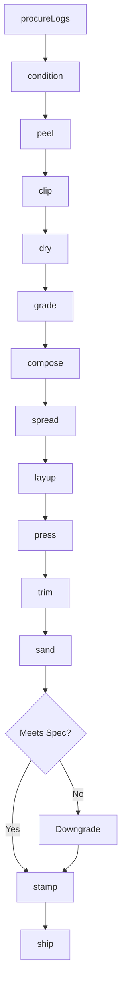
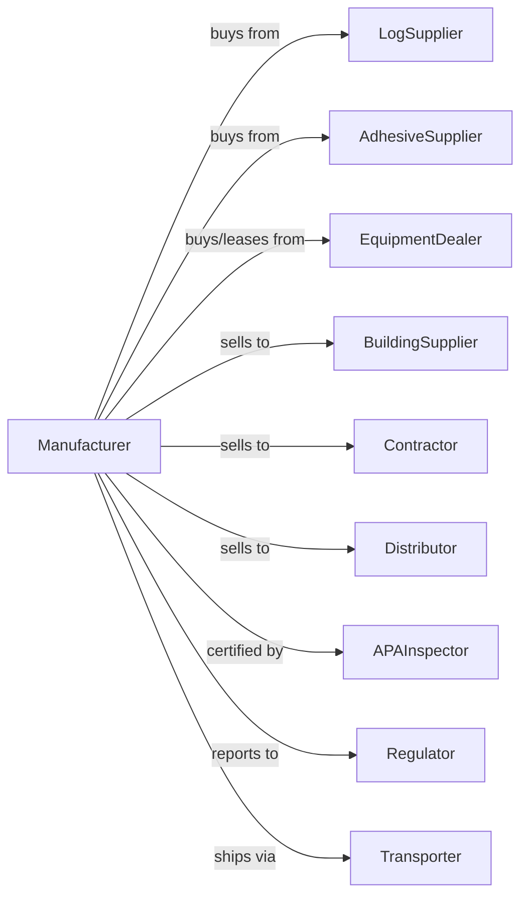

# Softwood Veneer and Plywood Manufacturing

> Business-as-Code definition for softwood veneer and plywood manufacturing operations. Models the complete production process from peeler log procurement through rotary peeling, panel pressing, and structural grade certification.

## Overview

This U.S. industry comprises establishments primarily engaged in manufacturing softwood veneer and/or softwood plywood. Cross-References. Establishments primarily engaged in--

## Actors

| Actor | Description |
|-------|-------------|
| LogSupplier | Provides softwood peeler logs from pine, fir, spruce |
| AdhesiveSupplier | Provides phenolic resins for structural bonding |
| EquipmentDealer | Sells and services rotary lathes and presses |
| BuildingSupplier | Purchases structural plywood for construction |
| Contractor | Buys sheathing and subfloor panels |
| Distributor | Wholesales plywood to retail and industrial |
| APAInspector | Certifies panels to APA performance standards |
| Regulator | Oversees emissions and workplace safety |
| Transporter | Handles bulk shipping of panel products |

## Roles

| Role | Description |
|------|-------------|
| PlantOwner | Owns facility and directs capital investment |
| PlantManager | Manages daily operations and production scheduling |
| LatheOperator | Operates rotary lathes for veneer peeling |
| DryerOperator | Manages veneer drying equipment |
| PressOperator | Operates hot press for panel manufacturing |
| GraderSorter | Grades and sorts veneer by quality |
| QualityTech | Performs panel testing and certification |

## Entities

| Entity | Description |
|--------|-------------|
| PeelerLog | Softwood log suitable for rotary peeling |
| Veneer | Continuous sheet peeled from rotating log |
| Core | Central plywood layer for structural strength |
| Crossband | Veneer layer perpendicular to face grain |
| Panel | Finished structural plywood product |
| PhenolicResin | Waterproof adhesive for exterior-grade panels |
| Grade | Structural and appearance classification |
| Span | Rated span capability for structural use |
| Thickness | Panel dimension affecting span rating |
| Stamp | APA trademark certifying panel performance |

## Actions

| Action | Description |
|--------|-------------|
| procureLogs | Purchase peeler logs by species and diameter |
| condition | Heat logs in hot pond or steam for peeling |
| peel | Rotary cut veneer from spinning log |
| clip | Cut continuous veneer into usable sheets |
| dry | Reduce veneer moisture in conveyor dryer |
| grade | Classify veneer by strength and appearance |
| compose | Arrange veneer layers with proper grain orientation |
| spread | Apply adhesive to veneer surfaces |
| layup | Stack veneer layers for pressing |
| press | Bond panel under heat and pressure |
| trim | Cut panels to standard dimensions |
| sand | Surface panels to specified smoothness |
| stamp | Apply APA grade stamp to certified panels |
| ship | Deliver products to customers |

## Events

| Event | Description |
|-------|-------------|
| logsProcured | Peeler logs purchased and delivered |
| logsConditioned | Logs heated and ready for peeling |
| veneerPeeled | Veneer cut from log |
| veneerClipped | Sheets cut to usable dimensions |
| veneerDried | Moisture reduced for bonding |
| veneerGraded | Quality classification assigned |
| panelComposed | Layer arrangement completed |
| panelPressed | Hot press cycle completed |
| panelTrimmed | Cut to final dimensions |
| panelStamped | Grade certification applied |
| orderShipped | Products delivered to customer |

## Searches

| Search | Description |
|--------|-------------|
| findLogs | List available peeler logs by species and size |
| getVeneerInventory | Retrieve veneer stock by grade |
| getPanelInventory | Retrieve panel inventory by thickness and grade |
| findBuyers | List customers with pending requirements |
| getOrders | Retrieve open orders by product specification |
| getProductionRate | Monitor line speed and efficiency |
| getGradeYield | Analyze grade distribution from log input |

## Workflow



## Actor Relationships



## Usage

### Calling Actions

```typescript
import { manufactureSoftwoodVeneer } from '@headlessly/manufacture-softwood-veneer'

const plant = manufactureSoftwoodVeneer()

// Check available stock
const stock = await plant.findLogs({ status: 'available' })

// Check finished goods inventory
const inventory = await plant.getVeneerInventory({ lowStockOnly: true })

// Procure peeler logs
const logs = await plant.procureLogs({
  species: 'douglas-fir',
  minDiameter: 10,
  maxDiameter: 24,
  quantity: 1000
})

// Condition logs for peeling
await plant.condition({
  logIds: logs.ids,
  method: 'hot-pond',
  temperature: 140,
  duration: 24
})

// Peel veneer
const veneer = await plant.peel({
  logId: logs.ids[0],
  thickness: 0.125,
  targetWidth: 54
})
```

### Event-Driven Automation

```typescript
// Auto-grade after drying
plant.veneerDried(async ({ veneerIds, moistureContent }) => {
  if (moistureContent <= 5) {
    for (const veneerId of veneerIds) {
      await plant.grade({
        veneerId,
        criteria: ['knots', 'splits', 'patches'],
        standard: 'PS1'
      })
    }
  }
})

// Auto-stamp certified panels
plant.panelPressed(async ({ panelId, thickness, bondTest }) => {
  const testResult = await plant.testBond({ panelId, method: 'vacuum-pressure' })

  if (testResult.passed) {
    await plant.trim({ panelId, width: 48, length: 96 })
    await plant.sand({ panelId, grit: 100 })
    await plant.stamp({
      panelId,
      grade: 'CDX',
      spanRating: '24/16',
      exposure: 'Exterior'
    })
  }
})
```
