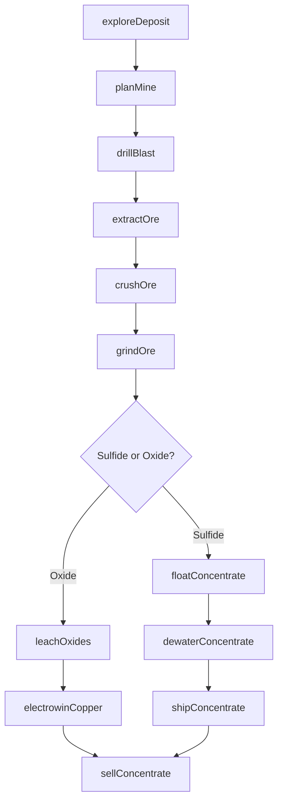
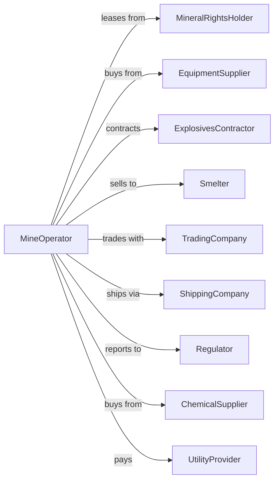

# Copper, Nickel, Lead, and Zinc Mining

> Business-as-Code definition for base metal ore mining operations. Models the complete lifecycle from exploration through extraction, concentration, and sale of copper, nickel, lead, and zinc ores.

## Overview

Copper, nickel, lead, and zinc mining involves the extraction and beneficiation of base metal sulfide and oxide ores. Operations include open-pit and underground mining, crushing, grinding, flotation concentration, and in some cases hydrometallurgical processing via leaching and electrowinning. This definition exposes actions for each phase of base metal production, events for workflow automation, and searches for data retrieval.

## Actors

| Actor | Description |
|-------|-------------|
| MineralRightsHolder | Owns subsurface mineral rights and grants mining leases |
| EquipmentSupplier | Provides mining and processing equipment |
| ExplosivesContractor | Supplies blasting materials and drilling services |
| Smelter | Purchases concentrate for conversion to refined metal |
| TradingCompany | Arranges concentrate sales and metal trading |
| ShippingCompany | Transports concentrate via rail, truck, or vessel |
| Regulator | Oversees permits, safety, and environmental compliance |
| ChemicalSupplier | Provides flotation reagents and processing chemicals |
| UtilityProvider | Supplies electricity and water for operations |

## Roles

| Role | Description |
|------|-------------|
| MineManager | Oversees all mining and processing operations |
| GeologicalEngineer | Maps ore bodies and estimates reserves |
| ProcessEngineer | Optimizes crushing, grinding, and flotation circuits |
| MetallurgicalEngineer | Designs and improves metal recovery processes |
| EnvironmentalManager | Manages tailings, water treatment, and compliance |
| MaintenanceSupervisor | Coordinates equipment repairs and preventive maintenance |
| FlotationOperator | Adjusts reagent dosages and cell conditions to optimize mineral separation |

## Entities

| Entity | Description |
|--------|-------------|
| OreBody | Geological deposit containing base metal mineralization |
| Pit | Open excavation for surface mining operations |
| Stope | Underground excavation where ore is extracted |
| Concentrator | Facility that upgrades ore through flotation |
| Concentrate | Upgraded material with high metal content for smelting |
| Tailings | Waste material remaining after flotation |
| LeachPad | Area for heap leaching of oxide ores |
| Cathode | Refined copper produced by electrowinning |
| Stockpile | Storage area for ore or concentrate |
| TailingsImpoundment | Facility for permanent storage of processing waste |

## Actions

| Action | Description |
|--------|-------------|
| exploreDeposit | Conduct drilling and sampling to delineate ore body |
| planMine | Design pit or underground workings and extraction sequence |
| drillBlast | Fragment ore with explosives for excavation |
| extractOre | Mine ore from pit benches or underground stopes |
| crushOre | Reduce ore to target particle size |
| grindOre | Process ore through ball mills for mineral liberation |
| floatConcentrate | Separate metal sulfides from waste rock via flotation |
| leachOxides | Apply acidic solution to dissolve copper from oxide ore |
| electrowinCopper | Plate copper cathodes from leach solution |
| dewater concentrate | Remove moisture for efficient transport |
| shipConcentrate | Transport concentrate to smelter |
| sellConcentrate | Execute sales contract with smelter or trader |
| manageTailings | Dispose of flotation waste in impoundment |
| reclaimSite | Restore mined areas per regulatory requirements |

## Events

| Event | Description |
|-------|-------------|
| depositExplored | Ore body delineated and reserves estimated |
| minePlanned | Extraction plan approved for development |
| oreBlasted | Material fragmented and ready for loading |
| oreExtracted | Material mined from pit or underground |
| oreCrushed | Ore reduced to target particle size |
| oreGround | Material processed through grinding circuit |
| concentrateFloated | Metal sulfides separated from waste rock |
| copperLeached | Metal dissolved from oxide ore |
| copperPlated | Cathode produced via electrowinning |
| concentrateShipped | Product dispatched to smelter |
| concentrateSold | Sales transaction completed |
| tailingsDeposited | Processing waste placed in impoundment |
| siteReclaimed | Mined area restored and approved |
| priceUpdated | Metal market price changed significantly |

## Searches

| Search | Description |
|--------|-------------|
| findDeposits | List ore bodies by metal content and status |
| getProduction | Retrieve tonnage and metal content by period |
| getRecovery | Check metal recovery rates by circuit |
| getInventory | Track ore, concentrate, and cathode stockpiles |
| checkPrices | Get current LME prices for copper, nickel, lead, zinc |
| findBuyers | List smelters and trading companies |
| getTailings | Monitor impoundment capacity and water quality |
| getEquipment | Check availability and status of mining equipment |

## Workflow



## Actor Relationships



## Usage

### Calling Actions

```typescript
import { mineCopper } from '@headlessly/mine-copper'

const mine = mineCopper()

// Check current LME copper price
const prices = await mine.checkPrices({ metals: ['copper', 'molybdenum'], exchange: 'LME' })

// Review concentrate inventory levels
const inventory = await mine.getInventory({ type: 'concentrate', minGrade: 25 })

// Explore deposit
const exploration = await mine.exploreDeposit({
  propertyId: 'morenci-extension',
  drillProgram: 'infill',
  holes: 75,
  targetMetals: ['copper', 'molybdenum']
})

// Plan mine development
const plan = await mine.planMine({
  depositId: exploration.depositId,
  method: 'open-pit',
  stripRatio: 2.5,
  millCapacity: 100000 // tons per day
})

// Extract and process ore
await mine.extractOre({
  pitId: plan.pitId,
  bench: 'bench-20',
  targetTons: 150000,
  cutoffGrade: 0.3 // % Cu
})
```

### Event-Driven Automation

```typescript
// Auto-route ore based on mineralogy
mine.oreExtracted(async ({ loadId, copperGrade, oreType }) => {
  if (oreType === 'oxide') {
    await mine.leachOxides({
      loadId,
      padSection: 'pad-3',
      acidRate: 8 // kg/ton
    })
  } else {
    await mine.crushOre({
      loadId,
      destination: 'primary-crusher'
    })
  }
})

// Auto-sell when price target reached
mine.concentrateFloated(async ({ batchId, dryTons, copperGrade }) => {
  const { copper } = await mine.checkPrices()

  if (copper >= 4.00) { // $/lb
    await mine.sellConcentrate({
      batchId,
      dryTons,
      copperGrade,
      spotSale: true
    })
  }
})
```
