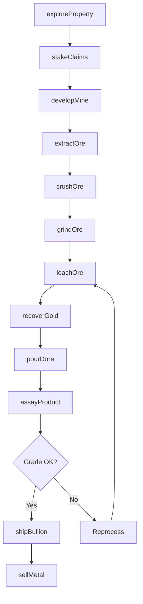
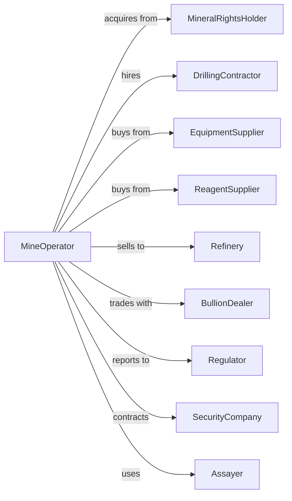

# Gold Ore and Silver Ore Mining

> Business-as-Code definition for gold and silver ore mining operations. Models the complete lifecycle from exploration through extraction, processing, and bullion production.

## Overview

Gold and silver ore mining involves the extraction and processing of precious metal-bearing rock through open-pit or underground methods. Operations include ore extraction, crushing, grinding, and metallurgical processing via heap leaching, carbon-in-pulp, or gravity separation to produce dore bars. This definition exposes actions for each phase of precious metals production, events for workflow automation, and searches for data retrieval.

## Actors

| Actor | Description |
|-------|-------------|
| MineralRightsHolder | Owns subsurface mineral rights and grants mining claims |
| DrillingContractor | Provides exploration and production drilling services |
| EquipmentSupplier | Supplies mining and processing equipment |
| ReagentSupplier | Provides cyanide, lime, and other processing chemicals |
| Refinery | Purchases dore bars for final refining into pure metal |
| BullionDealer | Trades refined gold and silver bars and coins |
| Regulator | Oversees permits, safety, and environmental compliance |
| SecurityCompany | Provides secure transport for bullion shipments |
| Assayer | Tests and certifies metal content in ore and products |

## Roles

| Role | Description |
|------|-------------|
| MineManager | Oversees all mining and processing operations |
| ExplorationGeologist | Identifies mineralization and plans drilling programs |
| MetallurgicalEngineer | Designs and optimizes gold recovery processes |
| MineGeologist | Maps ore zones and manages grade control |
| SecurityManager | Protects high-value materials and prevents theft |
| EnvironmentalEngineer | Manages cyanide handling and tailings compliance |
| Assayer | Performs fire assay and chemical analysis to determine gold and silver content |

## Entities

| Entity | Description |
|--------|-------------|
| Claim | Legal right to explore and mine minerals on a property |
| OreBody | Geological deposit containing gold or silver mineralization |
| Pit | Open excavation for surface mining operations |
| Stope | Underground excavation where ore is extracted |
| HeapLeachPad | Lined area where ore is stacked and treated with solution |
| CIPCircuit | Carbon-in-pulp processing system for gold extraction |
| DoreBar | Semi-refined gold-silver alloy bar ready for refinery |
| Tailings | Waste material remaining after metal extraction |
| Assay | Laboratory analysis of metal content |
| Refinery | Facility producing pure gold and silver |

## Actions

| Action | Description |
|--------|-------------|
| exploreProperty | Conduct geological mapping, sampling, and drilling |
| stakeClaimz | Secure mineral rights on prospective ground |
| developMine | Construct pit access or underground workings |
| extractOre | Mine ore from pit benches or underground stopes |
| crushOre | Reduce ore to optimal particle size |
| grindOre | Process ore through ball mills for liberation |
| leachOre | Apply cyanide solution to dissolve gold from ore |
| recoverGold | Extract gold from solution via carbon or electrowinning |
| pourDore | Cast recovered metal into dore bars |
| assayProduct | Test metal content in ore, concentrate, or dore |
| shipBullion | Transport dore bars to refinery under security |
| sellMetal | Execute sales at spot price or forward contract |
| manageTailings | Dispose of cyanide-bearing waste safely |
| reclaimSite | Restore mined areas and close facilities |

## Events

| Event | Description |
|-------|-------------|
| propertyExplored | Drilling completed and mineralization identified |
| claimStaked | Mineral rights secured on property |
| mineDeveloped | Site ready for ore production |
| oreExtracted | Material mined from pit or underground |
| oreCrushed | Ore reduced to target particle size |
| oreGround | Material processed through grinding circuit |
| goldLeached | Metal dissolved into cyanide solution |
| goldRecovered | Metal extracted from solution |
| dorePoured | Dore bar cast and weighed |
| productAssayed | Metal content certified by laboratory |
| bullionShipped | Dore bars dispatched to refinery |
| metalSold | Sales transaction completed |
| tailingsDeposited | Processing waste placed in storage facility |
| siteReclaimed | Mine closed and land restored |

## Searches

| Search | Description |
|--------|-------------|
| findClaims | List mineral claims by status, location, or owner |
| getProduction | Retrieve ounces produced by period or source |
| getGrades | Query ore grades by zone or blast hole |
| getRecovery | Check gold recovery rates by process circuit |
| getInventory | Track dore bars and concentrate in storage |
| checkPrices | Get current spot and futures prices for gold and silver |
| findBuyers | List refineries and bullion dealers |
| getAssays | Retrieve laboratory results by sample or batch |

## Workflow



## Actor Relationships



## Usage

### Calling Actions

```typescript
import { mineGoldOre } from '@headlessly/mine-gold-ore'

const mine = mineGoldOre()

// Check current gold and silver spot prices
const prices = await mine.checkPrices({ metals: ['gold', 'silver'], includeFutures: true })

// Find available mineral claims in the region
const claims = await mine.findClaims({ region: 'nevada', status: 'open', mineralType: 'gold' })

// Explore prospective property
const exploration = await mine.exploreProperty({
  propertyId: 'carlin-trend-prospect',
  drillProgram: 'rc-drilling',
  holes: 100,
  meters: 15000
})

// Develop open-pit mine
const development = await mine.developMine({
  propertyId: exploration.propertyId,
  type: 'open-pit',
  strippingRatio: 3.5,
  processingCapacity: 30000 // tons per day
})

// Extract and process ore
await mine.extractOre({
  pitId: development.pitId,
  bench: 'bench-12',
  targetTons: 50000,
  cutoffGrade: 0.3 // g/t
})
```

### Event-Driven Automation

```typescript
// Auto-route ore based on grade
mine.oreExtracted(async ({ loadId, grade }) => {
  const destination = grade >= 1.0
    ? 'mill-feed'
    : grade >= 0.3
      ? 'heap-leach-pad'
      : 'waste-dump'

  await mine.crushOre({
    loadId,
    destination,
    priority: destination === 'mill-feed' ? 'high' : 'standard'
  })
})

// Auto-sell when price target reached
mine.dorePoured(async ({ barId, goldOunces, silverOunces }) => {
  const { gold, silver } = await mine.checkPrices()

  if (gold >= 2000) {
    await mine.sellMetal({
      barId,
      goldOunces,
      silverOunces,
      spotSale: true
    })
  }
})
```
