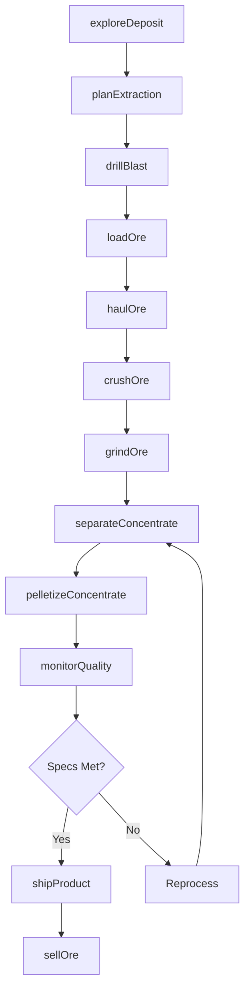
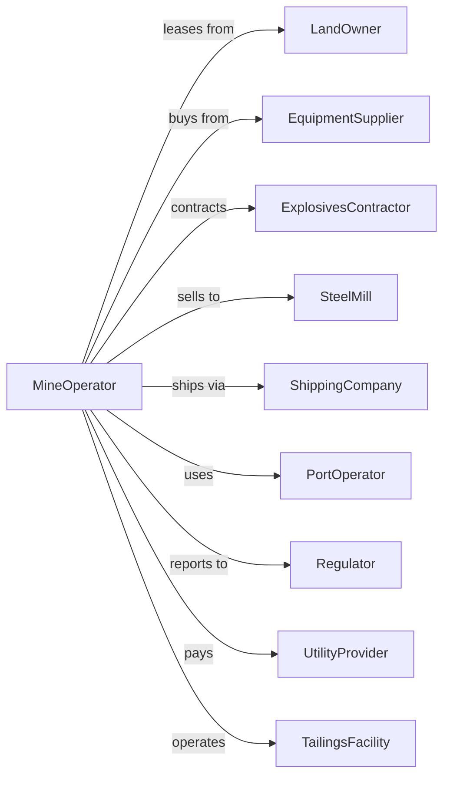

# Iron Ore Mining

> Business-as-Code definition for iron ore mining operations. Models the complete lifecycle from exploration through extraction, beneficiation, and pelletization for steel production.

## Overview

Iron ore mining involves the extraction and processing of iron-bearing minerals for use in steel manufacturing. Operations include open-pit mining, crushing and grinding, magnetic separation, and pelletization to produce concentrate suitable for blast furnaces. This definition exposes actions for each phase of iron ore production, events for workflow automation, and searches for data retrieval.

## Actors

| Actor | Description |
|-------|-------------|
| LandOwner | Holds mineral rights and grants mining leases |
| EquipmentSupplier | Provides haul trucks, shovels, crushers, and processing equipment |
| ExplosivesContractor | Supplies blasting materials and drilling services |
| SteelMill | Purchases iron ore pellets and concentrate for steel production |
| ShippingCompany | Transports ore via rail, lake freighter, or ocean vessel |
| PortOperator | Handles loading and unloading at shipping terminals |
| Regulator | Oversees mining permits, safety, and environmental compliance |
| UtilityProvider | Supplies electricity and natural gas for operations |
| TailingsFacility | Manages disposal of processing waste materials |

## Roles

| Role | Description |
|------|-------------|
| MineManager | Oversees all mining and processing operations |
| GeologicalEngineer | Maps ore bodies and plans extraction sequences |
| ProcessEngineer | Optimizes crushing, grinding, and separation operations |
| PitSupervisor | Manages day-to-day extraction activities |
| QualityController | Tests ore grade and pellet specifications |
| EnvironmentalManager | Ensures compliance with air, water, and tailings regulations |
| PelletPlantOperator | Operates balling drums and indurating furnaces to produce iron ore pellets |

## Entities

| Entity | Description |
|--------|-------------|
| Pit | Open excavation where ore is extracted |
| OreBody | Geological deposit containing extractable iron ore |
| Crusher | Equipment reducing ore to smaller particle sizes |
| Concentrator | Facility separating iron from waste rock |
| Pelletizer | Equipment forming iron concentrate into pellets |
| HaulTruck | Large vehicle transporting ore within the mine |
| Stockpile | Storage area for ore, concentrate, or pellets |
| Tailings | Waste material remaining after ore processing |
| Railcar | Rolling stock for transporting pellets to customers |
| Permit | Regulatory authorization for mining activities |

## Actions

| Action | Description |
|--------|-------------|
| exploreDeposit | Conduct drilling and sampling to map ore body |
| planExtraction | Design pit layout and mining sequence |
| drillBlast | Drill blast holes and fragment ore with explosives |
| loadOre | Excavate ore using shovels and load into trucks |
| haulOre | Transport ore from pit to crusher |
| crushOre | Reduce ore particle size through primary and secondary crushing |
| grindOre | Further reduce ore in ball mills or AG mills |
| separateConcentrate | Use magnetic separation to extract iron from waste |
| pelletizeConcentrate | Form concentrate into pellets and fire in kiln |
| shipProduct | Load pellets for rail or vessel transport |
| sellOre | Execute sales contract with steel mill |
| manageTailings | Dispose of processing waste in tailings facility |
| reclaimLand | Restore mined areas per regulatory requirements |
| monitorQuality | Test ore grade and pellet specifications |

## Events

| Event | Description |
|-------|-------------|
| depositExplored | Ore body mapped and reserves estimated |
| extractionPlanned | Mine plan approved for development |
| oreBlasted | Material fragmented and ready for loading |
| oreLoaded | Ore excavated and placed in haul trucks |
| oreHauled | Material delivered to crusher |
| oreCrushed | Ore reduced to target particle size |
| oreGround | Material processed through grinding circuit |
| concentrateSeparated | Iron extracted from waste rock |
| pelletized | Concentrate formed into finished pellets |
| productShipped | Pellets loaded and dispatched to customer |
| oreSold | Sales transaction completed with steel mill |
| qualityTested | Ore or pellet specifications verified |
| tailingsDeposited | Processing waste placed in storage facility |
| landReclaimed | Mined area restored and approved |

## Searches

| Search | Description |
|--------|-------------|
| findPits | List active pits with production and reserve data |
| getProduction | Retrieve tonnage by pit, date range, or product type |
| getInventory | Check stockpile quantities for ore, concentrate, and pellets |
| getQuality | Query ore grade and pellet specifications |
| findBuyers | List steel mills and contract opportunities |
| getEquipment | Check availability and status of mining equipment |
| getTailings | Monitor tailings facility capacity and conditions |
| getShipments | Track rail and vessel movements |

## Workflow



## Actor Relationships



## Usage

### Calling Actions

```typescript
import { mineIronOre } from '@headlessly/mine-iron-ore'

const mine = mineIronOre()

// Check pellet inventory and stockpile levels
const inventory = await mine.getInventory({ type: 'pellet', grade: 'blast-furnace' })

// Find steel mill buyers with open contracts
const buyers = await mine.findBuyers({ region: 'great-lakes', productType: 'pellets' })

// Explore new deposit
const exploration = await mine.exploreDeposit({
  siteId: 'mesabi-range-block-12',
  drillingProgram: 'infill',
  holes: 50,
  targetDepth: 300
})

// Plan extraction sequence
const plan = await mine.planExtraction({
  depositId: exploration.depositId,
  method: 'open-pit',
  stripRatio: 1.5,
  annualTonnage: 20000000
})

// Drill and blast ore
await mine.drillBlast({
  pitId: plan.pitId,
  bench: 'bench-15',
  pattern: '8x10',
  holeDepth: 45,
  explosiveType: 'anfo'
})
```

### Event-Driven Automation

```typescript
// Auto-route low-grade ore to stockpile
mine.oreLoaded(async ({ truckId, grade }) => {
  const destination = grade < 0.58 ? 'low-grade-stockpile' : 'crusher-1'
  await mine.haulOre({
    truckId,
    destination,
    priority: grade >= 0.58 ? 'high' : 'standard'
  })
})

// Auto-adjust processing when quality fails
mine.qualityTested(async ({ batchId, ironContent, silica }) => {
  if (ironContent < 65 || silica > 5) {
    await mine.separateConcentrate({
      batchId,
      magneticIntensity: 'increased',
      reprocess: true
    })
  }
})
```
