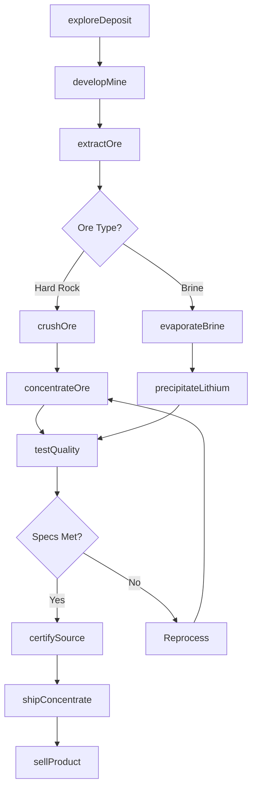
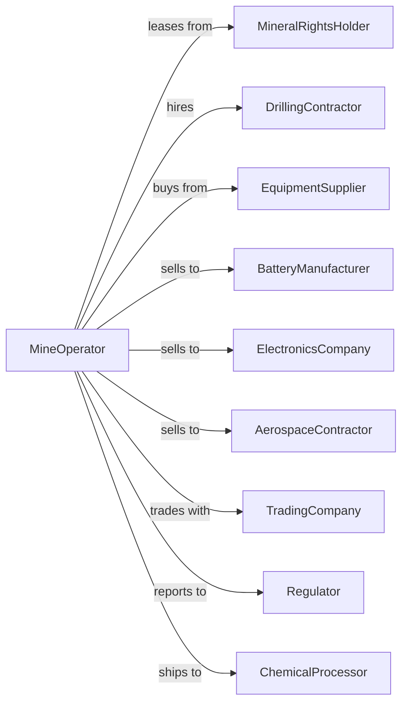

# Other Metal Ore Mining

> Business-as-Code definition for specialty and rare metal ore mining operations. Models the complete lifecycle from exploration through extraction and beneficiation of tungsten, titanium, tantalum, lithium, and other specialty metals.

## Overview

Other metal ore mining involves the extraction and processing of specialty metals including tungsten, titanium, tantalum, lithium, cobalt, molybdenum, vanadium, and rare earth elements. These metals are critical for electronics, aerospace, energy storage, and advanced manufacturing. This definition exposes actions for each phase of specialty metal production, events for workflow automation, and searches for data retrieval.

## Actors

| Actor | Description |
|-------|-------------|
| MineralRightsHolder | Owns mineral rights and grants exploration and mining permits |
| DrillingContractor | Provides core drilling and exploration services |
| EquipmentSupplier | Supplies mining and processing equipment |
| BatteryManufacturer | Purchases lithium and cobalt for battery production |
| ElectronicsCompany | Buys tantalum, tungsten, and rare earths for components |
| AerospaceContractor | Purchases titanium and specialty alloys |
| TradingCompany | Arranges sales and logistics for specialty metals |
| Regulator | Oversees permits, safety, and responsible sourcing compliance |
| ChemicalProcessor | Converts ore or concentrate into refined metal compounds |

## Roles

| Role | Description |
|------|-------------|
| MineManager | Oversees all mining and processing operations |
| ExplorationGeologist | Identifies mineralization and manages drilling programs |
| ProcessEngineer | Designs and optimizes beneficiation circuits |
| SupplyChainManager | Coordinates sales, logistics, and responsible sourcing |
| EnvironmentalManager | Ensures compliance with environmental regulations |
| QualityController | Tests product specifications for customer requirements |
| LeachPadOperator | Manages heap leach pads and pregnant solution collection for metal recovery |

## Entities

| Entity | Description |
|--------|-------------|
| Deposit | Geological occurrence of specialty metal mineralization |
| Pegmatite | Coarse-grained igneous rock hosting lithium or tantalum |
| HardRockOre | Consolidated rock containing metal mineralization |
| PlacerDeposit | Unconsolidated material with heavy mineral concentrations |
| Concentrate | Upgraded product ready for chemical processing |
| BrinePond | Evaporation pond for lithium extraction from brine |
| Tailings | Waste material from beneficiation process |
| Spodumene | Lithium-bearing mineral from hard rock deposits |
| Coltan | Tantalum-niobium mineral used in electronics |
| RareEarthOxide | Processed rare earth element compound |

## Actions

| Action | Description |
|--------|-------------|
| exploreDeposit | Conduct geological mapping and drilling to assess resource |
| developMine | Construct infrastructure and access for extraction |
| extractOre | Mine ore from open pit, underground, or placer operations |
| crushOre | Reduce ore to appropriate particle size |
| concentrateOre | Upgrade ore through gravity, flotation, or magnetic separation |
| evaporateBrine | Concentrate lithium from salt lake brines |
| precipitateLithium | Convert lithium brine to carbonate or hydroxide |
| shipConcentrate | Transport product to processor or end customer |
| sellProduct | Execute sales contract with buyer |
| certifySource | Document responsible sourcing and chain of custody |
| manageTailings | Dispose of processing waste per regulations |
| reclaimSite | Restore mined areas to approved condition |
| testQuality | Verify product meets customer specifications |
| trackInventory | Monitor stockpiles and shipments |

## Events

| Event | Description |
|-------|-------------|
| depositExplored | Resource delineated and reserves estimated |
| mineDeveloped | Site ready for ore production |
| oreExtracted | Material mined from deposit |
| oreConcentrated | Product upgraded to target grade |
| brineEvaporated | Lithium concentrated in ponds |
| lithiumPrecipitated | Lithium compound produced |
| productShipped | Concentrate dispatched to customer |
| productSold | Sales transaction completed |
| sourcesCertified | Responsible sourcing documentation completed |
| qualityVerified | Product meets customer specifications |
| tailingsDeposited | Processing waste placed in storage |
| siteReclaimed | Mined area restored and approved |
| priceUpdated | Commodity price changed significantly |

## Searches

| Search | Description |
|--------|-------------|
| findDeposits | List deposits by metal type and development stage |
| getProduction | Retrieve tonnage and grade by period |
| getInventory | Track concentrate and product stockpiles |
| checkPrices | Get current prices for lithium, cobalt, tantalum, rare earths |
| findBuyers | List potential customers by metal type |
| getCertification | Query responsible sourcing compliance status |
| getQuality | Retrieve product specifications and test results |
| getReserves | Query estimated recoverable resources |

## Workflow



## Actor Relationships



## Usage

### Calling Actions

```typescript
import { mineMetalOre } from '@headlessly/mine-metal-ore'

const mine = mineMetalOre()

// Check current lithium and cobalt prices
const prices = await mine.checkPrices({ metals: ['lithium', 'cobalt'], exchange: 'spot' })

// Find deposits in advanced development stage
const deposits = await mine.findDeposits({ metal: 'lithium', stage: 'feasibility' })

// Explore lithium deposit
const exploration = await mine.exploreDeposit({
  propertyId: 'nevada-lithium-basin',
  depositType: 'brine',
  targetMetal: 'lithium',
  assayProgram: 'geochemical-sampling'
})

// Develop hard rock tantalum mine
const development = await mine.developMine({
  depositId: 'greenbushes-extension',
  method: 'open-pit',
  targetMetal: 'tantalum',
  processingCapacity: 5000 // tons per day
})

// Extract and concentrate ore
await mine.extractOre({
  mineId: development.mineId,
  zone: 'pegmatite-zone-3',
  targetTons: 10000,
  cutoffGrade: 0.02 // % Ta2O5
})
```

### Event-Driven Automation

```typescript
// Auto-certify responsible sourcing
mine.productShipped(async ({ shipmentId, destination, metal }) => {
  if (['tantalum', 'cobalt', 'tungsten'].includes(metal)) {
    await mine.certifySource({
      shipmentId,
      standard: 'RMI-RMAP',
      chainOfCustody: true
    })
  }
})

// Auto-alert on price movements
mine.priceUpdated(async ({ metal, newPrice, changePercent }) => {
  if (changePercent > 10) {
    const inventory = await mine.getInventory({ metal })
    if (inventory.totalTons > 0) {
      await mine.sellProduct({
        metal,
        quantity: inventory.totalTons * 0.5,
        spotSale: true
      })
    }
  }
})
```
