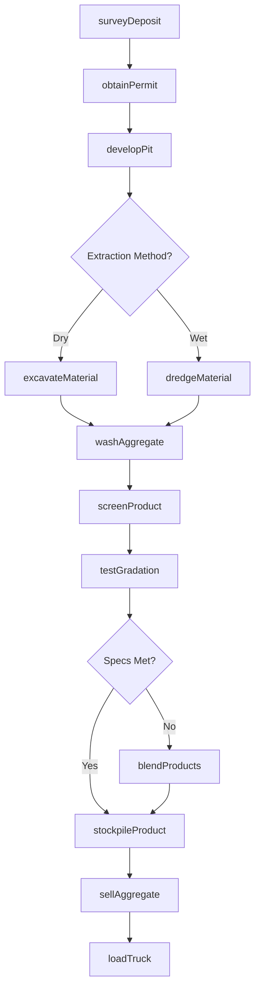
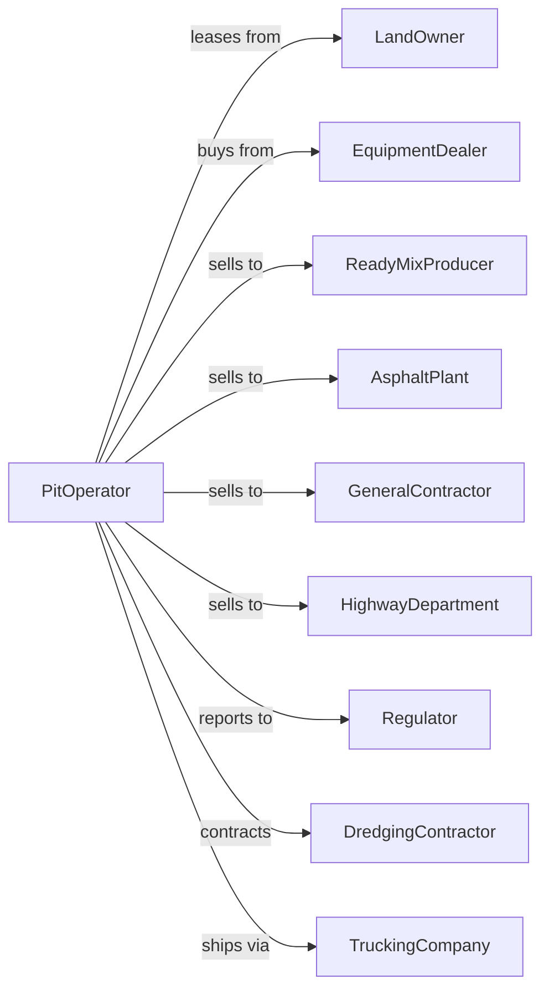

# Construction Sand and Gravel Mining

> Business-as-Code definition for construction sand and gravel mining operations. Models the complete lifecycle from pit development through extraction, washing, and sale of aggregate for concrete, asphalt, and general construction.

## Overview

Construction sand and gravel mining involves the extraction and processing of naturally occurring sand and gravel deposits from pits and dredging operations. Materials are washed, screened, and sized for use in ready-mix concrete, asphalt, road base, and fill applications. This definition exposes actions for each phase of aggregate production, events for workflow automation, and searches for data retrieval.

## Actors

| Actor | Description |
|-------|-------------|
| LandOwner | Holds surface and mineral rights for pit operations |
| EquipmentDealer | Sells and services loaders, screens, washers, and conveyors |
| ReadyMixProducer | Purchases sand and gravel for concrete production |
| AsphaltPlant | Buys aggregate for hot mix asphalt |
| GeneralContractor | Purchases fill, base, and drainage materials |
| HighwayDepartment | Procures aggregate for road construction |
| Regulator | Oversees permits, groundwater, and reclamation compliance |
| DredgingContractor | Provides underwater excavation services |
| TruckingCompany | Hauls aggregate to customer job sites |

## Roles

| Role | Description |
|------|-------------|
| PitManager | Oversees all extraction and processing operations |
| ExcavatorOperator | Operates loaders, excavators, and dredges |
| PlantOperator | Runs washing, screening, and stockpiling equipment |
| QualityTechnician | Tests gradation and material properties |
| SalesCoordinator | Manages customer orders and dispatching |
| ReclamationSpecialist | Plans and executes pit restoration |
| WashPlantOperator | Operates log washers and sand screws to remove clay and silt from aggregate |

## Entities

| Entity | Description |
|--------|-------------|
| Pit | Open excavation where sand and gravel are extracted |
| Deposit | Geological accumulation of sand and gravel |
| Dredge | Equipment for underwater sand and gravel extraction |
| WashPlant | Facility for cleaning and sizing aggregate |
| Screen | Equipment separating material by particle size |
| Stockpile | Storage area for sized sand and gravel products |
| Pond | Water body used for washing and settling operations |
| Loader | Equipment for excavating and moving material |
| Conveyor | Belt system moving material through the plant |
| Gradation | Particle size distribution of aggregate product |

## Actions

| Action | Description |
|--------|-------------|
| surveyDeposit | Map sand and gravel formation and estimate reserves |
| obtainPermit | Secure mining permits and environmental approvals |
| developPit | Establish access, pond, and processing infrastructure |
| excavateMaterial | Remove sand and gravel from pit face or pond |
| dredgeMaterial | Extract submerged sand and gravel |
| washAggregate | Clean material to remove clay, silt, and organics |
| screenProduct | Separate aggregate into sized fractions |
| blendProducts | Combine sizes to meet customer specifications |
| stockpileProduct | Store finished sand and gravel by size |
| testGradation | Verify particle size distribution meets specifications |
| sellAggregate | Execute sales and schedule deliveries |
| loadTruck | Transfer product from stockpile to customer vehicle |
| reclaimPit | Restore exhausted pit areas for approved end use |
| manageWater | Control groundwater and recycle wash water |

## Events

| Event | Description |
|-------|-------------|
| depositSurveyed | Sand and gravel reserves mapped and estimated |
| permitObtained | Mining authorization received |
| pitDeveloped | Site ready for extraction operations |
| materialExcavated | Sand and gravel removed from pit |
| materialDredged | Submerged aggregate extracted |
| aggregateWashed | Material cleaned of fines and impurities |
| productScreened | Aggregate separated into sized fractions |
| productsBlended | Custom mix created for customer |
| productStockpiled | Finished aggregate placed in inventory |
| gradationTested | Particle size verified against specifications |
| aggregateSold | Sales transaction completed |
| truckLoaded | Customer delivery dispatched |
| pitReclaimed | Exhausted area restored |
| waterLevelAdjusted | Pit dewatering or water management completed |

## Searches

| Search | Description |
|--------|-------------|
| getInventory | Check stockpile quantities by product size |
| getProduction | Retrieve tonnage by period or product |
| findCustomers | List buyers and contract opportunities |
| getGradation | Query particle size test results |
| checkPrices | Get current sand and gravel prices |
| getPermits | Retrieve permit status and compliance records |
| getWaterLevels | Monitor pit and groundwater conditions |
| trackDeliveries | Monitor truck movements and deliveries |

## Workflow



## Actor Relationships



## Usage

### Calling Actions

```typescript
import { quarryConstructionSand } from '@headlessly/quarry-construction-sand'

const pit = quarryConstructionSand()

// Check current stockpile levels
const inventory = await pit.getInventory({ product: 'washed-gravel', sizeRange: '3/4-inch' })

// Get current sand and gravel prices
const prices = await pit.checkPrices({ product: 'concrete-sand', region: 'midwest' })

// Survey sand and gravel deposit
const survey = await pit.surveyDeposit({
  siteId: 'river-valley-deposit-12',
  method: 'test-pits',
  estimatedReserves: 5000000, // tons
  overburdenDepth: 3 // feet
})

// Develop new pit area
const development = await pit.developPit({
  siteId: survey.siteId,
  ponds: 2,
  washPlant: true,
  screenDecks: 3
})

// Excavate and process material
await pit.excavateMaterial({
  pitId: development.pitId,
  targetTons: 1500,
  faceLocation: 'north-face'
})
```

### Event-Driven Automation

```typescript
// Auto-wash and screen excavated material
pit.materialExcavated(async ({ loadId, clayContent }) => {
  const washIntensity = clayContent > 5 ? 'high' : 'standard'

  await pit.washAggregate({
    loadId,
    intensity: washIntensity,
    recyclWater: true
  })
})

// Auto-blend to meet specifications
pit.gradationTested(async ({ productId, gradation, targetSpec }) => {
  if (!gradation.meetsSpec) {
    await pit.blendProducts({
      productId,
      targetSpec,
      adjustments: gradation.recommendedBlend
    })
  }
})
```
