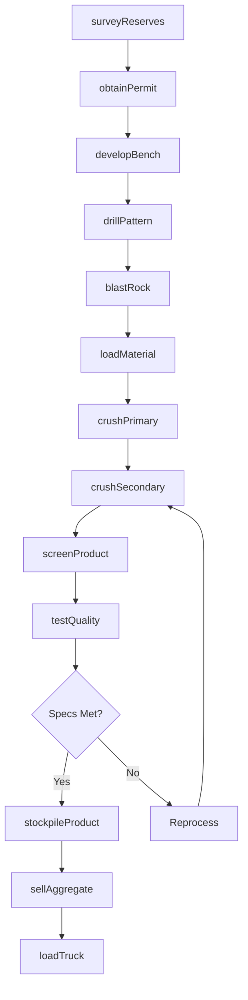
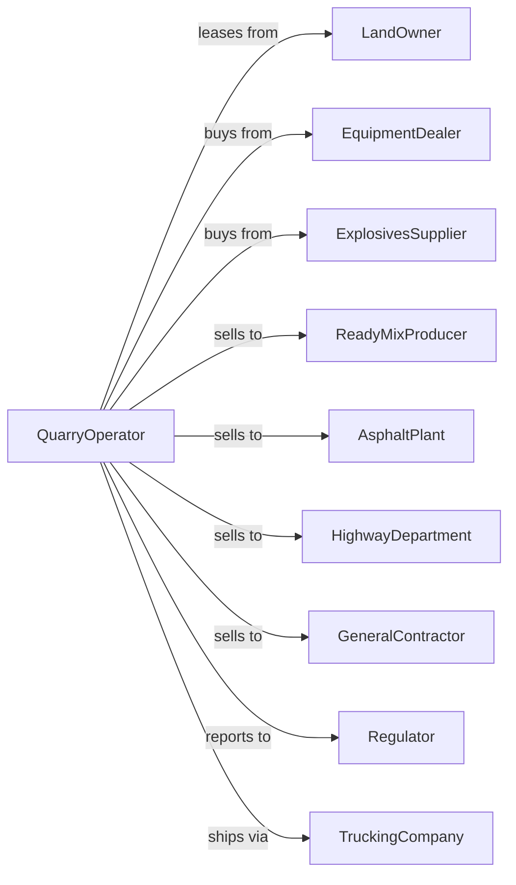

# Crushed and Broken Limestone Mining and Quarrying

> Business-as-Code definition for crushed limestone quarrying operations. Models the complete lifecycle from extraction through crushing, screening, and sale of limestone aggregate for construction and industrial applications.

## Overview

Crushed and broken limestone mining and quarrying involves the extraction and processing of limestone, dolomite, and related rocks for use as construction aggregate, road base, concrete production, and agricultural lime. Operations include drilling and blasting, crushing through multiple stages, and screening to produce sized products. This definition exposes actions for each phase of aggregate production, events for workflow automation, and searches for data retrieval.

## Actors

| Actor | Description |
|-------|-------------|
| LandOwner | Holds surface and mineral rights for quarry operations |
| EquipmentDealer | Sells and services crushers, screens, and loaders |
| ExplosivesSupplier | Provides blasting materials and technical services |
| ReadyMixProducer | Purchases aggregate for concrete production |
| AsphaltPlant | Buys crushed stone for hot mix asphalt |
| HighwayDepartment | Procures aggregate for road construction |
| GeneralContractor | Purchases stone for building and site work |
| Regulator | Oversees permits, safety, and environmental compliance |
| TruckingCompany | Hauls aggregate to customer job sites |

## Roles

| Role | Description |
|------|-------------|
| QuarryManager | Oversees all extraction and processing operations |
| BlastingEngineer | Designs and executes drilling and blasting programs |
| PlantOperator | Operates crushing and screening equipment |
| LoaderOperator | Loads trucks and manages stockpiles |
| QualityTechnician | Tests aggregate gradation and specifications |
| SalesRepresentative | Manages customer orders and pricing |
| ScaleOperator | Weighs trucks and issues load tickets at the quarry scale house |

## Entities

| Entity | Description |
|--------|-------------|
| Quarry | Open excavation where limestone is extracted |
| Bench | Horizontal level within the quarry face |
| Crusher | Equipment that reduces rock to smaller sizes |
| Screen | Equipment that separates crushed stone by size |
| Stockpile | Storage area for sized aggregate products |
| Conveyor | Belt system moving material through the plant |
| Loader | Equipment for loading trucks from stockpiles |
| Permit | Regulatory authorization for quarrying activities |
| Gradation | Size distribution of crushed stone product |
| Specification | Customer or agency requirements for aggregate |

## Actions

| Action | Description |
|--------|-------------|
| surveyReserves | Map limestone formation and estimate tonnage |
| obtainPermit | Secure quarrying permits and environmental approvals |
| developBench | Establish new extraction level in quarry |
| drillPattern | Create blast hole pattern for fragmentation |
| blastRock | Use explosives to fragment limestone |
| loadMaterial | Excavate blasted rock and load into trucks |
| crushPrimary | Reduce large rock in primary crusher |
| crushSecondary | Further reduce rock in secondary and tertiary crushers |
| screenProduct | Separate crushed stone into sized fractions |
| stockpileProduct | Store finished aggregate by size and type |
| loadTruck | Transfer product from stockpile to customer vehicle |
| sellAggregate | Execute sales and schedule deliveries |
| testQuality | Verify gradation and specifications |
| reclaimQuarry | Restore exhausted areas per permit requirements |

## Events

| Event | Description |
|-------|-------------|
| reservesSurveyed | Limestone formation mapped and tonnage estimated |
| permitObtained | Quarrying authorization received |
| benchDeveloped | New extraction level established |
| patternDrilled | Blast holes completed per design |
| rockBlasted | Material fragmented and ready for loading |
| materialLoaded | Rock excavated and hauled to crusher |
| primaryCrushed | Large rock reduced to intermediate size |
| secondaryCrushed | Rock reduced to near-final size |
| productScreened | Crushed stone separated into sized fractions |
| productStockpiled | Finished aggregate placed in inventory |
| truckLoaded | Customer delivery dispatched |
| aggregateSold | Sales transaction completed |
| qualityTested | Gradation verified against specifications |
| quarryReclaimed | Exhausted area restored |

## Searches

| Search | Description |
|--------|-------------|
| getInventory | Check stockpile quantities by product size |
| getProduction | Retrieve tonnage by date range or product |
| findCustomers | List buyers and contract opportunities |
| getQuality | Query gradation test results |
| checkPrices | Get current aggregate prices by product |
| getPermits | Retrieve permit status and compliance records |
| getEquipment | Monitor crusher and screen availability |
| trackDeliveries | Monitor truck movements and delivery status |

## Workflow



## Actor Relationships



## Usage

### Calling Actions

```typescript
import { quarryCrushedBroken } from '@headlessly/quarry-crushed-broken'

const quarry = quarryCrushedBroken()

// Survey limestone reserves
const survey = await quarry.surveyReserves({
  siteId: 'midwest-limestone-deposit',
  method: 'core-drilling',
  estimatedTonnage: 50000000
})

// Drill blast pattern
const pattern = await quarry.drillPattern({
  benchId: 'bench-12',
  spacing: 12, // feet
  burden: 10, // feet
  depth: 40, // feet
  holes: 50
})

// Process through crushing circuit
await quarry.crushPrimary({
  feedTons: 5000,
  targetSize: 6 // inches
})
```

### Event-Driven Automation

```typescript
// Auto-test quality after screening
quarry.productScreened(async ({ productId, size, stockpileId }) => {
  const result = await quarry.testQuality({
    productId,
    tests: ['gradation', 'specific-gravity', 'absorption']
  })

  if (result.meetsSpec) {
    await quarry.stockpileProduct({
      productId,
      stockpileId,
      certify: true
    })
  }
})

// Auto-schedule deliveries
quarry.aggregateSold(async ({ orderId, product, tons, deliveryDate }) => {
  await quarry.loadTruck({
    orderId,
    product,
    tons,
    scheduledDate: deliveryDate,
    truckCount: Math.ceil(tons / 25)
  })
})
```
