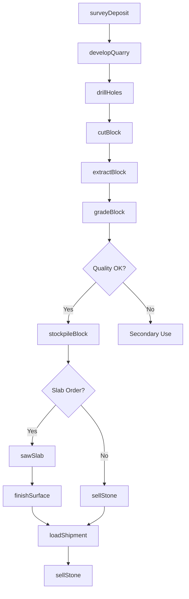
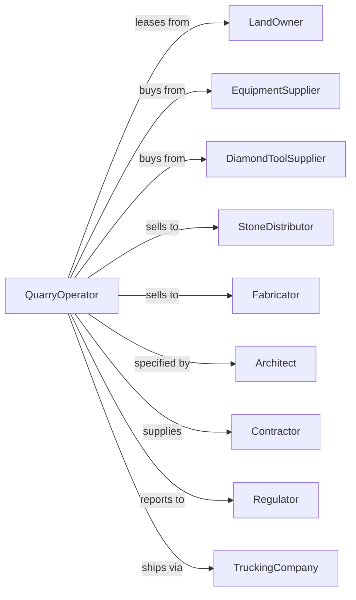

# Dimension Stone Mining and Quarrying

> Business-as-Code definition for dimension stone quarrying operations. Models the complete lifecycle from quarry development through block extraction, processing, and sale of granite, marble, limestone, and slate.

## Overview

Dimension stone mining and quarrying involves the extraction of rough blocks and slabs of natural stone for architectural, monumental, and decorative applications. Operations include controlled drilling and cutting to extract intact blocks, wire sawing, splitting, and surface finishing. This definition exposes actions for each phase of dimension stone production, events for workflow automation, and searches for data retrieval.

## Actors

| Actor | Description |
|-------|-------------|
| LandOwner | Holds surface and mineral rights for quarry operations |
| EquipmentSupplier | Provides wire saws, drills, cranes, and cutting equipment |
| DiamondToolSupplier | Supplies diamond wire, blades, and abrasives |
| StoneDistributor | Purchases blocks and slabs for resale |
| Fabricator | Cuts and finishes stone for construction projects |
| Architect | Specifies stone for building and landscape projects |
| Contractor | Installs finished stone in construction |
| Regulator | Oversees quarry permits, safety, and environmental compliance |
| TruckingCompany | Transports heavy stone blocks to customers |

## Roles

| Role | Description |
|------|-------------|
| QuarryManager | Oversees all quarrying and processing operations |
| Geologist | Maps stone deposits and identifies quality zones |
| QuarryOperator | Operates drilling, cutting, and extraction equipment |
| CraneOperator | Handles and moves large stone blocks |
| StoneGrader | Evaluates block quality, color, and defects |
| SafetyCoordinator | Ensures compliance with safety regulations |
| WireSawOperator | Runs diamond wire saws to cut large blocks from the quarry face |

## Entities

| Entity | Description |
|--------|-------------|
| Quarry | Open excavation where stone is extracted |
| Bench | Horizontal level within the quarry face |
| Block | Large rectangular piece of rough stone |
| Slab | Thin cut of stone ready for fabrication |
| WireSaw | Diamond-impregnated cutting tool for block extraction |
| Derrick | Lifting equipment for moving blocks |
| Stockyard | Storage area for blocks awaiting sale |
| Permit | Regulatory authorization for quarrying activities |
| Defect | Natural flaw affecting stone quality or value |
| Finish | Surface treatment applied to stone slabs |

## Actions

| Action | Description |
|--------|-------------|
| surveyDeposit | Map stone formation and identify quality zones |
| developQuarry | Construct access roads, benches, and infrastructure |
| drillHoles | Create holes for wire insertion or splitting |
| cutBlock | Separate block from quarry face using wire saw |
| splitStone | Use wedges or hydraulic splitters to separate stone |
| extractBlock | Remove cut block from quarry face |
| gradeBlock | Evaluate quality, color consistency, and defects |
| stockpileBlock | Store blocks in yard for inventory |
| sawSlab | Cut blocks into slabs of specified thickness |
| finishSurface | Apply polished, honed, or textured finish |
| loadShipment | Transfer blocks or slabs to transport |
| sellStone | Execute sales contract with buyer |
| reclaimQuarry | Restore exhausted areas per permit requirements |
| trackInventory | Monitor block and slab inventory by grade |

## Events

| Event | Description |
|-------|-------------|
| depositSurveyed | Stone formation mapped and quality assessed |
| quarryDeveloped | Site ready for block extraction |
| holesDrilled | Preparation completed for wire cutting |
| blockCut | Stone separated from quarry face |
| blockExtracted | Block removed and moved to staging area |
| blockGraded | Quality classification assigned |
| blockStockpiled | Block placed in inventory yard |
| slabSawed | Block cut into slabs |
| surfaceFinished | Finish applied to slab |
| shipmentLoaded | Stone loaded for transport |
| stoneSold | Sales transaction completed |
| quarryReclaimed | Exhausted area restored |
| defectIdentified | Quality issue found in block or slab |

## Searches

| Search | Description |
|--------|-------------|
| findBlocks | List blocks by stone type, grade, and dimensions |
| getInventory | Check block and slab quantities by variety |
| findBuyers | List distributors, fabricators, and project opportunities |
| getQuarryStatus | Monitor extraction progress and bench levels |
| getQuality | Query grading results and defect rates |
| checkPrices | Get current market prices by stone variety |
| getPermits | Retrieve permit status and compliance records |
| trackShipments | Monitor deliveries to customers |

## Workflow



## Actor Relationships



## Usage

### Calling Actions

```typescript
import { quarryDimensionStone } from '@headlessly/quarry-dimension-stone'

const quarry = quarryDimensionStone()

// Survey stone deposit
const survey = await quarry.surveyDeposit({
  siteId: 'vermont-marble-ridge',
  stoneType: 'marble',
  method: 'core-sampling',
  targetArea: 50 // acres
})

// Develop new quarry bench
const bench = await quarry.developQuarry({
  siteId: survey.siteId,
  benchLevel: 3,
  accessRamp: true,
  drainageSystem: true
})

// Extract dimension block
await quarry.cutBlock({
  benchId: bench.id,
  dimensions: { length: 10, width: 5, height: 5 }, // feet
  method: 'diamond-wire'
})
```

### Event-Driven Automation

```typescript
// Auto-grade extracted blocks
quarry.blockExtracted(async ({ blockId, stoneType }) => {
  const grading = await quarry.gradeBlock({
    blockId,
    criteria: ['color-consistency', 'vein-pattern', 'structural-soundness']
  })

  if (grading.grade === 'A') {
    await quarry.stockpileBlock({
      blockId,
      zone: 'premium-inventory'
    })
  }
})

// Auto-process for slab orders
quarry.stoneSold(async ({ orderId, blockId, slabThickness }) => {
  if (slabThickness) {
    await quarry.sawSlab({
      blockId,
      thickness: slabThickness,
      finish: 'polished'
    })
  }
})
```
