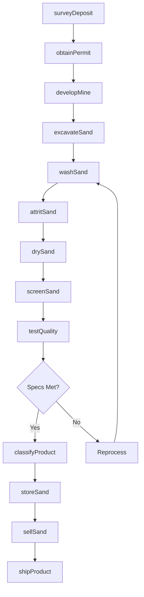
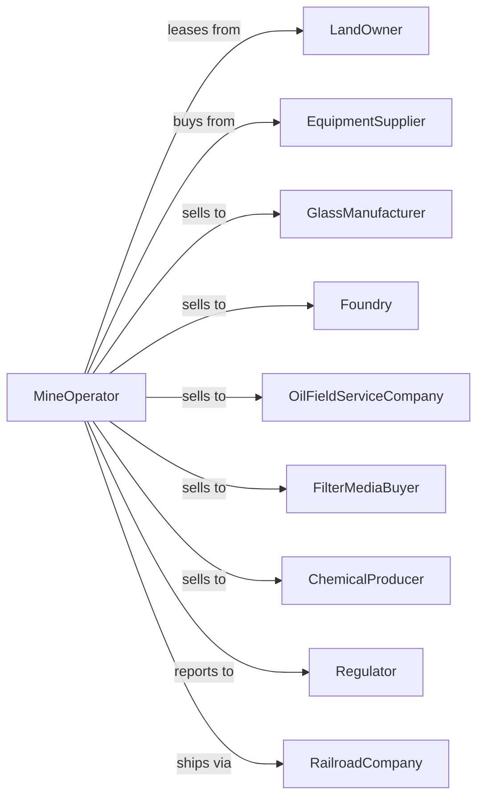

# Industrial Sand Mining

> Business-as-Code definition for industrial sand mining operations. Models the complete lifecycle from extraction through processing and sale of high-purity silica sand for glass, foundry, hydraulic fracturing, and specialty applications.

## Overview

Industrial sand mining involves the extraction and processing of high-purity silica sand for specialized applications including glass manufacturing, foundry casting, hydraulic fracturing (frac sand), filtration, and chemical production. Operations require precise processing to meet strict particle size, shape, and purity specifications. This definition exposes actions for each phase of industrial sand production, events for workflow automation, and searches for data retrieval.

## Actors

| Actor | Description |
|-------|-------------|
| LandOwner | Holds mineral rights for sand deposits |
| EquipmentSupplier | Provides processing and handling equipment |
| GlassManufacturer | Purchases high-purity sand for glass production |
| Foundry | Buys molding sand for metal casting operations |
| OilFieldServiceCompany | Procures frac sand for well stimulation |
| FilterMediaBuyer | Purchases sand for water and wastewater filtration |
| ChemicalProducer | Buys silica for industrial chemical production |
| Regulator | Oversees permits, air quality, and environmental compliance |
| RailroadCompany | Transports bulk sand to distant markets |

## Roles

| Role | Description |
|------|-------------|
| MineManager | Oversees all extraction and processing operations |
| ProcessEngineer | Optimizes washing, drying, and sizing operations |
| QualityManager | Ensures products meet customer specifications |
| PlantOperator | Operates processing equipment |
| LogisticsCoordinator | Manages rail and truck shipments |
| EnvironmentalSpecialist | Monitors dust control and water management |
| SandDryerOperator | Operates rotary dryers and thermal systems to remove moisture from silica sand |

## Entities

| Entity | Description |
|--------|-------------|
| Deposit | High-purity silica sand formation |
| Pit | Open excavation where sand is extracted |
| WashPlant | Facility for cleaning and removing impurities |
| Dryer | Equipment for reducing moisture content |
| Screen | Equipment for precise particle size separation |
| Silo | Storage for processed dry sand |
| Railcar | Rolling stock for bulk sand transport |
| FracSand | Proppant sand meeting API specifications |
| GlassSand | High-purity sand for container and flat glass |
| FoundrySand | Sand meeting AFS grain fineness specifications |

## Actions

| Action | Description |
|--------|-------------|
| surveyDeposit | Map sand formation and assess silica content |
| obtainPermit | Secure mining permits and environmental approvals |
| developMine | Establish pit access and processing infrastructure |
| excavateSand | Extract raw sand from deposit |
| washSand | Remove clay, iron, and organic impurities |
| attritSand | Scrub particles to remove surface coatings |
| drySand | Reduce moisture for dry processing and shipping |
| screenSand | Separate into precise mesh sizes |
| classifyProduct | Assign grade based on specifications |
| storeSand | Place finished product in silos or stockpiles |
| testQuality | Verify silica content, size, and roundness |
| shipProduct | Load rail cars or trucks for delivery |
| sellSand | Execute sales contracts with buyers |
| controlDust | Manage particulate emissions from operations |

## Events

| Event | Description |
|-------|-------------|
| depositSurveyed | Sand formation mapped and quality assessed |
| permitObtained | Mining authorization received |
| mineDeveloped | Site ready for extraction operations |
| sandExcavated | Raw sand removed from deposit |
| sandWashed | Impurities removed from material |
| sandAttrited | Surface contaminants scrubbed from particles |
| sandDried | Moisture reduced to target level |
| sandScreened | Material separated into mesh sizes |
| productClassified | Grade assigned based on specifications |
| sandStored | Finished product placed in inventory |
| qualityTested | Specifications verified by laboratory |
| productShipped | Sand dispatched to customer |
| sandSold | Sales transaction completed |
| dustControlled | Emission levels maintained within limits |

## Searches

| Search | Description |
|--------|-------------|
| getInventory | Check silo and stockpile quantities by grade |
| getProduction | Retrieve tonnage by period or product type |
| findCustomers | List buyers for each sand grade |
| getQuality | Query silica content and particle specifications |
| checkPrices | Get current industrial sand prices by grade |
| getPermits | Retrieve permit status and compliance records |
| getRailcars | Track rail car availability and movements |
| getFracDemand | Monitor oil and gas drilling activity and demand |

## Workflow



## Actor Relationships



## Usage

### Calling Actions

```typescript
import { quarryIndustrialSand } from '@headlessly/quarry-industrial-sand'

const mine = quarryIndustrialSand()

// Survey silica sand deposit
const survey = await mine.surveyDeposit({
  siteId: 'wisconsin-sand-formation',
  method: 'core-sampling',
  targetSilica: 99.5, // percent
  assessProperties: ['roundness', 'sphericity', 'crush-resistance']
})

// Process for frac sand
const processing = await mine.excavateSand({
  pitId: survey.pitId,
  targetTons: 5000,
  destinationPlant: 'frac-plant-1'
})

// Screen to API specification
await mine.screenSand({
  batchId: processing.batchId,
  meshSizes: ['20/40', '30/50', '40/70'],
  destination: 'frac-silos'
})
```

### Event-Driven Automation

```typescript
// Auto-route based on quality results
mine.qualityTested(async ({ batchId, silicaContent, roundness }) => {
  let grade = 'standard'

  if (silicaContent >= 99.5 && roundness >= 0.7) {
    grade = 'premium-frac'
  } else if (silicaContent >= 99.0) {
    grade = 'glass-grade'
  } else {
    grade = 'foundry-grade'
  }

  await mine.classifyProduct({
    batchId,
    grade,
    certify: true
  })
})

// Auto-ship when rail cars available
mine.sandStored(async ({ siloId, product, tons }) => {
  const cars = await mine.getRailcars({ available: true })

  if (cars.length >= Math.ceil(tons / 100)) {
    await mine.shipProduct({
      siloId,
      product,
      tons,
      mode: 'rail'
    })
  }
})
```
