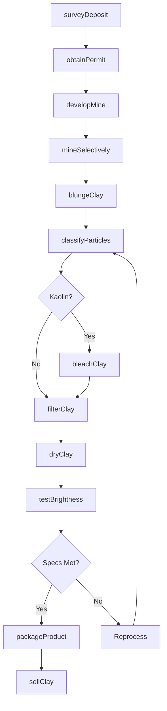
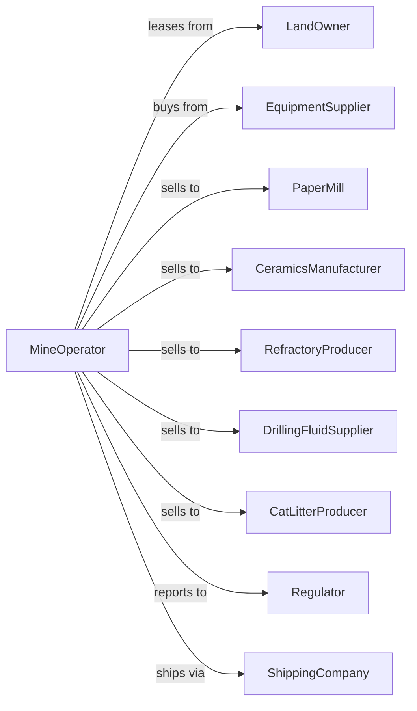

# Kaolin, Clay, and Ceramic and Refractory Minerals Mining

> Business-as-Code definition for kaolin and specialty clay mining operations. Models the complete lifecycle from extraction through processing and sale of kaolin, bentonite, ball clay, and refractory minerals for paper, ceramics, and industrial applications.

## Overview

Kaolin, clay, and ceramic minerals mining involves the extraction and processing of industrial clays and specialty minerals for paper coating, ceramics, refractories, drilling fluids, and absorbent products. Operations include selective mining, blunging, classification, and drying to produce materials meeting precise specifications. This definition exposes actions for each phase of clay minerals production, events for workflow automation, and searches for data retrieval.

## Actors

| Actor | Description |
|-------|-------------|
| LandOwner | Holds mineral rights for clay deposits |
| EquipmentSupplier | Provides mining and processing equipment |
| PaperMill | Purchases kaolin for coating and filling paper |
| CeramicsManufacturer | Buys ball clay and kaolin for pottery and tile |
| RefractoryProducer | Purchases high-alumina clays for heat-resistant products |
| DrillingFluidSupplier | Buys bentonite for drilling mud |
| CatLitterProducer | Purchases absorbent clays for pet products |
| Regulator | Oversees permits, water discharge, and reclamation |
| ShippingCompany | Transports bulk clay products |

## Roles

| Role | Description |
|------|-------------|
| MineManager | Oversees all extraction and processing operations |
| MineGeologist | Maps clay deposits and directs selective mining |
| ProcessEngineer | Optimizes beneficiation and drying operations |
| QualityManager | Ensures products meet customer specifications |
| PlantOperator | Operates blungers, classifiers, and dryers |
| EnvironmentalManager | Manages settling ponds and reclamation |
| SlurryOperator | Manages blunging and hydrocyclone circuits to separate kaolin by particle size |

## Entities

| Entity | Description |
|--------|-------------|
| Deposit | Geological formation containing clay minerals |
| Pit | Open excavation where clay is extracted |
| Kaolin | White clay used for paper coating and ceramics |
| Bentonite | Swelling clay used for drilling and absorbents |
| BallClay | Plastic clay used in ceramics |
| Feldspar | Mineral used as flux in ceramics and glass |
| Blunger | Equipment for mixing clay with water |
| Classifier | Equipment separating clay by particle size |
| Dryer | Equipment removing moisture from clay product |
| SettlingPond | Basin for clay waste water treatment |

## Actions

| Action | Description |
|--------|-------------|
| surveyDeposit | Map clay formation and assess mineral quality |
| obtainPermit | Secure mining permits and environmental approvals |
| developMine | Establish pit access and processing infrastructure |
| mineSelectively | Extract specific clay zones by quality |
| blungeClay | Mix clay with water to create slurry |
| classifyParticles | Separate clay by particle size and grade |
| bleachClay | Chemically treat kaolin to improve brightness |
| filterClay | Remove water from processed slurry |
| dryClay | Reduce moisture to shipping specifications |
| pelletizeClay | Form clay into pellets for specific applications |
| packageProduct | Bag, bulk, or containerize for shipment |
| testBrightness | Measure whiteness and reflectance of kaolin |
| sellClay | Execute sales contracts with buyers |
| reclaimSite | Restore mined areas per permit requirements |

## Events

| Event | Description |
|-------|-------------|
| depositSurveyed | Clay formation mapped and quality assessed |
| permitObtained | Mining authorization received |
| mineDeveloped | Site ready for extraction operations |
| clayMined | Material selectively extracted from deposit |
| clayBlunged | Slurry created from raw clay |
| particlesClassified | Clay separated by particle size |
| clayBleached | Brightness improved through treatment |
| clayFiltered | Water removed from processed slurry |
| clayDried | Moisture reduced to target level |
| clayPelletized | Product formed into pellets |
| productPackaged | Clay prepared for shipment |
| brightnessTested | Kaolin quality verified |
| claySold | Sales transaction completed |
| siteReclaimed | Mined area restored |

## Searches

| Search | Description |
|--------|-------------|
| getInventory | Check stockpile quantities by product grade |
| getProduction | Retrieve tonnage by period or product type |
| findCustomers | List buyers for each clay product |
| getBrightness | Query kaolin brightness test results |
| getParticleSize | Retrieve particle size distribution data |
| checkPrices | Get current clay prices by grade |
| getPermits | Retrieve permit status and compliance records |
| getSettlingPonds | Monitor pond levels and water quality |

## Workflow



## Actor Relationships



## Usage

### Calling Actions

```typescript
import { quarryKaolin } from '@headlessly/quarry-kaolin'

const mine = quarryKaolin()

// Survey kaolin deposit
const survey = await mine.surveyDeposit({
  siteId: 'georgia-kaolin-belt',
  mineralType: 'kaolin',
  method: 'core-drilling',
  assessProperties: ['brightness', 'particle-size', 'viscosity']
})

// Selectively mine high-brightness zone
const extraction = await mine.mineSelectively({
  pitId: survey.pitId,
  zone: 'premium-white',
  targetTons: 2000,
  minBrightness: 88
})

// Process for paper coating grade
await mine.classifyParticles({
  batchId: extraction.batchId,
  targetSize: 2.0, // microns
  grade: 'coating-grade'
})
```

### Event-Driven Automation

```typescript
// Auto-route by brightness level
mine.brightnessTested(async ({ batchId, brightness }) => {
  let grade = 'filler-grade'

  if (brightness >= 90) {
    grade = 'premium-coating'
  } else if (brightness >= 85) {
    grade = 'standard-coating'
  }

  await mine.packageProduct({
    batchId,
    grade,
    packaging: grade.includes('premium') ? 'super-sacks' : 'bulk'
  })
})

// Auto-manage settling ponds
mine.clayBlunged(async ({ batchId, wasteWaterVolume }) => {
  const ponds = await mine.getSettlingPonds()
  const availablePond = ponds.find(p => p.capacity > wasteWaterVolume)

  if (availablePond) {
    await mine.reclaimSite({
      pondId: availablePond.id,
      wasteWater: wasteWaterVolume,
      settleDays: 30
    })
  }
})
```
