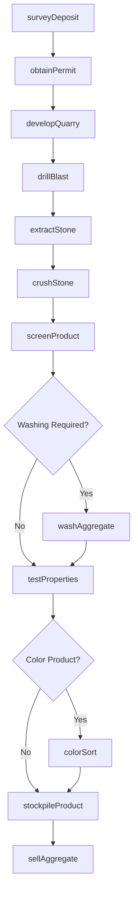
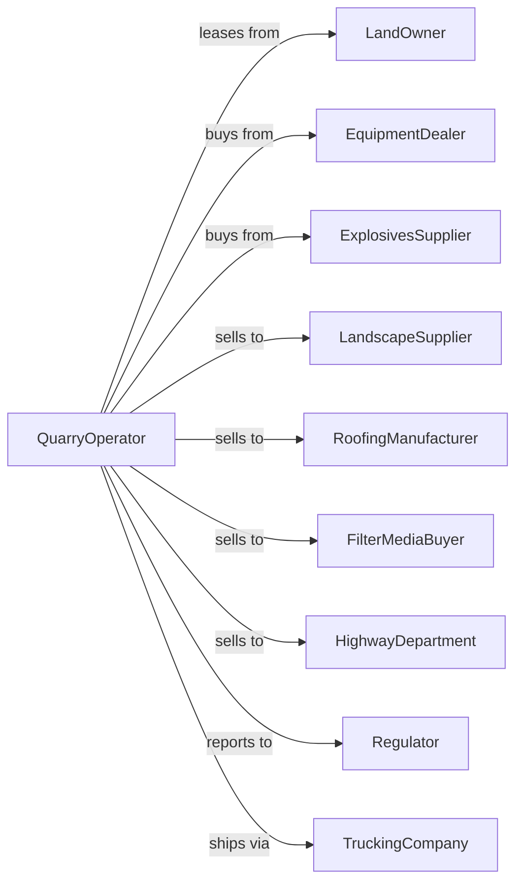

# Other Crushed and Broken Stone Mining and Quarrying

> Business-as-Code definition for specialty crushed stone quarrying operations. Models the complete lifecycle from extraction through processing and sale of sandstone, traprock, slate, and other specialty aggregate materials.

## Overview

Other crushed and broken stone mining and quarrying involves the extraction and processing of specialty stone types including sandstone, traprock, basalt, slate, marble, and volcanic rock for construction and industrial applications. These materials serve specialized markets requiring specific physical or chemical properties. This definition exposes actions for each phase of specialty aggregate production, events for workflow automation, and searches for data retrieval.

## Actors

| Actor | Description |
|-------|-------------|
| LandOwner | Holds surface and mineral rights for quarry operations |
| EquipmentDealer | Sells and services crushers, screens, and processing equipment |
| ExplosivesSupplier | Provides blasting materials and technical services |
| LandscapeSupplier | Purchases decorative stone for retail and wholesale distribution |
| RoofingManufacturer | Buys crushed slate and granules for roofing products |
| FilterMediaBuyer | Purchases specialty stone for water filtration systems |
| HighwayDepartment | Procures aggregate meeting specialty specifications |
| Regulator | Oversees permits, safety, and environmental compliance |
| TruckingCompany | Transports aggregate to customer locations |

## Roles

| Role | Description |
|------|-------------|
| QuarryManager | Oversees all extraction and processing operations |
| GeologicalTechnician | Maps deposits and identifies quality stone zones |
| BlastingSupervisor | Plans and executes drilling and blasting programs |
| ProcessingOperator | Operates crushing, screening, and washing equipment |
| QualityController | Tests aggregate properties and certifies products |
| SalesManager | Develops markets and manages customer relationships |
| GranulesMiller | Operates specialized mills to produce roofing granules from crushed stone |

## Entities

| Entity | Description |
|--------|-------------|
| Quarry | Open excavation where stone is extracted |
| Deposit | Geological formation containing specialty stone |
| Crusher | Equipment reducing rock to target sizes |
| Screen | Equipment separating crushed stone by size |
| Washer | Equipment removing fines and impurities |
| Stockpile | Storage area for processed products |
| Traprock | Dark igneous rock with high durability |
| Sandstone | Sedimentary rock used for building and aggregate |
| Slate | Fine-grained metamorphic rock for roofing and decorative use |
| Specification | Technical requirements for aggregate products |

## Actions

| Action | Description |
|--------|-------------|
| surveyDeposit | Map stone formation and assess quality characteristics |
| obtainPermit | Secure quarrying permits and environmental approvals |
| developQuarry | Establish access, benches, and infrastructure |
| drillBlast | Fragment stone using controlled blasting |
| extractStone | Remove blasted material and haul to processing |
| crushStone | Reduce rock through primary and secondary crushing |
| screenProduct | Separate material into sized fractions |
| washAggregate | Remove fines, clay, and impurities |
| colorSort | Separate stone by color for decorative products |
| stockpileProduct | Store finished products by type and grade |
| testProperties | Verify physical and chemical specifications |
| sellAggregate | Execute sales contracts with customers |
| loadShipment | Transfer product to customer vehicles |
| reclaimQuarry | Restore exhausted quarry areas |

## Events

| Event | Description |
|-------|-------------|
| depositSurveyed | Stone formation mapped and quality assessed |
| permitObtained | Quarrying authorization received |
| quarryDeveloped | Site ready for extraction operations |
| stoneBlasted | Material fragmented and ready for loading |
| stoneExtracted | Rock hauled to processing plant |
| stoneCrushed | Material reduced to target sizes |
| productScreened | Stone separated into sized fractions |
| aggregateWashed | Impurities removed from product |
| colorSorted | Decorative stone separated by color |
| productStockpiled | Finished aggregate placed in inventory |
| propertiesTested | Quality verified against specifications |
| aggregateSold | Sales transaction completed |
| shipmentLoaded | Product dispatched to customer |
| quarryReclaimed | Exhausted area restored |

## Searches

| Search | Description |
|--------|-------------|
| getInventory | Check stockpile quantities by product type and size |
| getProduction | Retrieve tonnage by period or product |
| findCustomers | List buyers for specialty stone products |
| getQuality | Query physical and chemical test results |
| checkPrices | Get current prices for specialty aggregates |
| getPermits | Retrieve permit status and compliance records |
| getEquipment | Monitor processing equipment status |
| trackShipments | Monitor deliveries to customers |

## Workflow



## Actor Relationships



## Usage

### Calling Actions

```typescript
import { quarryCrushedBroken } from '@headlessly/quarry-crushed-broken'

const quarry = quarryCrushedBroken()

// Survey traprock deposit
const survey = await quarry.surveyDeposit({
  siteId: 'new-england-traprock-ridge',
  stoneType: 'basalt',
  method: 'core-sampling',
  assessProperties: ['hardness', 'polishing-resistance', 'specific-gravity']
})

// Process for specialty roofing granules
const processing = await quarry.crushStone({
  feedTons: 2000,
  stoneType: 'slate',
  targetProduct: 'roofing-granules',
  sizeRange: { min: 0.5, max: 2.0 } // mm
})

// Color sort decorative stone
await quarry.colorSort({
  batchId: processing.batchId,
  colors: ['charcoal', 'weathered-green', 'purple'],
  destination: 'decorative-stockpile'
})
```

### Event-Driven Automation

```typescript
// Auto-route by product type
quarry.stoneExtracted(async ({ loadId, stoneType, quality }) => {
  if (stoneType === 'slate' && quality === 'premium') {
    await quarry.crushStone({
      loadId,
      targetProduct: 'roofing-granules',
      priority: 'high'
    })
  } else {
    await quarry.crushStone({
      loadId,
      targetProduct: 'construction-aggregate',
      priority: 'standard'
    })
  }
})

// Auto-certify specialty products
quarry.propertiesTested(async ({ productId, results, specification }) => {
  if (results.meetsSpec) {
    await quarry.stockpileProduct({
      productId,
      certified: true,
      specificationMet: specification
    })
  }
})
```
