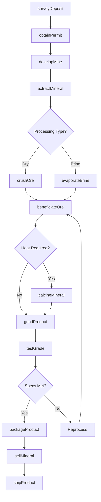
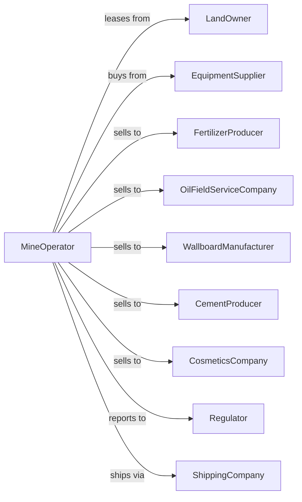

# Other Nonmetallic Mineral Mining and Quarrying

> Business-as-Code definition for specialty nonmetallic mineral mining operations. Models the complete lifecycle from extraction through processing and sale of phosphate, potash, sulfur, barite, gypsum, and other industrial minerals.

## Overview

Other nonmetallic mineral mining involves the extraction and processing of industrial minerals including phosphate rock, potash, sulfur, barite, gypsum, talc, mica, and perlite. These materials serve diverse markets including fertilizer production, oil drilling, construction, and chemical manufacturing. This definition exposes actions for each phase of specialty mineral production, events for workflow automation, and searches for data retrieval.

## Actors

| Actor | Description |
|-------|-------------|
| LandOwner | Holds mineral rights for deposits |
| EquipmentSupplier | Provides mining and processing equipment |
| FertilizerProducer | Purchases phosphate and potash for fertilizer manufacturing |
| OilFieldServiceCompany | Buys barite for drilling fluid weighting |
| WallboardManufacturer | Purchases gypsum for drywall production |
| CementProducer | Buys gite for cement additives |
| CosmeticsCompany | Purchases talc for cosmetic products |
| Regulator | Oversees permits, emissions, and environmental compliance |
| ShippingCompany | Transports bulk minerals to customers |

## Roles

| Role | Description |
|------|-------------|
| MineManager | Oversees all extraction and processing operations |
| GeologicalEngineer | Maps deposits and plans extraction sequences |
| ProcessEngineer | Optimizes beneficiation and processing operations |
| QualityManager | Ensures products meet customer specifications |
| LogisticsManager | Coordinates shipments and inventory |
| EnvironmentalSpecialist | Manages emissions and waste disposal |
| BeneficiationOperator | Operates flotation and gravity separation circuits for mineral concentration |

## Entities

| Entity | Description |
|--------|-------------|
| Deposit | Geological formation containing target mineral |
| Mine | Extraction site for mineral operations |
| Phosphate | Mineral used for fertilizer and chemical production |
| Potash | Potassium minerals used for fertilizers |
| Barite | Heavy mineral used in drilling fluids |
| Gypsum | Calcium sulfate mineral for wallboard and cement |
| Sulfur | Element used in chemical and fertilizer production |
| BeneficiationPlant | Facility for mineral upgrading and processing |
| Stockpile | Storage area for processed mineral products |
| Brine | Mineral-bearing solution from evaporation operations |

## Actions

| Action | Description |
|--------|-------------|
| surveyDeposit | Map mineral formation and estimate reserves |
| obtainPermit | Secure mining permits and environmental approvals |
| developMine | Establish access and processing infrastructure |
| extractMineral | Remove ore from deposit using appropriate method |
| crushOre | Reduce material to target particle size |
| beneficiateOre | Upgrade mineral content through separation processes |
| evaporateBrine | Concentrate minerals from brine solutions |
| calcineMinite | Heat gypsum or other minerals for processing |
| grindProduct | Reduce particle size to customer specifications |
| packageProduct | Prepare mineral for bulk or bagged shipment |
| testGrade | Verify mineral content meets specifications |
| sellMineral | Execute sales contracts with buyers |
| shipProduct | Transport mineral to customer location |
| reclaimSite | Restore mined areas per permit requirements |

## Events

| Event | Description |
|-------|-------------|
| depositSurveyed | Mineral formation mapped and reserves estimated |
| permitObtained | Mining authorization received |
| mineDeveloped | Site ready for extraction operations |
| mineralExtracted | Ore removed from deposit |
| oreCrushed | Material reduced to target size |
| oreBeneficiated | Mineral content upgraded |
| brineEvaporated | Minerals concentrated from solution |
| mineralCalcined | Heat treatment completed |
| productGround | Material reduced to final particle size |
| productPackaged | Mineral prepared for shipment |
| gradeTested | Quality verified against specifications |
| mineralSold | Sales transaction completed |
| productShipped | Mineral dispatched to customer |
| siteReclaimed | Mined area restored |

## Searches

| Search | Description |
|--------|-------------|
| getInventory | Check stockpile quantities by mineral and grade |
| getProduction | Retrieve tonnage by period or mineral type |
| findCustomers | List buyers for each mineral product |
| getGrade | Query mineral content test results |
| checkPrices | Get current mineral prices |
| getPermits | Retrieve permit status and compliance records |
| getShipments | Track transportation and delivery status |
| getReserves | Query estimated mineral reserves |

## Workflow



## Actor Relationships



## Usage

### Calling Actions

```typescript
import { quarryNonmetallicMineral } from '@headlessly/quarry-nonmetallic-mineral'

const mine = quarryNonmetallicMineral()

// Survey phosphate deposit
const survey = await mine.surveyDeposit({
  siteId: 'florida-phosphate-matrix',
  mineralType: 'phosphate',
  method: 'dragline-sampling',
  targetP2O5: 30 // percent
})

// Extract and beneficiate phosphate rock
const extraction = await mine.extractMineral({
  mineId: survey.mineId,
  method: 'dragline',
  targetTons: 50000
})

// Process to fertilizer grade
await mine.beneficiateOre({
  batchId: extraction.batchId,
  method: 'flotation',
  targetGrade: 'DAP-grade',
  P2O5Target: 31
})
```

### Event-Driven Automation

```typescript
// Auto-route by mineral type
mine.mineralExtracted(async ({ batchId, mineralType, grade }) => {
  if (mineralType === 'gypsum' && grade === 'wallboard') {
    await mine.calcineMineral({
      batchId,
      temperature: 150, // celsius
      product: 'stucco'
    })
  } else {
    await mine.crushOre({
      batchId,
      targetSize: mineralType === 'barite' ? 325 : 200 // mesh
    })
  }
})

// Auto-ship when inventory thresholds reached
mine.productPackaged(async ({ mineral, inventory }) => {
  const threshold = { phosphate: 10000, barite: 5000, gypsum: 20000 }

  if (inventory >= threshold[mineral]) {
    await mine.shipProduct({
      mineral,
      quantity: inventory * 0.8,
      priority: 'standard'
    })
  }
})
```
