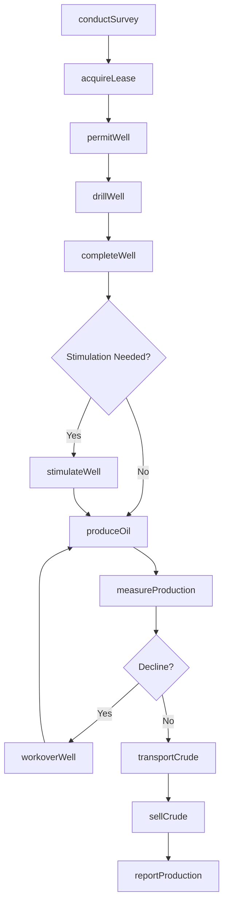
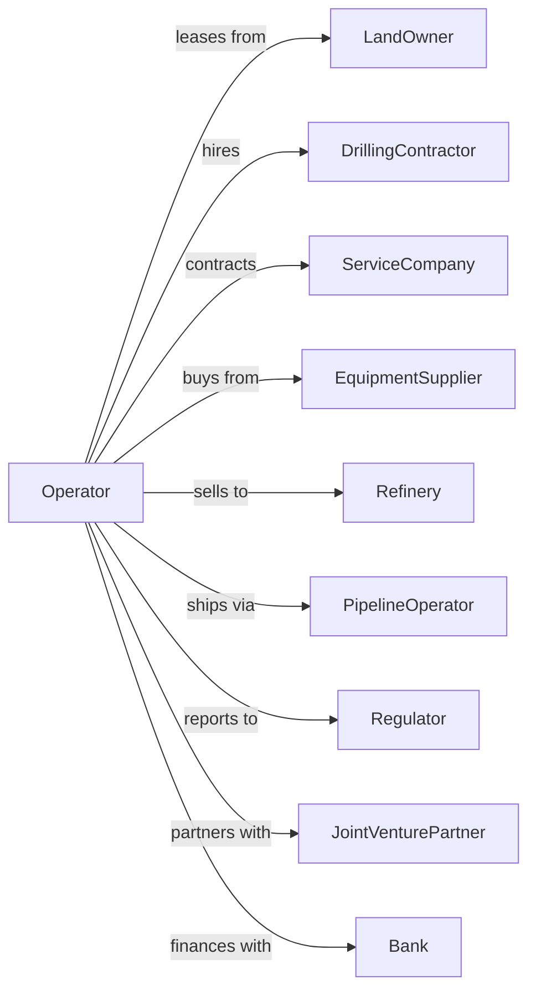

# Crude Petroleum Extraction

> Business-as-Code definition for crude petroleum extraction operations. Models the complete lifecycle from exploration and drilling through production and sale of crude oil.

## Overview

Crude petroleum extraction involves the exploration, development, and production of oil from underground reservoirs. Operations include geological surveying, well drilling, reservoir management, and crude oil production using primary, secondary, and enhanced recovery techniques. This definition exposes actions for each phase of the extraction process, events for workflow automation, and searches for data retrieval.

## Actors

| Actor | Description |
|-------|-------------|
| LandOwner | Holds mineral rights and grants leases for exploration and production |
| DrillingContractor | Provides drilling rigs and crews for well construction |
| ServiceCompany | Supplies specialized oilfield services including cementing, logging, and stimulation |
| EquipmentSupplier | Provides pumps, valves, tubing, and production equipment |
| Refinery | Purchases crude oil for processing into petroleum products |
| PipelineOperator | Transports crude oil from wellhead to storage or refinery |
| Regulator | Oversees permits, safety compliance, and environmental standards |
| JointVenturePartner | Co-invests in exploration and production operations |
| Bank | Provides reserve-based lending and capital financing |

## Roles

| Role | Description |
|------|-------------|
| FieldOperator | Manages daily production operations and well performance |
| PetroleumEngineer | Designs drilling programs and optimizes reservoir recovery |
| Geologist | Interprets seismic data and identifies drilling targets |
| LandManager | Negotiates leases and manages mineral rights |
| ProductionSupervisor | Oversees field personnel and equipment maintenance |
| HSEManager | Ensures health, safety, and environmental compliance |
| Pumper | Visits well sites daily to gauge tanks, check equipment, and report production |

## Entities

| Entity | Description |
|--------|-------------|
| Well | A drilled hole for accessing underground petroleum reservoirs |
| Lease | Legal agreement granting rights to explore and produce oil |
| Reservoir | Underground formation containing recoverable petroleum |
| Rig | Drilling equipment used to construct wells |
| Wellhead | Surface equipment controlling well pressure and flow |
| Pipeline | Infrastructure for transporting crude oil |
| Storage Tank | Facility for holding produced crude before transport |
| Permit | Regulatory authorization for drilling or production |
| SeismicData | Subsurface imaging used to identify prospects |
| ProductionReport | Daily record of oil volumes and well performance |

## Actions

| Action | Description |
|--------|-------------|
| conductSurvey | Perform seismic surveys to map subsurface geology |
| acquireLease | Negotiate and secure mineral rights from landowners |
| permitWell | Submit applications and obtain regulatory drilling permits |
| drillWell | Construct wellbore to target formation depth |
| completeWell | Install casing, perforate, and prepare well for production |
| stimulateWell | Apply hydraulic fracturing or acidizing to enhance flow |
| produceOil | Extract crude petroleum from reservoir to surface |
| measureProduction | Record daily volumes and test oil quality |
| injectWater | Pump water into reservoir to maintain pressure and sweep oil |
| workoverWell | Perform remedial operations to restore or improve production |
| transportCrude | Move oil via pipeline or truck to storage or buyer |
| sellCrude | Execute sales contract with refinery or trading partner |
| abandonWell | Plug and decommission wells at end of productive life |
| reportProduction | Submit required production data to regulators |

## Events

| Event | Description |
|-------|-------------|
| surveyCompleted | Seismic data acquisition and processing finished |
| leaseAcquired | Mineral rights secured from landowner |
| permitApproved | Regulatory drilling authorization received |
| wellDrilled | Wellbore construction completed to target depth |
| wellCompleted | Well prepared and ready for production |
| productionStarted | First oil produced from well |
| productionDeclined | Well output dropped below threshold |
| wellWorkedOver | Remedial operations completed |
| oilSold | Sales transaction completed with buyer |
| spillDetected | Environmental release identified requiring response |
| inspectionPassed | Regulatory compliance review completed successfully |
| wellAbandoned | Well plugged and site reclaimed |
| reserveUpdated | Estimated recoverable reserves revised |
| contractSigned | New sales or service agreement executed |

## Searches

| Search | Description |
|--------|-------------|
| findWells | List wells with filters for status, production, or location |
| getProduction | Retrieve production volumes by well, lease, or date range |
| getLeases | Query active leases by expiration, acreage, or owner |
| findProspects | Identify drilling targets based on seismic interpretation |
| getPermits | Retrieve permit status and regulatory filings |
| checkPrices | Get current crude oil benchmark prices and differentials |
| getReserves | Query estimated recoverable reserves by property |
| findContractors | List available drilling and service contractors |

## Workflow



## Actor Relationships



## Usage

### Calling Actions

```typescript
import { extractCrudePetroleum } from '@headlessly/extract-crude-petroleum'

const operation = extractCrudePetroleum()

// Check current crude oil benchmark prices
const prices = await operation.checkPrices({ benchmarks: ['WTI', 'brent'], includeHistory: true })

// Find available drilling prospects
const prospects = await operation.findProspects({ basin: 'permian', minEstimatedReserves: 500000 })

// Conduct seismic survey to identify prospects
const survey = await operation.conductSurvey({
  areaId: 'permian-basin-block-42',
  type: '3D',
  squareMiles: 25
})

// Acquire mineral lease
const lease = await operation.acquireLease({
  landOwnerId: 'smith-ranch-minerals',
  acreage: 640,
  royaltyRate: 0.20,
  bonusPerAcre: 5000,
  termYears: 3
})

// Drill exploration well
await operation.drillWell({
  leaseId: lease.id,
  wellName: 'Smith Ranch 1H',
  targetDepth: 10500,
  type: 'horizontal',
  lateralLength: 10000
})
```

### Event-Driven Automation

```typescript
// Auto-schedule workover when production declines
operation.productionDeclined(async ({ wellId, currentRate, declinePercent }) => {
  if (declinePercent > 30) {
    await operation.workoverWell({
      wellId,
      type: 'recompletion',
      priority: 'high'
    })
  }
})

// Auto-report spill incidents
operation.spillDetected(async ({ wellId, volumeBarrels, type }) => {
  await operation.reportProduction({
    wellId,
    incidentType: 'spill',
    volume: volumeBarrels,
    substance: type,
    notifyRegulator: true
  })
})
```
