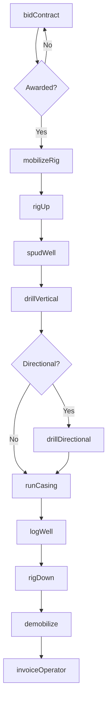
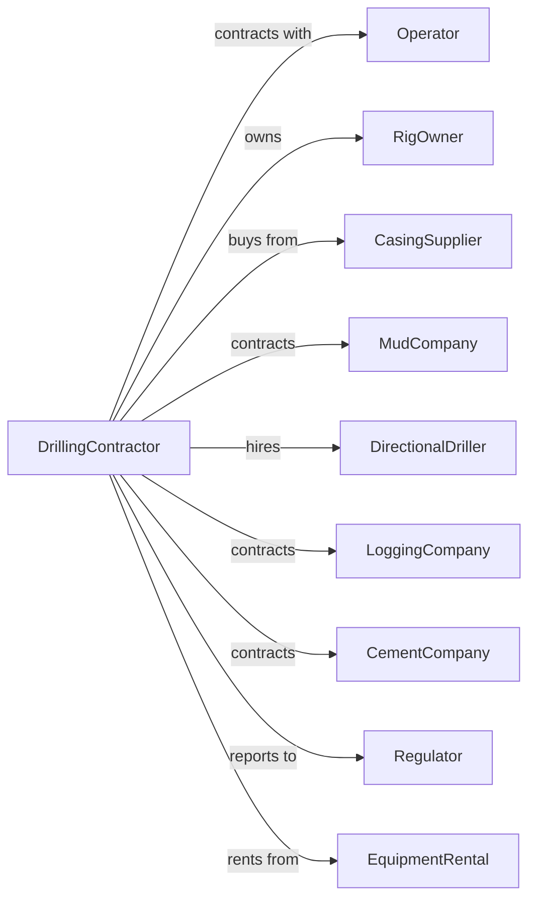

# Drilling Oil and Gas Wells

> Business-as-Code definition for contract drilling operations. Models the complete lifecycle from rig mobilization through well construction and demobilization for oil and gas operators.

## Overview

Drilling oil and gas wells involves providing contract drilling services to exploration and production companies. Operations include rig mobilization, spudding, directional drilling, casing installation, and well completion on a fee or day-rate basis. This definition exposes actions for each phase of well construction, events for workflow automation, and searches for data retrieval.

## Actors

| Actor | Description |
|-------|-------------|
| Operator | Oil and gas company contracting for drilling services |
| RigOwner | Company owning and operating drilling rigs |
| CasingSupplier | Provides tubular goods and casing strings |
| MudCompany | Supplies drilling fluids and mud engineering services |
| DirectionalDriller | Provides specialized directional drilling services |
| LoggingCompany | Performs wellbore logging and evaluation services |
| CementCompany | Provides cementing services and materials |
| Regulator | Oversees drilling permits and safety compliance |
| EquipmentRental | Supplies auxiliary drilling equipment |

## Roles

| Role | Description |
|------|-------------|
| ToolPusher | Supervises rig operations and drilling crew |
| Driller | Operates drawworks and controls drilling parameters |
| Derrickman | Works on derrick handling drill pipe and mud systems |
| Floorhand | Performs manual labor on rig floor |
| MWDEngineer | Monitors measurement-while-drilling systems |
| CompanyMan | Represents operator on location and makes decisions |

## Entities

| Entity | Description |
|--------|-------------|
| Rig | Drilling equipment assembly for well construction |
| DrillString | Assembly of drill pipe and bottom hole tools |
| Wellbore | Hole drilled into the earth for oil or gas access |
| Casing | Steel pipe installed to support and seal the wellbore |
| DrillBit | Cutting tool at bottom of drill string |
| DrillingFluid | Mud circulated to cool bit and remove cuttings |
| BOP | Blowout preventer for well control |
| Derrick | Tower supporting the hoisting equipment |
| DayRate | Daily fee charged for drilling services |
| AFE | Authorization for Expenditure from operator |

## Actions

| Action | Description |
|--------|-------------|
| bidContract | Submit proposal for drilling services |
| mobilizeRig | Move rig equipment to drilling location |
| rigUp | Assemble and prepare rig for drilling operations |
| spudWell | Begin drilling by making initial hole |
| drillVertical | Drill straight down to kick-off point |
| drillDirectional | Steer wellbore to target formation |
| runCasing | Install and cement casing strings |
| circulateMud | Pump drilling fluid to clean hole and cool bit |
| tripPipe | Pull and run drill string for bit changes |
| logWell | Perform wireline logging of formations |
| testBOP | Verify blowout preventer functionality |
| rigDown | Disassemble rig after well completion |
| demobilize | Move rig to next location or yard |
| invoiceOperator | Bill client for drilling services |

## Events

| Event | Description |
|-------|-------------|
| contractAwarded | Drilling agreement signed with operator |
| rigMobilized | Equipment arrived at drilling location |
| riggedUp | Rig assembled and ready to spud |
| wellSpudded | Drilling commenced on new well |
| verticalDrilled | Vertical section completed |
| kickOffCompleted | Directional drilling initiated |
| targetReached | Wellbore reached target formation |
| casingRun | Casing installed and cemented |
| wellLogged | Formation evaluation completed |
| bopTested | Well control equipment verified |
| riggedDown | Rig disassembled after completion |
| rigDemobilized | Equipment moved from location |
| invoiceSent | Billing submitted to operator |
| nptOccurred | Non-productive time recorded |

## Searches

| Search | Description |
|--------|-------------|
| findRigs | List available rigs by type and location |
| getContracts | Retrieve active and pending drilling contracts |
| getRigStatus | Check current rig operational status |
| getWellProgress | Monitor drilling depth and rate of penetration |
| getDayRates | Get current market day rates by rig class |
| findOperators | List potential clients seeking drilling services |
| getCrewSchedule | Retrieve rig crew rotation and availability |
| getNPT | Query non-productive time by rig or contract |

## Workflow



## Actor Relationships



## Usage

### Calling Actions

```typescript
import { supportDrillingOil } from '@headlessly/support-drilling-oil'

const driller = supportDrillingOil()

// Bid on drilling contract
const bid = await driller.bidContract({
  operatorId: 'permian-resources',
  wellName: 'State 45-1H',
  rigClass: '1500hp-ac',
  estimatedDays: 18,
  dayRate: 28500
})

// Mobilize rig to location
const mobilization = await driller.mobilizeRig({
  rigId: 'rig-45',
  contractId: bid.contractId,
  location: { lat: 31.9523, lng: -102.4567 },
  estimatedDays: 3
})

// Spud and drill well
await driller.spudWell({
  contractId: bid.contractId,
  rigId: mobilization.rigId,
  surfaceHoleDepth: 2500,
  mudWeight: 9.5
})
```

### Event-Driven Automation

```typescript
// Auto-track non-productive time
driller.nptOccurred(async ({ rigId, reason, hours }) => {
  await driller.invoiceOperator({
    rigId,
    nptHours: hours,
    reason,
    billable: !['weather', 'operator-delay'].includes(reason)
  })
})

// Auto-notify on well progress
driller.targetReached(async ({ wellId, depth, formation }) => {
  await driller.logWell({
    wellId,
    services: ['gamma-ray', 'resistivity', 'density'],
    formation,
    notifyOperator: true
  })
})
```
