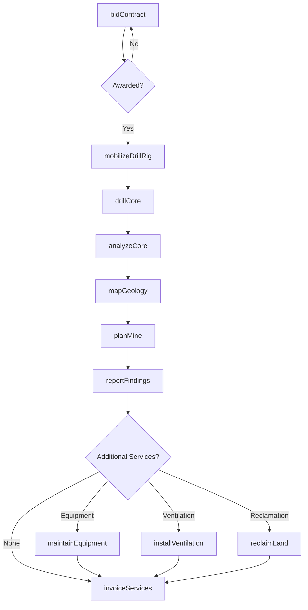
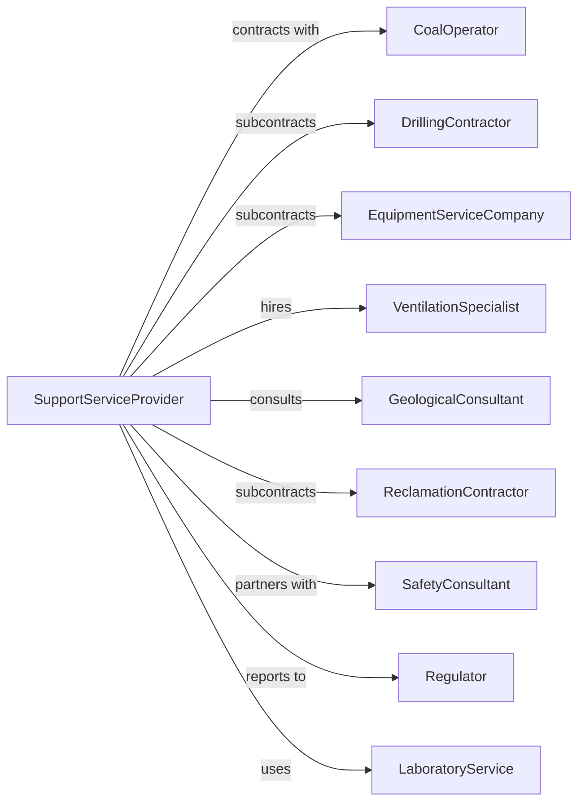

# Support Activities for Coal Mining

> Business-as-Code definition for coal mining support services. Models the complete lifecycle from exploration drilling through mine development, equipment services, and reclamation support for coal operators.

## Overview

Support activities for coal mining involve providing specialized services to coal mining companies on a contract or fee basis. Services include exploration drilling, mine planning, equipment maintenance, ventilation services, and reclamation support. This definition exposes actions for each phase of coal mining support, events for workflow automation, and searches for data retrieval.

## Actors

| Actor | Description |
|-------|-------------|
| CoalOperator | Mining company contracting for support services |
| DrillingContractor | Provides core drilling and exploration services |
| EquipmentServiceCompany | Maintains and repairs mining equipment |
| VentilationSpecialist | Designs and installs mine ventilation systems |
| GeologicalConsultant | Provides geological mapping and resource estimation |
| ReclamationContractor | Performs land restoration and revegetation |
| SafetyConsultant | Provides mine safety training and compliance services |
| Regulator | Oversees mining permits and MSHA compliance |
| LaboratoryService | Analyzes coal samples and air quality |

## Roles

| Role | Description |
|------|-------------|
| ProjectManager | Oversees support service contracts and delivery |
| DrillingSupervisor | Manages core drilling operations |
| EquipmentTechnician | Repairs and maintains mining equipment |
| Geologist | Interprets core samples and maps coal seams |
| VentilationEngineer | Designs airflow systems for underground mines |
| ReclamationSpecialist | Plans and executes land restoration |
| CoreLogger | Describes and records lithology, fractures, and coal seam thickness from drill core |

## Entities

| Entity | Description |
|--------|-------------|
| DrillRig | Equipment for core drilling operations |
| CoreSample | Cylindrical rock sample from drilling |
| CoalSeam | Layer of coal targeted for mining |
| VentilationSystem | Network of fans, ducts, and airways |
| MiningEquipment | Machinery used in coal extraction |
| ReclamationSite | Mined area undergoing restoration |
| GeologicalMap | Subsurface mapping of coal deposits |
| SampleAnalysis | Laboratory testing results for coal quality |
| ServiceContract | Agreement for support services |
| SafetyTraining | Compliance training program for miners |

## Actions

| Action | Description |
|--------|-------------|
| bidContract | Submit proposal for support services |
| mobilizeDrillRig | Move drilling equipment to exploration site |
| drillCore | Extract core samples from coal formations |
| analyzeCore | Test coal quality, thickness, and characteristics |
| mapGeology | Create subsurface maps of coal deposits |
| planMine | Develop extraction plans and sequences |
| maintainEquipment | Service and repair mining machinery |
| installVentilation | Set up mine airflow systems |
| monitorAirQuality | Test atmospheric conditions in underground mines |
| trainPersonnel | Provide safety and compliance training |
| reclaimLand | Restore mined areas with grading and seeding |
| conductInspection | Perform regulatory compliance reviews |
| reportFindings | Deliver exploration and analysis results |
| invoiceServices | Bill operator for support services |

## Events

| Event | Description |
|-------|-------------|
| contractAwarded | Support services agreement signed |
| rigMobilized | Drilling equipment arrived on site |
| coreRecovered | Core samples extracted from formation |
| coreAnalyzed | Laboratory results available |
| geologyMapped | Subsurface interpretation completed |
| minePlanDelivered | Extraction plan presented to operator |
| equipmentServiced | Machinery repaired and returned to service |
| ventilationInstalled | Airflow system commissioned |
| airQualityTested | Atmospheric monitoring completed |
| trainingCompleted | Safety program delivered |
| landReclaimed | Restoration work finished |
| inspectionPassed | Regulatory review completed successfully |
| reportDelivered | Findings document submitted to operator |
| invoiceSent | Billing submitted to client |

## Searches

| Search | Description |
|--------|-------------|
| findContracts | List available support service opportunities |
| getDrillRigs | Check drilling equipment availability |
| getProjects | Monitor active support contracts |
| getCoreResults | Retrieve laboratory analysis data |
| getEquipmentStatus | Check mining equipment service status |
| findOperators | List potential coal mining clients |
| getReclamationProgress | Track land restoration activities |
| getSafetyRecords | Query training and compliance records |

## Workflow



## Actor Relationships



## Usage

### Calling Actions

```typescript
import { supportSupportActivities } from '@headlessly/support-support-activities'

const coalSupport = supportSupportActivities()

// Bid on exploration contract
const bid = await coalSupport.bidContract({
  operatorId: 'arch-coal',
  projectName: 'spruce-fork-exploration',
  services: ['core-drilling', 'geological-mapping', 'mine-planning'],
  estimatedDuration: 60 // days
})

// Mobilize drilling equipment
const mobilization = await coalSupport.mobilizeDrillRig({
  contractId: bid.contractId,
  rigId: 'core-rig-7',
  location: { lat: 37.8521, lng: -81.4532 },
  targetDepth: 500 // feet
})

// Drill and analyze core
await coalSupport.drillCore({
  contractId: bid.contractId,
  holeNumber: 'SF-01',
  targetSeam: 'pocahontas-3',
  depth: 350,
  coreSize: 'hq'
})
```

### Event-Driven Automation

```typescript
// Auto-analyze recovered core
coalSupport.coreRecovered(async ({ holeId, coreLength, seam }) => {
  await coalSupport.analyzeCore({
    holeId,
    tests: ['proximate', 'ultimate', 'ash-fusion', 'sulfur'],
    seam,
    rushPriority: coreLength > 50
  })
})

// Auto-generate geological map when drilling complete
coalSupport.coreAnalyzed(async ({ projectId, results }) => {
  const allHoles = await coalSupport.getCoreResults({ projectId })

  if (allHoles.every(h => h.analyzed)) {
    await coalSupport.mapGeology({
      projectId,
      method: 'kriging',
      includeReserveEstimate: true
    })
  }
})
```
