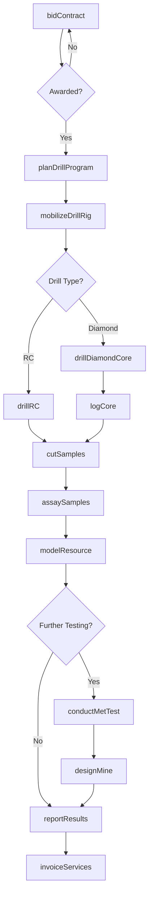
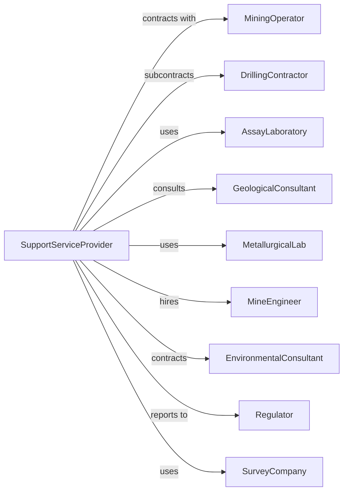

# Support Activities for Metal Mining

> Business-as-Code definition for metal mining support services. Models the complete lifecycle from exploration drilling through assaying, mine development services, and metallurgical testing for metal ore operators.

## Overview

Support activities for metal mining involve providing specialized services to metal mining companies on a contract or fee basis. Services include exploration drilling, geological consulting, assaying, metallurgical testing, mine engineering, and environmental services. This definition exposes actions for each phase of metal mining support, events for workflow automation, and searches for data retrieval.

## Actors

| Actor | Description |
|-------|-------------|
| MiningOperator | Metal mining company contracting for support services |
| DrillingContractor | Provides diamond and RC drilling services |
| AssayLaboratory | Analyzes ore samples for metal content |
| GeologicalConsultant | Provides mapping, modeling, and resource estimation |
| MetallurgicalLab | Tests ore processing characteristics |
| MineEngineer | Provides mine planning and design services |
| EnvironmentalConsultant | Conducts environmental assessments and monitoring |
| Regulator | Oversees permits and compliance |
| SurveyCompany | Provides topographic and underground surveying |

## Roles

| Role | Description |
|------|-------------|
| ExplorationManager | Oversees drilling programs and geological work |
| DrillingSupervisor | Manages drilling crews and equipment |
| Geologist | Logs core, maps geology, and interprets data |
| Assayer | Performs chemical analysis of ore samples |
| MetallurgicalEngineer | Designs and tests processing flowsheets |
| MineEngineer | Plans extraction sequences and infrastructure |
| CoreCutter | Splits diamond drill core with a rock saw and bags half-core samples for assay |

## Entities

| Entity | Description |
|--------|-------------|
| DrillRig | Diamond or reverse circulation drilling equipment |
| CoreSample | Cylindrical rock sample from diamond drilling |
| RCChips | Rock chips from reverse circulation drilling |
| Assay | Chemical analysis determining metal content |
| GradeModel | Three-dimensional block model of ore grades |
| Metallurgical Test | Processing test determining recovery rates |
| ResourceEstimate | Calculated tonnes and grade of mineral resource |
| DrillHole | Location and data from exploration drilling |
| SampleChain | Chain of custody for assay samples |
| MineModel | Engineering model for extraction planning |

## Actions

| Action | Description |
|--------|-------------|
| bidContract | Submit proposal for support services |
| planDrillProgram | Design exploration drilling campaign |
| mobilizeDrillRig | Move drilling equipment to site |
| drillDiamondCore | Extract core samples using diamond drill |
| drillRC | Collect chip samples using reverse circulation |
| logCore | Record geological characteristics of core |
| cutSamples | Split core and prepare samples for assay |
| assaySamples | Analyze samples for metal content |
| modelResource | Create three-dimensional grade model |
| conductMetTest | Perform metallurgical processing tests |
| designMine | Develop pit or underground mine plans |
| conductEnvironmentalStudy | Assess environmental baseline and impacts |
| reportResults | Deliver findings to mining operator |
| invoiceServices | Bill client for support services |

## Events

| Event | Description |
|-------|-------------|
| contractAwarded | Support services agreement signed |
| programPlanned | Drill program designed and approved |
| rigMobilized | Drilling equipment arrived on site |
| coreRecovered | Core samples extracted from formation |
| rcChipsCollected | Chip samples collected from drilling |
| coreLogged | Geological observations recorded |
| samplesCut | Core split and bagged for assay |
| assaysReceived | Laboratory results returned |
| resourceModeled | Block model and estimate completed |
| metTestCompleted | Metallurgical testing finished |
| mineDesigned | Engineering plans delivered |
| environmentalAssessed | Baseline study completed |
| resultsReported | Findings document submitted |
| invoiceSent | Billing submitted to client |

## Searches

| Search | Description |
|--------|-------------|
| findContracts | List available service opportunities |
| getDrillRigs | Check drilling equipment availability |
| getProjects | Monitor active support contracts |
| getAssays | Retrieve assay results by project or hole |
| getGradeModel | Query resource model data |
| getMetResults | Retrieve metallurgical test data |
| findOperators | List potential mining clients |
| getLabCapacity | Check assay laboratory turnaround times |

## Workflow



## Actor Relationships



## Usage

### Calling Actions

```typescript
import { supportSupportActivities } from '@headlessly/support-support-activities'

const metalSupport = supportSupportActivities()

// Plan exploration program
const program = await metalSupport.planDrillProgram({
  operatorId: 'newmont-mining',
  projectName: 'goldrush-extension',
  drillType: 'diamond',
  meters: 25000,
  targetCommodity: 'gold'
})

// Mobilize drill rig
const mobilization = await metalSupport.mobilizeDrillRig({
  programId: program.programId,
  rigId: 'diamond-rig-15',
  location: { lat: 40.1234, lng: -117.5678 },
  capacity: 1500 // meters
})

// Drill and sample
await metalSupport.drillDiamondCore({
  programId: program.programId,
  holeId: 'GR-001',
  azimuth: 270,
  dip: -60,
  depth: 500,
  coreSize: 'nq'
})
```

### Event-Driven Automation

```typescript
// Auto-send samples for assay when core logged
metalSupport.coreLogged(async ({ holeId, intervals }) => {
  const samples = await metalSupport.cutSamples({
    holeId,
    intervals,
    splitMethod: 'half-core',
    duplicateRate: 0.1
  })

  await metalSupport.assaySamples({
    samples: samples.sampleIds,
    elements: ['Au', 'Ag', 'Cu', 'As'],
    method: 'fire-assay',
    rush: false
  })
})

// Auto-update model when assays received
metalSupport.assaysReceived(async ({ projectId, holeId, results }) => {
  const allHoles = await metalSupport.getAssays({ projectId })
  const completedHoles = allHoles.filter(h => h.assayed).length

  if (completedHoles % 10 === 0) {
    await metalSupport.modelResource({
      projectId,
      method: 'ordinary-kriging',
      updateEstimate: true
    })
  }
})
```
