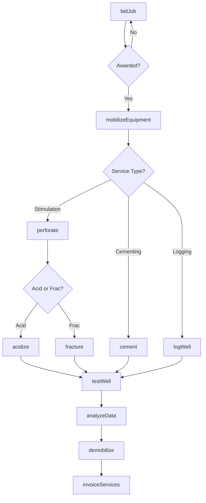
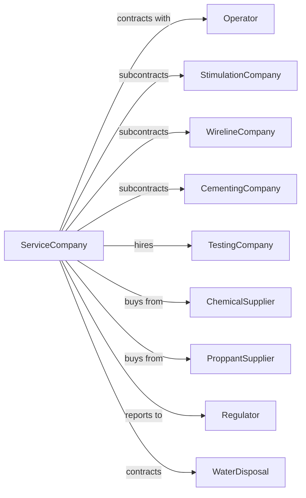

# Support Activities for Oil and Gas Operations

> Business-as-Code definition for oilfield services operations. Models the complete lifecycle from well stimulation through production optimization services provided to oil and gas operators.

## Overview

Support activities for oil and gas operations involve providing specialized services to exploration and production companies on a contract or fee basis. Services include well completion, stimulation, cementing, wireline logging, well testing, and production enhancement. This definition exposes actions for each phase of oilfield services, events for workflow automation, and searches for data retrieval.

## Actors

| Actor | Description |
|-------|-------------|
| Operator | Oil and gas company contracting for services |
| StimulationCompany | Provides hydraulic fracturing and acidizing services |
| WirelineCompany | Performs logging, perforating, and intervention services |
| CementingCompany | Provides primary and remedial cementing services |
| TestingCompany | Conducts well testing and production evaluation |
| ChemicalSupplier | Provides treatment chemicals and additives |
| ProppantSupplier | Supplies frac sand and ceramic proppants |
| Regulator | Oversees operations and environmental compliance |
| WaterDisposal | Handles produced water and flowback disposal |

## Roles

| Role | Description |
|------|-------------|
| ServiceSupervisor | Manages field operations and crew |
| FracEngineer | Designs and monitors stimulation treatments |
| WirelineOperator | Runs logging tools and performs perforating |
| PumpOperator | Operates high-pressure pumping equipment |
| ChemicalEngineer | Formulates treatment fluids and monitors chemistry |
| DataEngineer | Analyzes real-time job data and optimizes treatments |
| BlenderOperator | Mixes proppant and chemicals into frac fluid at precise ratios during pumping |

## Entities

| Entity | Description |
|--------|-------------|
| Well | Oil or gas well receiving services |
| FracFleet | Equipment spread for hydraulic fracturing operations |
| Wireline | Cable system for running tools into wellbore |
| Perforating Gun | Explosive device creating holes in casing |
| Pump | High-pressure equipment for stimulation treatments |
| Proppant | Material holding fractures open after treatment |
| TreatmentFluid | Liquid carrying proppant into formation |
| Coiled Tubing | Continuous tubing for well intervention |
| Packer | Downhole device isolating zones |
| ServiceTicket | Record of services performed and materials used |

## Actions

| Action | Description |
|--------|-------------|
| bidJob | Submit proposal for oilfield services |
| mobilizeEquipment | Move service equipment to well location |
| perforate | Create holes in casing to access formation |
| acidize | Pump acid to dissolve formation and enhance flow |
| fracture | Perform hydraulic fracturing to stimulate well |
| cement | Pump cement to seal annulus or repair casing |
| logWell | Run wireline tools to evaluate formation |
| testWell | Conduct flow tests to evaluate well performance |
| coilTubingIntervention | Perform wellbore cleanout or stimulation via coil |
| installArtificialLift | Set up pumping system for production |
| disposeWater | Handle and dispose of produced water |
| invoiceServices | Bill operator for services and materials |
| analyzeData | Process job data and provide recommendations |
| demobilize | Remove equipment from location |

## Events

| Event | Description |
|-------|-------------|
| jobAwarded | Service contract signed with operator |
| equipmentMobilized | Service equipment arrived on location |
| perforatingCompleted | Casing perforated to expose formation |
| acidizingCompleted | Acid treatment pumped and flushed |
| fracturingCompleted | Stimulation treatment finished |
| cementingCompleted | Cement placed and cured |
| loggingCompleted | Wireline data acquired |
| testingCompleted | Well flow test finished |
| liftInstalled | Artificial lift system commissioned |
| waterDisposed | Flowback and produced water handled |
| dataAnalyzed | Job analysis report delivered |
| invoiceSent | Billing submitted to operator |
| equipmentDemobilized | Service equipment removed from location |
| incidentReported | Safety or environmental event documented |

## Searches

| Search | Description |
|--------|-------------|
| findJobs | List available service opportunities |
| getEquipment | Check fleet availability and location |
| getJobStatus | Monitor active service jobs |
| getWellHistory | Retrieve service history for wells |
| getPricing | Get current service rates and material costs |
| findOperators | List potential clients |
| getCrewSchedule | Retrieve crew availability and assignments |
| getChemicalInventory | Check treatment chemical stock levels |

## Workflow



## Actor Relationships



## Usage

### Calling Actions

```typescript
import { serviceOilfieldOperations } from '@headlessly/service-oilfield-operations'

const oilfield = serviceOilfieldOperations()

// Check available service jobs in the area
const jobs = await oilfield.findJobs({ basin: 'anadarko', services: ['fracturing', 'perforating'] })

// Verify equipment availability for mobilization
const equipment = await oilfield.getEquipment({ type: 'frac-fleet', status: 'available' })

// Bid on completion job
const bid = await oilfield.bidJob({
  operatorId: 'devon-energy',
  wellName: 'Anderson 12-1H',
  services: ['perforating', 'fracturing'],
  stages: 45,
  estimatedDays: 5
})

// Mobilize frac fleet
const mobilization = await oilfield.mobilizeEquipment({
  jobId: bid.jobId,
  fleetId: 'frac-fleet-3',
  horsepower: 50000,
  location: { lat: 35.4521, lng: -97.5432 }
})

// Execute stimulation treatment
await oilfield.fracture({
  jobId: bid.jobId,
  stage: 1,
  proppantType: '40/70-sand',
  proppantVolume: 400000, // lbs
  fluidVolume: 12000, // bbls
  rate: 90 // bpm
})
```

### Event-Driven Automation

```typescript
// Auto-advance to next stage
oilfield.fracturingCompleted(async ({ jobId, stage, totalStages }) => {
  if (stage < totalStages) {
    await oilfield.perforate({
      jobId,
      stage: stage + 1,
      clusters: 5,
      shotsPerFoot: 6
    })
  } else {
    await oilfield.testWell({
      jobId,
      duration: 24, // hours
      measureFlowback: true
    })
  }
})

// Auto-generate invoice after demob
oilfield.equipmentDemobilized(async ({ jobId, services, materials }) => {
  await oilfield.invoiceServices({
    jobId,
    services,
    materials,
    generateReport: true
  })
})
```
