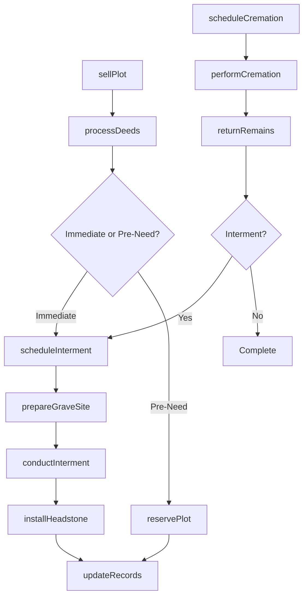
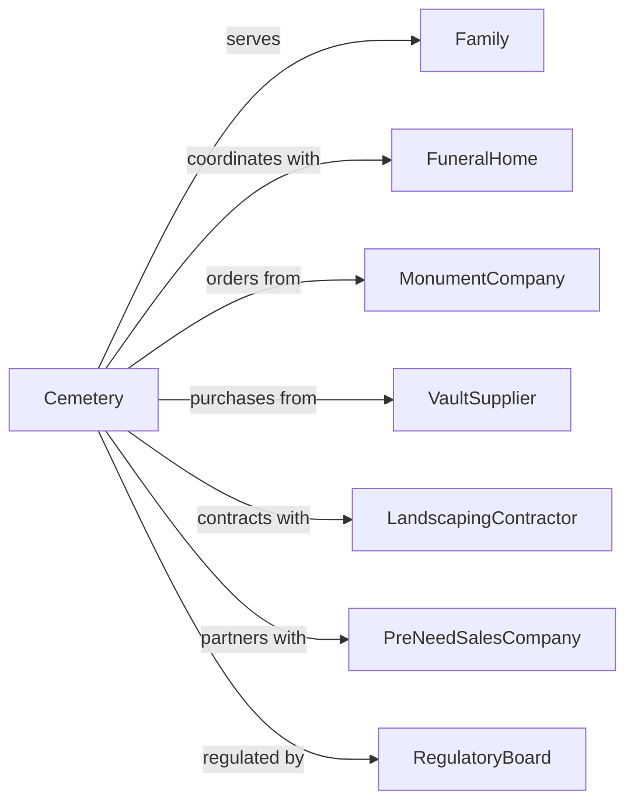

# Cemeteries and Crematories

> Business-as-Code definition for cemetery and crematory operations. Models burial site management, cremation services, and memorial property sales.

## Overview

Cemeteries and crematories operate sites for human and pet remains interment and provide cremation services. This definition exposes actions for property sales, interment coordination, cremation processing, and grounds maintenance, with events for service delivery and searches for available plots and services.

## Actors

| Actor | Description |
|-------|-------------|
| Family | Surviving relatives arranging final disposition |
| FuneralHome | Partners for burial and cremation coordination |
| MonumentCompany | Provides headstones and markers |
| VaultSupplier | Provides burial vaults and liners |
| LandscapingContractor | Maintains grounds and gardens |
| PreNeedSalesCompany | Markets pre-arranged burial plots |
| RegulatoryBoard | Oversees cemetery operations and compliance |

## Roles

| Role | Description |
|------|-------------|
| CemeteryManager | Oversees all cemetery operations |
| GroundsCrewLead | Manages interment and landscaping crews |
| CremationOperator | Operates cremation equipment |
| SalesCounselor | Sells burial plots and services |
| RecordsManager | Maintains plot ownership and interment records |
| MaintenanceWorker | Maintains grounds and facilities |

## Entities

| Entity | Description |
|--------|-------------|
| Plot | Individual burial space |
| GraveSite | Prepared location for interment |
| Mausoleum | Above-ground burial structure |
| Columbarium | Structure for cremated remains |
| Crematory | Facility for cremation |
| Urn | Container for cremated remains |
| Headstone | Grave marker with inscription |
| Vault | Burial container for casket |
| Deed | Legal ownership of burial rights |
| CrematedRemains | Ashes from cremation process |

## Actions

| Action | Description |
|--------|-------------|
| sellPlot | Sell burial rights for grave site |
| reservePlot | Hold plot for future use |
| scheduleInterment | Coordinate burial date and time |
| prepareGraveSite | Excavate and prepare for burial |
| conductInterment | Perform burial ceremony |
| scheduleCremation | Book cremation appointment |
| performCremation | Execute cremation process |
| returnRemains | Deliver cremated remains to family |
| installHeadstone | Place grave marker |
| maintainGrounds | Care for landscaping and facilities |
| processDeeds | Issue and transfer burial rights |
| updateRecords | Document interments and ownership |

## Events

| Event | Description |
|-------|-------------|
| plotSold | Burial rights have been purchased |
| plotReserved | Plot has been held for future use |
| intermentScheduled | Burial date has been set |
| graveSitePrepared | Site is ready for burial |
| intermentCompleted | Burial has been performed |
| cremationScheduled | Cremation date has been set |
| cremationCompleted | Cremation has been performed |
| remainsReturned | Ashes have been delivered to family |
| headstoneInstalled | Grave marker has been placed |
| deedIssued | Legal ownership has been transferred |

## Searches

| Search | Description |
|--------|-------------|
| findAvailablePlots | Search open burial sites |
| getPlotInventory | View all plots by section |
| findIntermentSchedule | View upcoming burials |
| searchDeceasedRecords | Find burial locations |
| getCremationSchedule | View upcoming cremations |
| getMaintenanceSchedule | View grounds care calendar |

## Workflow



## Actor Relationships



## Usage

### Calling Actions

```typescript
import { interRemains } from '@headlessly/inter-remains'

const cemetery = interRemains()

// Search open burial sites
const findAvailablePlotsResult = await cemetery.findAvailablePlots({ status: 'active' })

// View all plots by section
const getPlotInventoryResult = await cemetery.getPlotInventory({ status: 'active' })

// Sell burial plot
const sale = await cemetery.sellPlot({
  section: 'Garden of Peace',
  plotNumber: 'GP-142',
  buyerName: 'John Smith',
  plotType: 'single',
  includeVault: true
})

// Schedule interment
await cemetery.scheduleInterment({
  plotId: sale.plotId,
  deceasedName: 'Mary Smith',
  date: '2024-03-15',
  time: '14:00',
  funeralHomeId: 'fh-123'
})

// Perform cremation
const cremation = await cemetery.performCremation({
  deceasedName: 'Robert Johnson',
  cremationDate: '2024-03-12',
  urnProvided: true,
  witnessedCremation: false
})
```

### Event-Driven Automation

```typescript
// Auto-prepare grave site when interment scheduled
cemetery.intermentScheduled(async ({ plotId, date }) => {
  await cemetery.prepareGraveSite({
    plotId,
    prepDate: addDays(date, -1),
    tentRequired: true,
    chairCount: 20
  })
})

// Notify family when remains ready
cemetery.cremationCompleted(async ({ cremationId, familyContact }) => {
  await cemetery.notifyFamily({
    contact: familyContact,
    message: 'Cremation is complete. Remains are ready for pickup or delivery.'
  })
})

// Schedule headstone installation after interment
cemetery.intermentCompleted(async ({ plotId, headstoneOrdered }) => {
  if (headstoneOrdered) {
    await cemetery.installHeadstone({
      plotId,
      installDate: addWeeks(new Date(), 4)
    })
  }
})
```
