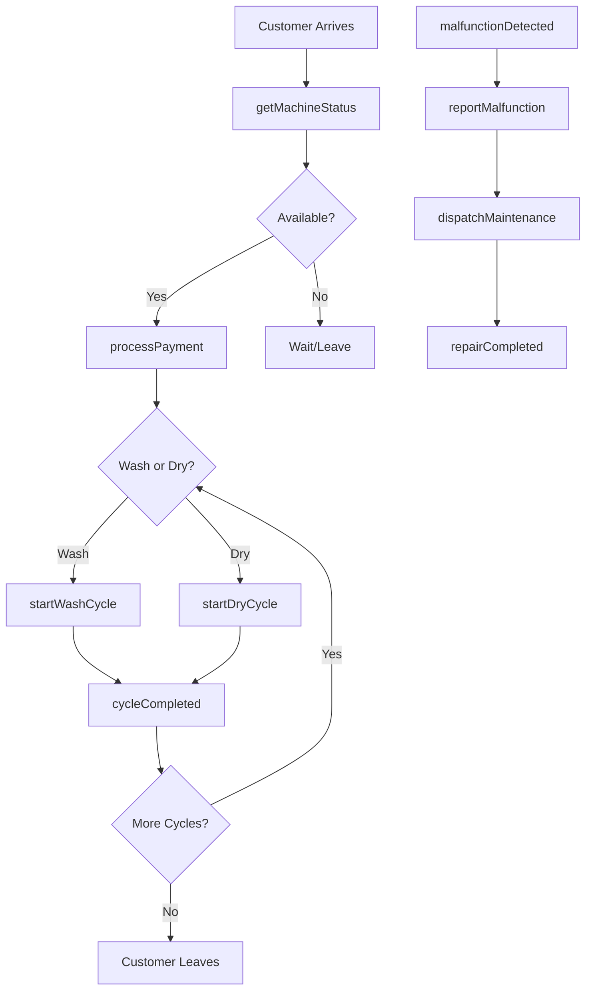
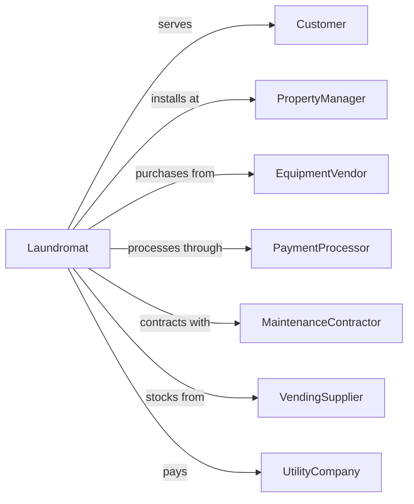

# Coin-Operated Laundries and Drycleaners

> Business-as-Code definition for self-service laundromat operations. Models coin-operated and card-operated laundry facilities.

## Overview

Coin-operated laundries provide self-service washing and drying equipment for customer use, as well as equipment installation services for multi-housing properties. This definition exposes actions for equipment monitoring, payment processing, and facility management, with events for machine status and searches for availability.

## Actors

| Actor | Description |
|-------|-------------|
| Customer | Individual using laundry facilities |
| PropertyManager | Multi-housing operator with on-site laundry |
| EquipmentVendor | Supplies washers, dryers, and payment systems |
| PaymentProcessor | Handles card and mobile payments |
| MaintenanceContractor | Services and repairs equipment |
| VendingSupplier | Provides soap, dryer sheets, and supplies |
| UtilityCompany | Provides water, gas, and electricity |

## Roles

| Role | Description |
|------|-------------|
| StoreOwner | Owns and operates the laundromat |
| Attendant | Assists customers and maintains facility |
| MaintenanceTech | Repairs and services equipment |
| RouteDriver | Services machines at multiple locations |
| CollectionAgent | Collects cash from coin machines |

## Entities

| Entity | Description |
|--------|-------------|
| Washer | Washing machine for customer use |
| Dryer | Drying machine for customer use |
| PaymentKiosk | Card and coin payment terminal |
| VendingMachine | Supplies dispenser |
| Location | Laundromat facility or route stop |
| CoinBox | Cash collection container |
| LoyaltyCard | Reloadable payment card |
| MachineStatus | Equipment operational state |
| CycleCount | Usage tracking for machines |
| Revenue | Income from machine operations |

## Actions

| Action | Description |
|--------|-------------|
| startWashCycle | Initiate washing machine |
| startDryCycle | Initiate drying machine |
| processPayment | Accept coins, cards, or mobile payment |
| monitorMachines | Track equipment status remotely |
| reportMalfunction | Log equipment issues |
| dispatchMaintenance | Send technician for repairs |
| collectCoins | Retrieve cash from machines |
| reloadCard | Add value to loyalty card |
| restockVending | Refill supply dispensers |
| adjustPricing | Update cycle prices |
| generateReports | Create revenue and usage reports |
| cleanFacility | Maintain cleanliness of location |

## Events

| Event | Description |
|-------|-------------|
| cycleStarted | Machine has begun operation |
| cycleCompleted | Machine has finished cycle |
| paymentProcessed | Payment has been accepted |
| malfunctionDetected | Equipment issue identified |
| maintenanceDispatched | Technician has been sent |
| repairCompleted | Equipment has been fixed |
| coinsCollected | Cash has been retrieved |
| cardReloaded | Value has been added to card |
| vendingRestocked | Supplies have been refilled |
| revenueReported | Financial data has been generated |

## Searches

| Search | Description |
|--------|-------------|
| getMachineStatus | Check availability of washers and dryers |
| findNearestLocation | Locate laundromats nearby |
| getUsageStats | Retrieve machine cycle counts |
| checkRevenueByLocation | View income by facility |
| findMaintenanceHistory | Retrieve repair records |
| getCardBalance | Check loyalty card value |

## Workflow



## Actor Relationships



## Usage

### Calling Actions

```typescript
import { launderLaundry } from '@headlessly/launder-laundry'

const laundromat = launderLaundry()

// Check machine availability
const status = await laundromat.getMachineStatus({
  locationId: 'loc-123',
  machineType: 'washer'
})

// Process payment and start wash
await laundromat.processPayment({
  machineId: 'washer-05',
  amount: 3.50,
  paymentMethod: 'loyaltyCard',
  cardId: 'card-456'
})

await laundromat.startWashCycle({
  machineId: 'washer-05',
  cycleType: 'hotWash',
  addedOptions: ['extraRinse']
})

// Monitor machines remotely
const allStatus = await laundromat.monitorMachines({
  locationId: 'loc-123',
  includeRevenue: true
})
```

### Event-Driven Automation

```typescript
// Auto-dispatch maintenance when malfunction detected
laundromat.malfunctionDetected(async ({ machineId, errorCode, locationId }) => {
  await laundromat.dispatchMaintenance({
    machineId,
    locationId,
    issueType: errorCode,
    priority: errorCode.startsWith('CRITICAL') ? 'urgent' : 'standard'
  })
})

// Notify customer when cycle complete (if app connected)
laundromat.cycleCompleted(async ({ machineId, customerId }) => {
  if (customerId) {
    await laundromat.notifyCustomer({
      customerId,
      message: `Your laundry is done! Machine ${machineId} has finished.`
    })
  }
})

// Generate daily revenue reports
laundromat.revenueReported(async ({ locationId, date, total }) => {
  await laundromat.sendDailyReport({
    locationId,
    date,
    revenue: total,
    recipients: ['owner@example.com']
  })
})
```
